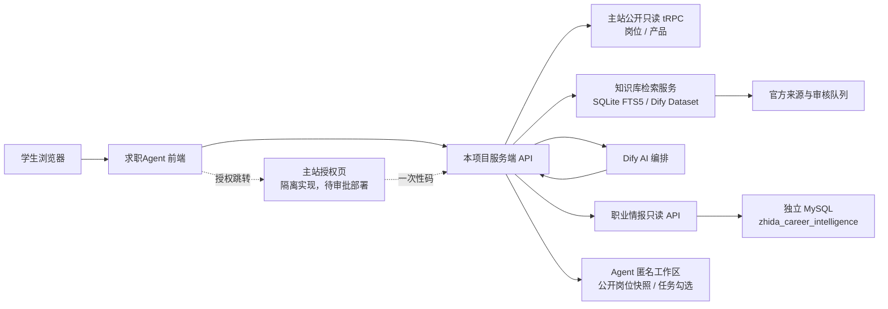

# 求职Agent 项目全景文档

> 文档名称：`PROJECT_DOCUMENTATION-AGENT.md`  
> 产品名称：求职Agent  
> 产品定位：面向学生的央国企职业规划、岗位决策与求职行动平台  
> 文档版本：v3.59
> 最后盘点：2026-07-23（Asia/Shanghai）
> 维护原则：先确认事实边界，再修改代码、数据库或部署

这是一份交接文档。新成员应先读本文件，再读对应目录下的代码和阶段报告。文档把“已经存在的代码”“仓库曾经记录的部署验证”“尚未接入的规划”分开写，不能只看一个状态词就判断系统已经生产可用。

当前最重要的结论：**主 Beta 页面和领域逻辑已形成，主站岗位/产品目录已有服务端只读适配，策略页也已接入独立职业情报的官方证据决策；Mac mini 上的独立情报 API、知识库、Dify 与 Qdrant 均在线。策略网络已经把路径成本具体化为总计划时间、每周容量、负荷/超载、能力工作量、目标专属任务和未知现金费用；每个 7 天任务都有确定性耗时估算，但它不是录用承诺。知识库当前保存 81 条文档，但不能统称为“81 篇正文”：确定性动态质量门禁将其分为 61 条可回答证据、20 条只用于发现详情页的栏目索引和 0 条残缺页。当前 17 条正文由 Apple Vision 长图 OCR 补全、1 条中国石油公告由 Tesseract 补全，37 条原始 OCR 审计记录可追溯，当前低质量 OCR 为 0；73 个 Dify 映射均为 `synced` 且与本地正文 hash 一致，`queued=0`、`error=0`。**

**2026-07-21 云端数据库切换结论：独立职业情报正式库已完成受控迁移、影子对账、正式导入、备份恢复和前端切换，当前为 27 张基础表、8 个视图、253,402 行源业务数据及 68,353 条当前岗位快照。云端只读 API 只监听回环地址，Mac mini 通过受限隧道的 `18082` 读取；`18080` 旧 API 与旧库完整保留作回滚。每日官方证据任务已改为向云端追加并完成真实试写。主站仍为 63 张基础表，列结构签名操作前后保持 `814f084ddebedb79b1e47b5e651f10b65a326d8e830823bec41fa69f81e516ae`，无跨库外键，未写入、未删表、未删除任何数据库。当前 68,353 条是迁移快照，不等于已建立主站岗位实时同步；正式事实源见 `求职Agent-career-intelligence/docs/CLOUD_DATABASE_CUTOVER_2026-07-21.md`。**

**2026-07-22 决策模型 V1 结论：第一版央国企校招/实习决策链和本轮质量修复均已发布到 Mac mini 内部 `127.0.0.1:3000`，当前发布包为 `job-search-agent-main-beta-abc6a3e90a99e935`。主站完整且持续更新的 `job.list` 作为候选岗位真源，在学生发起报告时按资料进行服务端只读查询；独立职业情报库不承担“复制主站全部岗位”的职责，只提供企业、批次、官方证据和历史补强。确定性模型统一输出资格预判、准备度、核验优先级、主攻/冲刺/稳妥组合、行动成本和第一行动；这些分数均不是录取概率。本轮新增两位数届别解析、过期岗位组合隔离、待核验/高风险/已截止的分数上限和 8 组决策质量灰度。115/115 单测、类型检查、ESLint、生产构建、5/5 服务端渲染通过；3002 完整门禁和内部 3000 的 8/8 真实只读灰度通过，基础设施失败 0、决策失败 0、每组一次请求，“待核验却 100 分”清零。主站公开接口期间曾短暂 502，发布门禁正确停止并在恢复 200 后才继续。当前非阻断问题是部分专业方向分类过宽，以及主站 `active` 中混有较多已过截止时间岗位；这些岗位已被排除出当前执行组合。公网 3001 PID 50814、主站数据库、独立数据库、知识库、Dify 和既有 Tunnel 均未切换或修改。本轮未连接数据库、未执行 SQL、未写入、修改或删除主站数据库。详情见 `docs/DECISION_MODEL_V1.md` 与 `docs/DECISION_QUALITY_GRAY_V1.md`。**

**2026-07-22 求职市场报告 V2 结论：报告已改为“真实岗位结论 → 求职时间线 → 当前动作 → 主攻/备选/提升后冲刺 → 当前与近一年样本对比”的决策顺序。当前市场规模、个人候选和岗位卡片均由主站公开 `job.list` 服务端只读查询生成；近一年对比使用 `status=all`、按 `createdAt` 倒序读取的 300 条有界样本，页面明确标为数据库样本，不能写成近一年全量。2028 届样本的本轮只读结果为专业相关 1277、央国企相关 745、央国企校招/实习 557、去重候选 123、资料字段匹配 69；数字会随主站数据更新。资料字段匹配只表示主站字段吻合，仍需按企业公告核验资格。确定性规则现在同时解析岗位标题中的明确届别，2026 届专属岗位不会进入 2028 届当前主攻、备选或冲刺组合；高风险、已截止和明确届别冲突均退出当前执行组合。旧准备度分数和无含义进度条已删除，首屏结论缩短，当前动作改为优先/其次/再三步，热力图可切换当前样本与近一年样本。116/116 单测、类型检查、ESLint 和生产构建通过；1440、1024、390 三种宽度无横向溢出。当前只完成本地预览，未部署、未提交、未推送，未连接数据库、未执行 SQL、未写入或修改主站。**

**2026-07-22 推荐组合 V2 本地修正：报告改为先做“专业 + 学历 + 届别”的严格资料查询，再补充相邻岗位方向；严格命中会进入详细候选池接受同一套届别、学历、时效和风险核验。主攻只接收原始字段无冲突的候选；备选接收仍有少量关键信息待核验的候选；提升后冲刺必须有企业难度或岗位专属能力差距证据，没有证据时保持为空。全局简历、实习、项目等补齐工时只生成行动计划，不参与岗位分组。AI 的权限固定为字段抽取、证据解释、追问和执行陪伴，不能覆盖确定性资格门槛。本科、2028 届、电气工程及其自动化的本轮主站只读快照为详细去重候选 179、资料严格匹配 69；组合为主攻 1、备选 3、提升后冲刺 0，观察池 56，另排除高风险 92、已截止 27。数字会随主站更新。页面同时显示分组标准、每个岗位的入组理由和排除审计，不再按前三名或卡片数量硬凑组合。当前仅完成本地代码和 `localhost:3011` 预览，尚未部署到内部 3000 或公网 3001；未连接数据库、未执行 SQL、未写入、修改或删除主站数据。**

**2026-07-22 天津大学院校求职情报 V3：纠正此前把院校百科和校园满意度放进求职报告的产品偏差。第三方综合满意度、环境、生活、宿舍、网络和匿名校园评价已从数据模型、页面和测试中全部删除。院校模块现在只回答求职问题：学校平台能否通过常见初筛、哪些目标雇主真实进入过学校招聘、专业方向分别对应哪些岗位、课程和实验如何转成简历证据、历史毕业去向是什么、当前学生仍缺哪些能力和核验证据。网上材料只保留天津大学就业指导中心可核验的 2026 届校招记录，新增国家电网、国家电投、国电投核电技术服务、特变电工、航空工业津电和国电众智六个入口，并明确历史来校不代表 2028 届批次开放。2019 届毕业生调查只提取学校品牌、专业相关度和沟通表达、问题分析、外语三类求职信息，不再展示工作满意度。学校全称仍只进入 Agent 本地院校匹配，不转发主站岗位接口。本轮未连接数据库、未执行 SQL、未修改、删除或同步主站数据，未部署、未提交、未推送。**

**2026-07-22 求职报告 V4 本地优化：报告顺序固定为资格基线、市场机会漏斗、当前行动、唯一主时间线、方向确认、候选岗位解释、市场分布和院校深度资料。新增 11 项个人资格矩阵，区分已知硬条件和待补求职证据；岗位数量改成专业相关、央国企校招/实习、资料字段匹配、方向确认前候选的连续漏斗。报告不再在学生选方向前宣称主攻岗位已经形成，原组合改为方向确认前的优先核验、字段待补和冲刺证据样本。每个岗位显示当前可核验或当前可准备、学历、届别、地域、截止时间、四项闸门、入组理由、核验任务、更新时间和来源；历史来校企业只形成未来公告监控节点。行动卡新增总工时、每周投入、最低现金成本和完成标准。院校模块保留求职摘要与企业监控，课程、资源、历史去向和证据来源默认折叠。补充电气专业的电网运行、发电与新能源、电气工程、自动化研发四类方向规则，并把决策相关辅助文字提高到至少 11px。所有新增结论仍来自学生本地档案、主站只读岗位字段或已核验院校资料；缺失字段保持待核验。本轮未连接数据库、未执行 SQL、未修改或删除主站数据，未部署、未提交、未推送。**

**2026-07-22 求职报告 V5 阶段边界修正：求职报告只承担咨询和判断，不在学生选择求职方向前生成决策。页面删除当前行动、主时间线、主攻/备选/冲刺组合、行动投入和产品触发；保留学生资格基线、学校与专业求职价值、真实岗位市场漏斗、专业相关方向分布、在招岗位样本、当前与近一年地域分布、数据来源和报告边界。方向分布只说明市场结构，岗位样本不构成推荐顺序。学生通过报告底部按钮进入方向选择后，系统才开始目标、路线、时间线、行动计划和产品触发。方向选择页及后续策略系统未改动。本轮仍只读使用既有接口，未连接数据库、未执行 SQL、未修改或删除主站数据，未部署、未提交、未推送。**

**2026-07-22 求职报告 V6 咨询信息补全：报告在保持咨询与决策阶段分离的前提下，新增学生优势、当前限制和综合建议，并增加薪资、发展、城市、工作强度、福利五项工作条件说明。所有内容只使用学生本地档案、主站公开岗位字段和岗位正文中的明确表述；主站适配器新增只读接收岗位正文及结构化薪资字段，不建立数据库连接、不执行 SQL。薪资少于 3 条仅显示小样本，其他维度只有至少 5 条且覆盖率达到 30% 才标为可用；字段未披露时保持未知。2028 届天津大学电气案例的本轮只读样本为 179 条，薪资仅 1 条，发展 6 条、工作强度 27 条、福利 20 条存在明确正文信号，均在页面显示样本覆盖与取舍依据。专项测试 15/15、类型检查、ESLint、生产构建通过；1710px 与 934px 浏览器无横向溢出，控制台无错误。当前仅本地修改，未部署、未提交、未推送，未写入、修改或删除主站数据库。**

**2026-07-22 求职报告 V7 产品化减法：根据学生端使用反馈删除重复资料基线与“求职证据尚未开始”模块；首屏改为一句短结论和央国企机会、初步符合、涉及企业三项数字；移除只读连接状态、漏斗箭头、技术解释、重复的报告依据、底部边界卡和重复提示；学生评估压缩为优势、待补、综合建议；学校模块改为学校与专业、三条事实和历史来校企业，深度资料继续折叠；工作条件保留五项，但只显示结论、必要信号和一条取舍建议。数据计算与后续决策逻辑均未删除。专项测试 20/20、类型检查、ESLint、生产构建通过；934px 浏览器无横向溢出，控制台无错误。当前仅本地修改，未部署、未提交、未推送，未连接数据库、未执行 SQL、未修改或删除主站数据。**

**2026-07-22 DeepSeek V4 Flash AI 层：新增 DeepSeek 官方兼容接口并固定使用 `deepseek-v4-flash`。本机密钥只保存于 Git 忽略的 `.env.local`，文件权限为 `0600`；官方模型列表鉴权返回 200 并确认模型可用，本轮未调用聊天生成接口、未消耗模型 Token。AI 只用于用户主动发起且已有 RAG 证据的顾问解释；求职报告、岗位筛选、资格门槛和决策计算继续使用确定性规则。DeepSeek 配置后优先于 Dify，运行失败不自动二次调用 Dify；默认关闭思考模式，单次输出上限 700 tokens，回答限制在 600 个中文字符内，只携带最近 4 条且合计最多 1800 字的对话，每次用户动作最多一次模型请求，会话每分钟最多 6 次。引用校验、企业隔离和无依据拒答继续生效。Mac mini 环境模板、发布密钥扫描和状态接口已支持 `aiConfigured`。当前本地 AI 已配置，但 RAG、会话保护和访问许可仍未配置，因此学生对话按安全策略保持关闭。DeepSeek 专项与既有顾问测试通过；类型检查、ESLint、生产构建和 5/5 服务端渲染通过。全量单测为 119/123，通过项包括全部 DeepSeek 改动；另有 4 项既有工作区存储测试因 `corrupt_state` 失败，单独运行仍可复现，未在本轮扩大修改范围。未部署、未提交、未推送、未连接数据库、未执行 SQL、未写入、修改或删除主站数据。**

**2026-07-23 求职报告 V8 四章结构与综合评分：报告固定为整体情况、学校情况、市场情况、建议四个连续章节，学校与市场原有事实内容保留，优势、短板和综合建议后置。整体情况新增小型半圆仪表盘和五项评分构成，权重为院校基础25%、专业入口25%、学历基础15%、市场机会20%、求职准备15%；院校、专业、学历和岗位数量形成当前基线，简历、实习、项目、网申、面试和竞赛状态使分数随档案更新。主站现有竞争力模型需要先选定目标岗位与企业，不能直接用于报告前置阶段；本报告只复用确定性加权、学历分档和等级区间原则，不调用AI，不把评分描述成同类排名或录取概率。天津大学电气案例当前显示81分、竞争力强，完成现有能力项的理论提升空间为9分；该数字会随学生档案与主站岗位样本变化。专项测试15/15、类型检查、ESLint、生产构建通过；1440、1024、390三种宽度视觉验收通过，390px横向溢出为0且四章边界一致。本轮仅本地修改，未部署、未提交、未推送，未连接数据库、未执行SQL、未写入、修改或删除主站数据。**

**2026-07-23 独立公网部署决策：求职Agent 的正式入口固定为 `https://agent.zhidasihai.cn`，代码仓库为私有 GitHub 项目 `axjlkeke/job-search-agent`，Vercel 使用独立项目和独立环境变量。主站 `zhidasihai.cn` 不增加页面入口、不复用主站构建产物、不修改主站路由或数据库；主站只在 `PROJECT_DOCUMENTATION.md` 保存本项目维护索引。项目完整事实、架构、数据边界、环境变量、测试、部署和回滚以本文件为唯一总入口；具体模块再按本文链接进入 `docs/`、`infra/`、`services/knowledge-base/` 和测试目录。**

> 历史状态说明：下一个长段汇总了 2026-07-18 的知识库和主 Beta 发布状态，其中“79/49”和“18080 尚未上线”只代表当时；数据库/API 当前状态一律以上面的 2026-07-21 切换结论和第 9.4.3 节为准。

**栏目抓取已改为正文优先、分页渐进；同一 50 页预算的稳定复跑为 `seen=50 / changed=0 / errors=0`。已知不支持的 Office/媒体附件不会再被误报为网页故障。Qdrant 的 1024 文件句柄瓶颈已修复为 65536，并新增只允许当前安全证据重提的 `dify-retry`，但重提后仍必须通过 `dify-reconcile` 才能进入回答。国家电网、中国石油、中国石化、中国移动、中车长客和中国能建投资集团六份高频企业静态官方公告已接入；回答链继续拒绝栏目索引、残缺页、孤立远端记录、过期映射、审核阻断和错误企业证据，并显式隔离中石油与中石化。多条件检索会为招聘对象、学历、年龄、毕业时间、外语、专业、地点、岗位类型、福利、流程和入口逐项保留证据预算，且不会在首个页面版权信息处误删后续已核验补充窗口。本地公告变更门禁新增大冶市“核减1个招聘计划、取消7个岗位”和后续单岗位取消，以及淮安市“取消投资总监岗位并把名额转给投资经理”三条真实样本；已生效的决定、列表字段和标题型部分取消会进入对账，原公告中“未来可能取消”“后续将发补充公告”或“决定暂不取消”的表述不会被误判。同 URL 公告现在还会规范化提取“需求学科/招聘专业/专业要求”等单行字段及“机械类/电气类/计算机类”等分组清单；专业集合发生新增、删除或变化时进入人工复核，仅调整排序和分隔符不会误报，短海报 OCR 补全文本仍按技术增强放行。学历提取已经补齐“应聘要求/应聘条件”和不带“及以上”的硕士研究生表述；博士、硕士、本科或大专并列时按最低可报层级判断，不再把本科可投公告错误收紧为博士。年龄提取保留“博士/硕士/本科及职业学院”等人群与上限的映射，能识别“不超过、以下、不满、18岁以上至35岁以下”等表达；数字变化或人群对调均进入复核，单独最低年龄和普通年份不触发。工作经验同样保留博士/硕士/本科/专科与最低年限映射，统一“三年”和“3年”，兼容“不少于、满、至少、3年以上”等表达；数字变化或人群对调均进入复核，项目周期和毕业年份不触发。外语提取绑定本科/研究生等人群、CET4/CET6 等级和可选最低分，统一 CET-4/CET4/大学英语四级写法；等级、分数、人群映射变化或新增删除进入复核，员工培训介绍不触发。毕业时间提取把境内毕业取证截止、境外毕业区间和境外学历认证截止拆成独立签名；任一日期变化、新增或删除进入复核，普通报名截止和没有明确日期的“如期取得证书”不触发。招聘对象提取从明确招聘语境区分高校或应届毕业生、未就业毕业生、留学回国人员、社会人员、系统内外人员等类别；类别变化、新增或删除进入复核，企业社会责任和员工培训不触发。考试安排提取区分笔试、初选考试、测评和面试，保留暂定/确定状态以及完整日期、月日或日期区间；日期或确定性变化、新增或删除进入复核，缺失年份不会被擅自补齐。报名截止现在兼容“完整起始年 + 月日终点”和 17:00/17时等时刻；只有同年方向明确时才继承年份，跨年不明保留未知，并按逗号隔离后续考试日期。工作地点仅从“工作地点/工作城市/岗位所在地”等明确标签提取；地点增删或变更进入复核，省市后缀、排序和分隔符差异不误报，企业介绍及“以岗位详情为准”不形成地点事实。招聘人数只从明确人数/名额字段或“本次/计划/拟/公开招聘 × 人（名）”总量句提取，中文和阿拉伯数字统一；人数增删或变化进入复核，报名人数、资格复审人数、岗位数、开考比例、核减数量、人月和待定人数不触发。官方投递入口只从报名/网申/投递标签、招聘官网、紧邻登录动作的网址或投递邮箱提取；入口增删或变化进入复核，协议、域名大小写、`www`、默认端口、尾斜杠、参数顺序和追踪参数差异不误报，路径及 `id` 等功能参数继续保留，普通公司官网、公告来源、客服邮箱、待公布入口和同句远距网址不触发。知识库本地最新为 189/189，Mac mini 仍运行上一版 98/98，新增门禁尚未发布；招聘人数只能作为竞争判断证据之一，投递入口事实也不等于当前连通性验证，更不会触发自动投递。17 个事实级场景在 Mac mini 真实 RAG + Dify 链路通过 17/17；官方证据虽已扩至 79 个已核验岗位页和 49 个去重证据快照，但相对 68,353 个当前岗位快照仍属于低覆盖。职业情报本地待发布版本已在每次受支持的 Hotjob 岗位决策前实时核验企业官网，并在关闭、身份不符、超时或失败时禁止旧证据继续生成“可直接投递”；当前 `127.0.0.1:18080` 仍是旧服务，这项能力尚未上线。主站隔离工作区已把授权、兑换、SELECT-only 快照和 Vercel 同源代理升级为 `2026-07-18.3` 合同，并使用专用 HMAC 密钥生成不可逆匿名工作区标识；Agent 只在自己的私有目录保存公开岗位目标和任务勾选。主站全仓 41 文件/429 项、Agent 101 项单测和本地真实双端 E2E 均通过，E2E 确认工作区不含个人档案；两端仍未部署、未连接真实用户或生产数据库。Mac mini 仍为 `zhidaBridgeConfigured=false`；`tokensoff.com` 当前仍指向 3001 影子前端，公网 `/v2` 与 `/progress` 均为 404，未完成主 Beta 切换。**

阅读建议：产品或新成员先读第 1–4、14、17 节；前端/后端开发重点读第 3、5–11、16、18 节；部署和数据维护人员必须先读第 9、12、13、15 节。遇到状态冲突时，以“当前代码 + 本轮只读验证”优先，阶段报告只代表其生成当时。

---

## 0. 五分钟交接摘要

如果只够先读这一节，应记住以下事实：

1. **产品不是聊天机器人，而是求职决策与执行平台。** 核心结果是可追溯的求职路径和行动，不是泛泛的 AI 回答。
2. **起点来自学生真实资料，终点来自真实在招岗位。** 个人档案继续保存在本机；一次性只读接力已增加不可逆匿名工作区标识，Agent 可在自己的私有目录跨设备保存目标岗位和任务勾选。双端本地脱敏闭环已经完成，正式使用仍等待生产安全评审、部署与真实登录用户验收。
3. **原始岗位、官方证据、知识正文是三种不同数据。** 原始岗位说明“市场上有什么”；官方证据决定“当前能不能投”；知识正文解释“为什么、如何准备”。
4. **硬规则不能交给模型猜。** 学历、专业、届别、截止时间只能由确定性规则和 A/B 级已核验证据改变；缺证据一律 `unknown`。
5. **商业化发生在真实卡点之后。** 已购买的服务主动提供功能，未购买的服务才作为可选解决方案出现；高风险或当前不可投的目标不能被营销包装成可投。
6. **主站与职业情报库严格隔离。** 当前只使用主站公开只读 API；独立 MySQL、知识库 SQLite 与 Dify 不得写入或替代主站数据库。
7. **当前主开发工作区是 `求职Agent`，情报基础设施在并行 worktree `求职Agent-career-intelligence`。** 两边均有未提交改动，不能混用路径或默认已推送。
8. **云端数据库迁移与运行切换已完成，决策模型直接读取主站最新岗位。** 正式情报库、只读 API、受限隧道、每日证据追加、备份恢复和监控均已验收；主站不在迁移或写入链路中。主站岗位无需先全量复制到情报库才能决策：V1 在报告生成时只读查询主站最新候选，情报库只补充官方证据、批次和历史；68,353 条迁移快照仍不能写成实时市场总量。

当前开发判断顺序：

```text
确认工作区/分支
  → 确认问题属于 UI、领域规则、知识库、情报库还是部署
  → 只读验证真实状态
  → 修改最小范围
  → 跑对应测试
  → 本地验证不等于公网已部署
```

## 1. 一句话说明项目

求职Agent把学生的真实起点、当前在招岗位和可核验的官方招聘资料放在同一条求职路径上，输出“目标岗位 → 硬门槛 → 能力差距 → 行动成本 → 可选服务 → Offer”的决策闭环。

它不是单纯的聊天机器人，也不是泛化的岗位推荐器。核心对象是“求职路径”：

```text
学生档案
  → 真实岗位池
  → 学生选择一个或多个终点
  → 官方硬门槛核验
  → 路径风险与能力差距
  → 7 天/阶段行动
  → 只在真实卡点出现产品帮助
  → 持续执行并向 Offer 靠近
```

多个目标岗位会形成“求职网络”：共享的能力准备组成共同主干，企业或岗位专属要求形成分支。

## 2. 产品边界和成功标准

### 2.1 面向学生的主要价值

- 让学生知道自己目前在哪里，而不是只得到一句“你可以试试”。
- 让学生看到通往目标岗位需要补哪些能力、材料、经历和时间投入。
- 让学生看到每个目标的现实风险，并保留长期目标与当前替代机会。
- 让平台服务在学生真正卡住时出现，帮助完成简历、网申、面试、课程或岗位动作。
- 所有招聘事实都应能追溯到实时岗位、官方公告或可核验知识库资料。

### 2.2 明确不做的事情

- 不承诺“稳进、保录、内部名额”或伪造录取概率。
- 不把学历、专业或届别不满足的目标包装成当前可投。
- 不把资料缺失猜成符合；缺资料必须显示 `unknown`/“待核验”。
- 不自动投递、自动预约、自动购买或自动修改主站资料。
- 不把学生姓名、手机、身份证、简历原文、订单号等个人敏感数据写入职业情报库。
- 不直接从浏览器连接主站数据库、情报库、Dify 或模型服务。

### 2.3 “路径失败”的定义

产品不使用“路径失败”作为学生状态。以下情况要保留目标并明确风险：

- 当前学历或专业不满足公告硬门槛：`high-risk-long-term`，同时找同企业/相邻企业的可执行岗位。
- 当前批次已截止：`alternative-opportunity`，保留企业长期目标并寻找当前替代机会。
- 官方资料不足：`prepare-and-verify`，先补资料或人工核验。

真正禁止的是“虚假路径”：把不具备条件的目标显示成可直接投递，或把未知说成已确认。

### 2.4 商业闭环与产品触发原则

平台的商业模式不是先卖产品再找理由，而是先识别学生从起点到终点之间的真实缺口，再提供解决缺口的功能或服务。

```text
学生选择目标岗位
  → 系统识别硬门槛与能力缺口
  → 生成带时间/材料/完成标准的行动
  → 行动遇到卡点
       ├─ 用户已购买：直接弹出可使用功能
       ├─ 用户未购买：展示可选产品与适用原因
       └─ 当前目标不可投：先提示风险和替代机会，不做误导营销
```

产品触发必须同时满足：

- 有一个可解释的路径卡点，例如简历版本、网申材料、面试表达或岗位筛选；
- 产品确实解决该卡点，不能只靠关键词硬匹配；
- 已购/未购状态来自主站只读权益快照，未知时不得假装判断；
- 产品区与招聘事实区视觉和语义分离，始终标明“可选服务”；
- 不以“能保证录取”作为购买理由，不输出无法验证的成功概率。

商业化效果以后至少观察四类指标：路径创建率、首个行动完成率、卡点识别准确率、服务使用/购买后的行动解除率。成交额是业务指标，但不能替代路径真实性和行动完成质量。

---

## 3. 工作区、分支和真实来源

两个目录是同一个 Git 项目的并行 worktree，不能混用运行命令，也不能默认一个目录的改动已经同步到另一个目录。

| 工作区 | 分支 | 作用 | 当前入口 | 说明 |
| --- | --- | --- | --- | --- |
| `/Users/mr.zze/Desktop/项目中心/求职Agent` | `codex/rapid-beta-mvp` | 主 Beta 工作台、知识库适配层、用户路径 UI | `/`、`/v2`、`/progress` | 当前面向产品观察和主链路开发 |
| `/Users/mr.zze/Desktop/项目中心/求职Agent-career-intelligence` | `codex/career-intelligence-foundation` | 独立职业情报库、岗位快照、官方证据、只读情报 API | 独立前端与云端隧道 `127.0.0.1:18082`；18080回滚 | 正式情报基础设施分支，阶段与切换文档集中在其 `docs/` |

Git 远端：`git@github.com:axjlkeke/job-search-agent.git`。两个工作区当前都有大量未提交修改；不要把“本地文件存在”写成“GitHub 已发布”，也不要在未确认目标分支前合并或推送。

### 3.1 公网、仓库与维护总入口

| 项目 | 权威入口 | 维护规则 |
| --- | --- | --- |
| 学生端网页 | `https://agent.zhidasihai.cn` | 独立子域名；主站不放入口、不代理页面 |
| GitHub | `git@github.com:axjlkeke/job-search-agent.git` | 私有仓库；功能变更先走分支、测试与预览部署 |
| Vercel | 独立项目 `job-search-agent` | 使用 `npm run build:vercel`；环境变量不与主站共用 |
| 项目总文档 | 根目录 `PROJECT_DOCUMENTATION-AGENT.md` | 产品、架构、数据、接口、部署、测试和回滚的唯一总入口 |
| 快速说明 | 根目录 `README.md` | 只用于启动与入口索引，发生冲突时以项目总文档和当前代码为准 |
| 决策规则 | `docs/DECISION_MODEL_V1.md`、`docs/DECISION_QUALITY_GRAY_V1.md` | 说明分数、资格、推荐组合和质量门禁 |
| 知识库 | `services/knowledge-base/README.md` | 说明来源、版本、检索、审核与 Mac mini 运行边界 |
| 运维 | `infra/macmini/README.md`、本文部署章节 | 说明内部服务、备份和安全关闭策略 |

维护人员从主站进入本项目时，只需在主站根目录 `PROJECT_DOCUMENTATION.md` 搜索“求职Agent”，然后跳转到本表所列仓库和总文档。主站文档只承担索引职责，不复制本项目全部内容，避免两份长文档长期漂移。

### 3.2 状态标记规则

后续文档、进度页和提交信息统一使用以下含义：

- **已实现**：代码、接口或测试在当前工作区可定位。
- **本轮已验证**：本轮命令或检查实际通过。
- **阶段报告记录**：在 `求职Agent-career-intelligence/docs/STAGE_*.md` 中有机器或远端报告，但本轮没有重新连接远端复核。
- **规划中**：有设计或契约，尚未完成接入。
- **禁止默认执行**：可能连接主站、生产、用户数据或产生外部写入，必须再次确认范围。

### 3.3 2026-07-22 当前状态快照

| 模块 | 当前状态 | 可以依赖的事实 | 不可误解为 |
| --- | --- | --- | --- |
| 主 Beta UI | 已实现，本地与 Mac mini 内部 3000 灰度副本已更新 | `/`、`/v2`、`/progress` 和六个工作台视图存在；Mac mini 3000 已通过候选烟测和真实浏览器闭环 | 公网域名已切换、3001 已替换或已完成正式用户验收 |
| 主站岗位 | 已接入决策候选只读链路 | 服务端按学生脱敏条件和审核关键词调用公开 `job.list`，并发受限、语义去重、上游失败关闭 | 已连接主站数据库、拥有写权限、已经遍历全站全部岗位，或各关键词统计可以相加 |
| 决策模型 | V1 质量修复已发布到内部 3000；V2 证据分组修正仅在本地通过，公网未切换 | 央国企校招/实习可输出资格预判、核验优先级、证据驱动目标组合、行动成本和第一行动；主攻/备选/冲刺由确定性证据规则分配，AI 不可覆盖门槛；3002 会在实时报告不可用或边界漂移时停止发布 | V2 已经部署、方向分类与主站 active 时效问题已全部解决、分数是录取概率、原始字段已完成官方核验，或 AI 可直接决定资格 |
| 产品目录 | 已接入只读适配 | 可读取公开 `product.list` | 未连接资料接力时已知用户买过什么、剩余几次权益 |
| 策略网络 | 已实现并接入官方决策与路径成本模型 | 能生成共同主干、企业分支、风险与行动；确定性汇总总时间、每周容量、负荷/超载、能力工作量、目标专属任务和服务触发数量；现金成本未知时明确显示“未估算” | 每条路径都已有官方证据覆盖，时间估算等于录用承诺，或未知费用可以写成 0 元 |
| AI 顾问 | 代码与安全边界已实现，扩展事实回归已通过 | RAG、Dify、会话保护和匿名公开知识开关均真实可用；目标企业不匹配或只有残缺证据时 422 拒答；残缺页补成完整证据后可恢复回答；同集团/近名企业不再只靠宽松名称重叠；多条件问题从本地当前正文按维度取样并保留页脚后的核验补充；明确截止日会按参考日期标注时效；多招聘计划分别引用；17 个固定场景通过 17/17 | 已接入正式登录授权，或 17 个样本代表完整央国企覆盖与模型质量验收 |
| Python 知识库 | 正文优先遍历、OCR 稳定复用、目标企业与多维正文门禁版已部署；本地新增部分取消/核减、专业、混合学历、分学历年龄/工作年限、英语等级分数、境内外毕业/认证日期、招聘对象、考试日期、精确报名截止、工作地点、招聘人数和投递入口门禁后 189 项通过，Mac mini 上一版为 98 项 | 81 条保存文档动态分为 61 条可回答、20 条发现索引、0 条残缺；73 个 Dify 映射全部完成且 hash 一致；同图同版本复用 OCR 审计，SQLite 与 Dify 共用本地角色/状态/hash/目标企业门禁；短近名企业和中石油/中石化精确隔离，招聘对象、学历、年龄、毕业时间、外语、专业、地点、岗位类型、福利、流程与入口等多条件问题只从本地当前正文补缺；另有不可变版本、同/跨 URL 变化隔离、安全重试和覆盖率报告 | 本地新门禁已经发布、已经拥有完整央国企知识库、提取出的入口已经实时验证可用，或向量相似结果可以绕过学生已选企业 |
| 独立职业情报库 | 云端正式库和只读 API 已运行；Mac mini 旧库/API 保留回滚 | 云端 `zhida_career_intelligence` 为27表、8视图、253,402行源业务数据及68,353条当前岗位快照；前端经受限隧道读取18082，每日证据任务向云端追加；主站仍为63张表且列结构签名不变 | 68,353条已经实时同步主站、全部岗位仍开放，主站数据库已被修改，或两个数据库已经合并 |
| 官方证据 | 独立情报服务持续追加扩充 | 2026-07-21 云端健康核验为230个已核验官方岗位页、132个去重证据快照；每日任务只允许追加 | 68,353个岗位都已核验；页面数与去重快照数必须一一相等；或主站岗位已经实时同步 |
| 用户档案/权益接力 | 双端代码已在隔离工作区完成，本地脱敏闭环通过，正式能力安全关闭 | 主站显式授权、SELECT-only 读取、PM2 跨进程单次码、Vercel 同源代理，以及 Agent 的 state、PKCE、快照缩减、加密会话、核对、断开和权益优先触发均有代码与测试；远端状态仍为 `zhidaBridgeConfigured=false` | 主站授权页已部署、真实登录用户已接通或生产数据库已被读取 |
| 跨设备路径状态 | 双端代码与本地浏览器闭环已完成，正式能力安全关闭 | 主站只生成不可逆匿名标识；Agent 私有目录最多保存 3 个公开岗位和 200 个任务标识，个人档案不进入服务端状态；版本冲突、删除、私有权限和 180 天清理均有测试 | 主站存了路径、Agent 存了个人档案、正式用户已经可以跨设备使用 |
| 公网域名 | 职业情报影子在线，主 Beta 未切换 | 2026-07-18 实测 `tokensoff.com/` 返回 200；Tunnel 当前指向 3001 职业情报前端，`/v2` 返回 404 | 当前公网已经运行本工作区 3000 的最新主 Beta |

### 3.4 系统架构与数据归属



数据归属必须保持清楚：

| 数据 | 权威来源 | 本项目当前处理方式 | 是否允许写入 |
| --- | --- | --- | --- |
| 登录、用户、订单、会员权益 | 职达主站 | 双端最小快照接力已在隔离工作区实现，待生产部署；连接后只存本项目加密 HttpOnly 会话 | 未经批准不允许写主站；Agent 只写自身 Cookie |
| 在招岗位、公开产品 | 主站公开 tRPC | 服务端只读拉取并转成领域字段 | 不允许 |
| 学生档案 | 当前浏览器 | `localStorage` 保存 30 天；主站接回的档案也要学生确认后才进入本机表单 | 仅当前浏览器可写 |
| 目标岗位、任务完成状态 | 当前浏览器；连接后为 Agent 自有匿名工作区 | 未连接时保存在 `localStorage`；连接且配置私有目录后，通过不可逆匿名标识同步，最多 3 个公开岗位和 200 个任务标识 | 只允许写 Agent 自有状态目录；不得写主站 |
| 企业、学校、岗位快照、证据、历史线索 | 独立职业情报库 | 线上 API 只读；批处理账号最小权限 | 仅独立追加流程、需明确批准 |
| 知识正文、版本、同/跨 URL 审核关系 | Python 知识库 SQLite / Dify Dataset | 独立知识库服务维护；机器只提出候选，运营批准后才改变当前/被替代状态 | 只允许知识库同步与显式审核流程 |
| 模型回答 | 临时生成 | 必须引用检索资料，不作为事实库 | 不得反写硬规则 |

---

## 4. 用户端完整路径

### 4.1 建档：确认学生起点

当前 Beta 的建档字段包括：

- 姓名（当前仅本地预览保存）
- 学校、学校层级、学历
- 专业、毕业年份
- 当前城市、意向城市
- 求职方向/行业
- 每周可投入小时数
- 六类能力状态：简历、网申材料、面试表达、项目证据、实习经历、竞赛经历

领域类型中还定义了更细的能力键：`resume`、`application`、`interview`、`target_research`、`project_evidence`、`qualification`、`internship`、`competition`、`academic`。UI 首版只采集其中六类，不能把未采集项误写成已完成。

当主站资料接力配置并成功连接时，档案页先显示已接入的最小档案和可用功能数量，学生点击“填入表单并核对”后才把学校、学历、专业、届别、偏好和有限能力状态写入表单。主站快照不提供姓名，表单使用已有本地称呼或“同学”；学生仍须点击保存才进入岗位匹配。

学生档案当前保存在浏览器 `localStorage`：

- 键名：`job-agent-workspace-v1`
- 默认保留：30 天
- 建档页提供清除本机资料
- 档案本身不上传到 Agent 工作区，也不代表已连接主站登录态

接力会话与本地工作区不是一回事：接力资料/权益和不可逆匿名工作区标识存在本项目加密 HttpOnly Cookie，浏览器脚本不能读取。个人档案仍只存在 `localStorage`；目标岗位和任务勾选在未连接时也只存在本机，连接且 `JOB_AGENT_WORKSPACE_DIR` 配置后才同步到 Agent 自有私有目录。断开接力只清除 Cookie，不删除已保存的 Agent 路径状态；重新连接同一主站账号后可以继续。用户点击“清除本机与跨设备进度”时，必须先成功删除 Agent 状态，再清除本机资料，避免只清掉一端。

### 4.2 推荐岗位：确定终点候选

岗位来自主站的服务端只读接口，不由模型编造。系统可以按专业、学历、届别、城市、企业关键词筛选，并显示：

- 企业和岗位名称
- 岗位类型、学历原文、专业要求原文
- 工作地点
- 投递开始/截止时间
- 来源系统和更新时间
- 是否当前可申请

用户最多同时选择 3 个目标岗位。数量限制用于保持路径清晰，并不代表未来不能扩展。

### 4.3 生成策略网络：共同主干 + 企业分支

策略网络由 `buildStrategyNetwork` 生成：

- 先把多个目标的共同能力合并为主干任务。
- 再为每个企业/岗位保留资格核验、岗位情报和专属能力分支。
- 每个任务必须有完成标准，而不是只有“提升自己”这种口号。
- 生成固定的 7 天聚焦行动，同时保留后续阶段计划。

### 4.4 执行行动：把成本说清楚

每个行动应回答四件事：

1. 为什么现在做；
2. 需要学生投入多少时间或材料；
3. 什么结果算完成；
4. 完成后会解除哪一个卡点。

当前 Beta 的确定性路径成本模型使用统一任务类型估算，并同时展示：

- 全部可检查行动的总计划时间；
- 学生每周可投入时间和本周负荷比例；
- 超出容量的时间，或容量内剩余时间；
- 尚未完成的能力工作量和需要按目标单独完成的任务数量；
- 已购功能与可选服务数量；
- 尚无可靠数据的考试、交通、证书或服务现金费用，统一显示“未估算”，不能伪装成 0 元。

任务耗时用于排期和后续按真实用时校正，不代表学生一定能在该时间内完成，也不代表录用概率。行动状态刷新后应保持。未连接主站时，完成状态保存在浏览器；连接主站且 Agent 配置私有状态目录后，目标岗位和任务勾选会同步到 Agent 自有匿名工作区。个人档案仍只保存在浏览器，不进入该工作区。

### 4.5 服务触发：只在卡点处出现

产品不是首页广告位，而是路径上的可选解决方案：

- 简历卡点 → 简历指导/简历优化
- 网申材料卡点 → 网申指导
- 课程缺口 → 相关课程
- 面试表达卡点 → 面试指导/模拟面试
- 岗位选择或投递卡点 → 岗位匹配与投递建议

未连接主站资料接力时，前端只有公开产品目录，因此不能声称学生“已购买”。接力会话中的 `access.features[].allowed=true` 会被严格缩减成简历、网申/投递、面试三类功能权益，并在同类卡点中优先显示“直接使用”；没有被快照确认的服务仍只能作为可选营销。当前不把会员等级等同于某个具体产品，也不推断剩余次数。

### 4.6 功能优先级

| 优先级 | 功能 | 目的 | 当前状态 |
| --- | --- | --- | --- |
| P0 | 建档、真实岗位、目标选择 | 确定起点和终点 | 本地 Beta 已实现；资料接力双端代码已完成，待生产评审和部署 |
| P0 | 官方门槛、风险状态、替代机会 | 防止虚假路径 | 规则、情报接口和策略页证据展示已接通；覆盖率仍低 |
| P0 | 策略网络、七日行动、完成标准 | 把建议变成执行 | 已实现本地状态 |
| P0 | 资料引用与未知降级 | 防止 AI 编造 | 接口安全边界已实现；真实知识覆盖不足 |
| P1 | 已购权益识别、卡点触发服务 | 形成服务闭环且避免重复营销 | 双端权益快照与 Agent 优先触发已本地脱敏验证；真实权益等待生产部署与真实账号验收 |
| P1 | 服务端保存路径和行动状态 | 跨设备持续执行 | 已实现本地安全闭环：匿名 HMAC 标识、Agent 私有文件状态、版本冲突、删除和 UI 同步；待生产审批部署与双账号验收 |
| P1 | 主站一次性只读档案接力 | 消除重复填写 | 双端已在隔离工作区实现，主站接力专项 18 项、全仓 429 项与本地双端 E2E 通过；待审批、部署和生产前后数据库不变验证 |
| P2 | 模拟面试、简历优化工作流 | 深化付费服务 | 只保留入口/规划，不算闭环 |
| P2 | 投递、预约、购买 | 完成交易与动作闭环 | 未开放，必须逐步确认 |
| P2 | 小程序/桌面端 | 扩展终端 | 先完成网页版后再做 |

### 4.7 用户角色与权限预期

| 角色 | 主要任务 | 可见数据 | 不应拥有的权限 |
| --- | --- | --- | --- |
| 学生 | 建档、选目标、执行行动、使用已购功能、咨询 AI | 本人档案、本人路径、公开岗位和已授权权益 | 查看他人资料、直接访问下游数据库或密钥 |
| 内容/运营 | 审核来源、处理异常资料、维护产品与卡点映射 | 公开知识、审核队列、聚合覆盖率 | 查看不必要的学生敏感信息、修改主站数据库 |
| 求职顾问 | 在学生授权范围内辅助核验路径和行动 | 学生主动授权的最小资料和当前路径 | 批量导出完整用户资料、绕过硬门槛 |
| 开发/运维 | 维护代码、部署、健康检查和备份 | 最小化日志、聚合状态、受限服务配置 | 把密钥下发浏览器、用线上只读账号写数据 |
| 独立同步任务 | 追加公开岗位/证据/知识版本 | 已审核公开来源和独立库 | 读取学生 PII、连接或修改主站生产库 |

正式多用户版本的目标和任务已具备匿名标识隔离；档案、对话和更细权益授权仍需继续完成服务端权限模型。浏览器 `localStorage` 只是一种匿名预览和离线降级，不能作为正式权限模型。

---

## 5. 前端路由和组件

### 5.1 主工作区（`求职Agent`）

| 路由 | 用途 | 代码入口 |
| --- | --- | --- |
| `/` | 默认产品工作台 | `app/page.tsx` → `AgentWorkspace` |
| `/v2` | Studio 版新版工作台，保留独立观察入口 | `app/v2/page.tsx` |
| `/progress` | 开发里程碑、边界与验收状态 | `app/progress/page.tsx` |

默认 `/` 与 `/v2` 当前都使用 Studio 聚焦工作台，主导航只保留“对话”“求职报告”和“个人资料”。“求职报告”是独立常驻入口，学生完成档案后可随时回来查看；“求职方向选择”属于报告后的流程页面，不继续扩张主导航。下列经典视图仍留在代码中供兼容、领域验证和后续主站接线使用，但不再全部暴露给学生。

工作台视图：

1. `overview`：策略总览，显示今天最该做的事；
2. `profile`：学生档案；
3. `jobs`：在招岗位和目标选择；
4. `strategy`：策略网络与风险；
5. `tasks`：七日行动；
6. `advisor`：AI 顾问和知识库解释；
7. `report`：个人求职市场报告，作为独立常驻主导航入口。当前结构依次为短结论、主站四项数据、院校求职情报、求职时间线、优先/其次/再三步动作、主攻/备选/提升后冲刺岗位、当前与近一年样本热力图、准备投入和数据依据。院校求职情报把学校平台、专业方向、真实校招入口、历史就业去向和学生个人行动严格连接：资源存在不等于学生已使用，历史来校招聘不等于当前届开放，学校整体就业数据也不能冒充专业录用率。校园生活、宿舍、网络和泛满意度不进入求职报告。培养方案只展示可映射到岗位族和项目证据的内容；网上公开资料只保留 A/B 级官方就业报告、学校就业网校招记录与学院资源。`/api/market-report` 只读调用主站公开 `job.list`：先用专业、学历和届别执行严格资料查询，再用审核过的相邻岗位方向补充详细候选并语义去重；近一年对比另用 `status=all`、`createdAt` 倒序读取最多 300 条有界样本。300 条只用于趋势参考，不能冒充近一年全量。资料字段匹配不等于已确认可投，最终资格继续以逐岗 A/B 级官方证据和企业公告为准。主攻只接受原始字段无冲突候选；备选接受少量信息待核验候选；提升后冲刺必须有可核验的企业难度或岗位专属能力差距证据，允许为空。全局能力补齐工时不参与分组，AI 不能覆盖确定性门槛。明确旧届、已截止和高风险岗位不进入当前执行组合；任一关键只读查询失败时明确失败，不回退到硬编码数字；
8. `directions`：报告后的三级单任务决策页。第一层选择就业赛道（公务员、央国企、事业单位、民营企业、外资企业），第二层按赛道选择招录通道或行业，第三层才显示具体岗位。公务员包含选调生/国考/省考；事业单位包含联考 A/B/C、教师招聘/D、医疗卫生/E、省统考/单招；央国企按电力电网、能源化工、金融、烟草、建筑基建、通信科技、交通物流、军工制造、文旅服务和综合其他收窄；民营与外资按各自主要行业收窄。当前只有央国企第三层接入真实职业情报候选，其行业标签依据公开企业名与岗位文本初步归类、允许多标签命中且不能直接相加；其他赛道只展示已定义的前两层并明确“岗位数据待接入”，不得生成假岗位。具体岗位统一保持资格待核验；全部选择只保存在当前浏览器并作为 AI 对话上下文，不写主站或职业情报数据库；
9. `roadmap`：方向确认后的求职/招录路线页，先于 AI 对话出现。顶部固定提供“时间线版”和“招聘线版”切换：时间线版用一根共同准备主线连接多个企业、考试或地区分支；招聘线版用四个连续章节展示当前准备、首轮窗口、后续窗口和终点决策。央国企只使用职业情报候选已经提供的截止时间，不推测批次名、开始时间或资格，语义重复岗位会在方向页、决策摘要和路线页统一去重；公务员、事业单位等未接岗位源的路线只显示“结构示例/待核验”，不触发倒计时和可报判断，示例事件称为“待核验节点”而不是实际招录窗口。公务员使用招录语言与身份核验、行测、申论、职位表、体检考察、录用确认节点；事业单位使用职测、综应、资格复审等节点；民营/外资使用实习、网申测评、面试和 Offer 决策。所有分支挂在同一主时间线上，避免为每家企业生成互相冲突的多套行动计划。页面同时固定展示“数据—路线—决策”三层摘要：数据层只陈述现有来源、候选、单位和截止时间覆盖；路线层只使用前述事实形成共同主线与目标分支；决策层输出确定性状态和第一项可逆行动。AI 只接收并解释这份摘要，不自行发明资格或可报结论。

核心文件：

- `app/AgentWorkspace.tsx`：页面状态、交互、视图编排和数据请求。
- `app/RoutePlannerView.tsx`：多赛道路线模型、“时间线版/招聘线版”、数据—路线—决策摘要、真实时间边界和未接数据源安全降级。
- `app/AdvisorThread.tsx`：顾问对话展示。
- `app/VisualAsset.tsx`：界面视觉资产占位/渲染。
- `app/career-strategy.module.css`、`app/globals.css`：工作台和全局样式。
- `lib/career/types.ts`：领域类型。
- `lib/career/eligibility.ts`：学历、专业、届别、截止时间等确定性判断。
- `lib/career/strategy.ts`：多目标策略网络和行动生成。
- `lib/career/decision-system.ts`：从现有只读岗位事实生成统一的 `DecisionSystemSnapshot`，集中处理语义去重、数据状态、路线状态、决策边界、首项行动和 AI 上下文；不得把结构示例或未知资格升级成可投结论。
- `lib/career/live-job.ts`：主站岗位字段规范化。
- `lib/career/market-report.ts`：市场报告的真实岗位统计、地域 × 岗位热力图、数据边界和档案缺口行动排序。
- `lib/career/school-intelligence.ts`：院校名称/专业匹配、空状态和院校档案输出边界。
- `data/schools/tianjin-university.json`：天津大学电气专业首个可追溯院校资料记录；事实、口径、年份、来源等级和数据缺口分开保存。
- `lib/career/intelligence.ts`：把职业情报决策转换为主领域的资格结论，并最小化发送的学生字段。
- `lib/career/catalog.ts`、`lib/career/major.ts`：产品目录与专业映射。

### 5.2 职业情报分支前端

`求职Agent-career-intelligence/app/AgentWorkspace.tsx` 的视图更偏情报验证：AI 规划师、行动计划、真实决策、简历中心、面试训练。它显示“匿名预览”，并通过同源 `/api/intelligence` 访问只读情报服务。

注意：该分支 README 仍保留“原型模式/API 待接入/演示数据”的前端说明；这只描述前端产品壳，不能覆盖其 `docs/STAGE_B` 到 `STAGE_I` 对后端情报库的阶段报告。开发时要分别判断“前端是否接入”和“后端阶段是否已验证”。

### 5.3 前端技术栈

| 项目 | 当前选择 | 说明 |
| --- | --- | --- |
| 应用框架 | Next.js 16.2.6 + React 19.2.6 | App Router 风格目录，服务端 API 与页面同仓 |
| 本地/构建运行 | Vinext 0.0.50 + Vite 8 | `npm run dev/build/start` 由 Vinext 执行 |
| 语言 | TypeScript 5.9 | `strict` 类型检查由 `npm run typecheck` 验证 |
| AI UI | `@assistant-ui/react` | 顾问会话组件基础 |
| 图标 | Phosphor Icons | 禁止用 emoji 充当产品图标 |
| 样式 | CSS Modules + 全局 CSS | 当前没有把页面重构为第三方整套组件库 |
| 公网入口 | Cloudflare Tunnel | 只转发前端端口，内部服务保持回环监听 |

### 5.4 已确定的 UI/UX 方向

学生端当前产品骨架收敛为“对话 + 求职报告 + 个人资料”三个主入口。资料保存后生成市场报告，“求职报告”常驻导航以便学生随时复看；报告的下一步是独立的三级方向流程：“就业赛道 → 细分方向 → 真实具体岗位”，岗位确认后先进入不占主导航的 `roadmap` 路线页，再从路线的“开始第一项行动”进入 AI 对话。每一屏只做一个决定，已完成的上层收成可返回修改的路径摘要；修改上层必须清空下层。经典策略总览、岗位、策略网络和行动视图保留在代码层作为领域能力，不在当前 Studio 主导航中堆叠。设计迭代原则是**只保留高频核心入口，流程步骤不继续占用导航，重点改善视觉层级、可读性和行动感**。

- 主色采用正常黑白/中性灰，避免大面积花哨配色和廉价渐变；状态色只用于风险、完成与提示。
- 字号和间距要让学生一眼看到“终点、当前差距、下一步”，不能把所有信息压成同一视觉重量。
- 关键首屏允许使用协调的长幅背景图或编辑感图形；岗位终点、策略准备度和路径网络可使用信息图、示意图或轻动效加强理解。
- 图片、图标、图形分别承担场景、导航和结构说明，不能把占位符简单替换成无意义小图形。
- 不使用 emoji；图标风格、线宽、圆角、明暗和动效节奏必须统一。
- 不为了“看起来智能”堆叠发光、玻璃拟态、过密卡片或大段 AI 文案。
- 移动端优先保证下一步行动和底部导航可用；桌面端再增加并列信息，不让移动端变成缩小的后台系统。
- 产品文案使用人话，优先回答“我现在该做什么、为什么、要付出什么、做完算什么”。

设计验收不只看页面能否渲染，还要检查：首屏是否有明确终点、主行动是否唯一、风险是否可读、长页面是否有阶段收束、图片是否有意义、以及 390px 宽度下是否仍能完成核心路径。

---

## 6. 主项目服务端 API

浏览器只调用本项目服务端路由，密钥和下游地址不进入浏览器。

| 接口 | 作用 | 当前边界 |
| --- | --- | --- |
| `GET /api/jobs` | 读取并规范化主站在招岗位 | 只读；默认调用主站 `job.list` |
| `POST /api/market-report` | 并行执行三组主站公开 `job.list` 只读查询：市场分层计数、语义去重决策候选、近一年 300 条有界样本；同时按学校与专业读取 Agent 本地院校档案，生成教育背景判断、时间线、三步动作、当前目标组合和双热力图 | 接收学校、学历、专业、届别、地域偏好、时间投入和能力状态；不接收姓名或联系方式，不写数据库。学校全称只用于 Agent 本地院校档案匹配，绝不转发主站；主站请求只使用公开岗位筛选字段。`status=all` 仅用于近一年样本，不进入当前执行组合。资料字段匹配保持待核验，任一计数异常即失败关闭，不回退到硬编码数字 |
| `GET /api/products` | 读取在线产品目录 | 只读；不能确认用户购买状态 |
| `GET /api/system/status` | 返回岗位、职业情报、RAG、Dify、会话保护状态 | 只返回布尔状态和白名单计数，不返回密钥/地址 |
| `POST /api/zhida-connect/start` | 生成 state、PKCE 和主站授权跳转 | 未配置可信同源端点与 32 位以上专用密钥时 503 关闭 |
| `POST /api/zhida-connect/complete` | 服务端用一次性码兑换脱敏快照并签发本项目会话 | 请求体 8 KB、上游响应 128 KB、10 秒超时；敏感字段/错误来源/版本/隐私合同一律拒绝 |
| `GET /api/zhida-connect/session` | 返回已缩减的档案、权益和会员摘要 | 只读取加密 HttpOnly Cookie，不返回主站 token 或原始快照 |
| `DELETE /api/zhida-connect/session` | 断开资料接力 | 清除本项目会话，不修改主站资料或登录态 |
| `GET /api/intelligence/v1/jobs/search` | 同源代理职业情报岗位搜索 | 仅精确白名单路径、15 秒超时 |
| `POST /api/intelligence/v1/decisions/evaluate` | 让只读情报服务核验目标岗位 | 请求体最多 16 KB，不转发 Cookie/Authorization |
| `POST /api/advisor` | RAG 检索后调用 Dify，校验引用并返回答案 | 没有有效资料或配置时拒答 |

岗位接口对外输出的是领域字段，不直接把主站原始 JSON 全量透传。岗位筛选目前覆盖央企/国企校招及实习场景，并使用有限专业代码映射；未知字段保持未知。

`/api/system/status` 的职业情报探测只有在下游明确返回 `status=ok`、`accessMode=read-only`、`containsStudentPii=false` 时才会显示在线。可公开的计数采用字段白名单；数据库地址、账号和内部响应不会下发到浏览器。

### 6.1 AI 顾问请求链路

```text
浏览器
  → /api/advisor
  → 会话与限流检查
  → RAG_API_URL 检索
  → 规范化、限制数量、按目标企业过滤
  → DIFY_API_URL 流式请求
  → 校验 [资料1] 等引用
  → 按实际 citedSourceIds 绑定引用
  → 多目标分别附官方原文，并核验明确截止日
  → 返回带依据的回答
```

硬规则先于模型解释。Dify 不能改变学历、专业、届别或截止时间的确定性结论。

答案必须满足：

- 至少包含一个有效的 `[资料N]` 引用；
- 引用编号不能越界；
- 返回给浏览器的 `citedSourceIds` 必须与答案内编号和引用列表一一对应；
- 多个招聘计划必须分开陈述，不能把甲公告的投递次数、学历或截止时间套给乙公告；
- 公告原文明确给出报名/投递截止日时，以请求 `validAt` 或服务端当天为参考日期，过期机会必须写“已截止”，但仍可作为历史路径依据；
- RAG 无结果、Dify 流程失败、流提前结束时拒绝展示确定性答案；
- 事实、推断、建议分开表达；
- 没有资料时说“未知/待核验”，不补写常识作为公告事实。

---

## 7. 真实知识库与 RAG

知识库服务位于 `services/knowledge-base`，是一个独立的 Python FastAPI 服务：

- SQLite WAL 保存来源、文档、不可变正文版本、同步记录、Dify 映射和审核队列；
- SQLite FTS5（中文优先 `trigram`）提供本地检索；
- 配置 Dify Dataset 后优先使用远端混合检索；远端不可用或无结果时回退本地 FTS5；
- Dify 创建/更新是异步过程，只有远端批次返回同一个文档且状态为 `completed` 才把本地映射标为 `synced`；
- 文档被确定性分为 `evidence`、`discovery_index`、`content_stub`；只有 `evidence` 进入回答，发现索引保留用于继续抓详情页，残缺页进入 `content_quality` 审核；
- Dify 检索片段会按远端文档 ID 回查本地不可变事实，只有本地当前正文可回答、映射 `synced` 且 hash 一致才保留，再补齐标题、URL 和发布日期并合并同一文档的重复片段；孤立远端记录不可信；
- 请求带 `target.companies` 时，Dify 与 SQLite 结果必须再次命中选定企业或受控简称；企业目标优先于岗位名，明确企业无资料时返回空结果，不能拿岗位相似但企业错误的公告替代；
- 同一 URL + 同一正文 hash 不重复建版本；正文变化才追加新版本；
- 抓取/解析失败进入 `review_queue`，不伪装成已成功资料；
- 本地增强版支持来源主机白名单、包含/排除路径、跳转后最终 URL 复核和最多 50 个来源的受限批量同步；
- 本地增强版支持覆盖率报告，分开统计“已登记、已启用、已保存页面、可回答证据、发现索引、残缺页、从未同步、过期、待审核”，避免把抓取数量误写成知识覆盖；
- Mac mini 优先使用 Apple Vision 高精度中文 OCR，按 3000 像素高度切分超长海报；Vision/非 Mac 环境失败时回退 Tesseract；
- 清洗后的 OCR 正文进入检索，原始输出、图片 hash、引擎配置和质量分数写入独立 `ocr_artifacts` 审计表；低质量正文不发送 Dify，并进入审核队列；
- Bearer 鉴权可选，但生产必须配置强随机 `KB_API_KEY`。

知识库与职业情报库不是同一个系统：知识库保存可检索的正文和版本，用于回答与解释；职业情报库存结构化岗位快照和官方证据，用于确定性决策。两边可以引用同一个官方页面，但不得用模糊文本检索结果直接覆盖结构化硬门槛。

### 7.1 启动

```bash
cd /Users/mr.zze/Desktop/项目中心/求职Agent/services/knowledge-base
python3 -m venv .venv
source .venv/bin/activate
pip install -r requirements.txt
cp .env.example .env
set -a && source .env && set +a
python -m app.cli init
uvicorn app.main:app --host 127.0.0.1 --port 8001
```

健康检查：

```bash
curl http://127.0.0.1:8001/health
```

### 7.2 知识库接口

- `GET /health`：健康检查，不要求鉴权。
- `GET /stats`：来源、保存文档、版本、同步、审核队列，以及 `retrievableDocuments`、`discoveryDocuments`、`contentStubs`。
- `GET /coverage?stale_after_days=14`：来源启用、保存页面、可回答证据/发现索引/残缺页、陈旧和待审核报告；需鉴权。
- `GET /sources`：来源注册表。
- `POST /search`：检索真实正文，返回 `results[]`。
- `POST /sources`：登记来源。
- `POST /sources/{id}/sync`：同步单个已启用来源。

默认 `examples/sources.json` 有 4 个官方企业招聘入口，且 `enabled=false`。它们只是待审核种子，不代表已经抓取完整央国企资料，也不代表岗位覆盖率。`examples/verified-sources.json` 是已核对域名与栏目范围的候选来源包；导入会写入独立知识库来源注册表，执行前仍要确认当前机器网络、来源等级和抓取范围。

本地增强版 CLI：

```bash
# 单个来源
python -m app.cli sync "来源名称"

# 全部已启用来源；limit 仍受代码 50 的硬上限约束
python -m app.cli sync --all --limit-sources 20

# 对账 Dify 创建/更新后的异步索引批次
python -m app.cli dify-reconcile --limit 200

# 只重提通过当前安全门禁的 Dify 错误映射，随后仍须再次对账
python -m app.cli dify-retry --limit 100
python -m app.cli dify-reconcile --limit 200

# 查看覆盖率，不等同于岗位覆盖率
python -m app.cli coverage --stale-after-days 14
```

Mac mini 定时入口为 `infra/macmini/run-kb-sync.sh`，LaunchAgent 模板为 `com.tokensoff.kb-sync.plist.template`，计划每天 04:10 运行。文档存在和本地脚本通过检查不等于定时任务已经安装；必须在目标机器上同时验证 plist 已加载、日志有运行记录、覆盖率发生预期变化。

### 7.3 来源治理与抓取安全

每个来源都应明确：

- `allowed_hosts`：允许访问的官方主机；
- `include_paths`：只允许进入的栏目路径；
- `exclude_paths`：登录、搜索、用户中心等明确排除路径；
- `follow_links` 与 `max_documents`：是否跟随链接和单次最大正文数；
- `source_grade`、标签、来源类型与启用状态。

同步器会拒绝回环、内网、保留地址和越界跳转。在使用透明代理 fake-IP DNS 的 Mac 上，只能显式开启 `KB_ALLOW_FAKE_IP_DNS=true`，且只放行 `198.18.0.0/15` 中、同时命中来源 `allowed_hosts` 的域名；直接访问 IP 字面量仍拒绝。`KB_PROXY_URL` 只允许指向本机代理，当前 Mac mini 没有可依赖的 `127.0.0.1:7897` 监听，因此不能照抄一个不存在的代理地址。

2026-07-17 验证发现 Mac mini 对国资委 HTTPS 抓取存在连接问题，而 HTTP 页面可达。若使用 HTTP 候选源，必须降为 B 级并保留正文 hash、版本和审核记录，不能因为发布方是官方机构就忽略传输安全差异写成 A 级。

### 7.4 RAG 请求契约

```json
{
  "query": "计算机专业想进国家电网应该准备什么？",
  "topK": 6,
  "profile": {
    "degreeLevel": "本科",
    "major": "计算机科学与技术",
    "graduationYear": 2027
  },
  "target": {
    "companies": ["国家电网"],
    "jobTitles": ["信息技术"]
  },
  "filters": {
    "validAt": "2026-07-17",
    "status": "recruiting"
  }
}
```

返回的每条资料至少要有标题和正文片段：

```json
{
  "results": [
    {
      "id": "document-or-segment-id",
      "title": "官方招聘公告",
      "snippet": "与问题相关的原文片段",
      "url": "https://official.example/notice/1",
      "publishedAt": "2026-07-01",
      "score": 0.91
    }
  ]
}
```

### 7.5 环境变量

主项目 `.env.example` 是服务端配置模板，关键变量为：

- `ZHIDA_TRPC_URL`：主站 tRPC 地址；
- `RAG_API_URL`、`RAG_API_KEY`：知识库检索；
- `DIFY_API_URL`、`DIFY_API_KEY`：Dify 应用；
- `DEEPSEEK_API_URL`、`DEEPSEEK_API_KEY`、`DEEPSEEK_MODEL`：DeepSeek 直连模型；配置后优先于 Dify，默认模型为 `deepseek-v4-flash`；
- `DEEPSEEK_THINKING_ENABLED`、`DEEPSEEK_MAX_OUTPUT_TOKENS`：Token 成本控制；默认关闭思考模式并把单次输出限制为 700 tokens；
- `CAREER_INTELLIGENCE_API_URL`：职业情报只读 API，运行时代码和 `.env.example` 默认 `http://127.0.0.1:18080`；
- `ADVISOR_SESSION_SECRET`：至少 32 位随机值；
- `ADVISOR_ALLOW_ANONYMOUS_PUBLIC_KB`：默认 `false`，含个人或内部资料时不得开启。
- `ZHIDA_AGENT_AUTHORIZE_URL`、`ZHIDA_AGENT_EXCHANGE_URL`：主站一次性授权与兑换地址；正式环境必须同属一个 HTTPS origin，本地只允许回环 HTTP；
- `ZHIDA_AGENT_SESSION_SECRET`：至少 32 位的接力专用加密密钥，不得与顾问会话或主站密钥复用；
- `ZHIDA_AGENT_AUDIENCE`：一次性码受众，默认 `job-search-agent`。

所有密钥只能存在服务端环境或 Mac mini 受限 secrets 目录；不能使用 `NEXT_PUBLIC_` 暴露。

知识库自身还使用 `KB_DATABASE_PATH`、`KB_API_KEY`、`DIFY_DATASET_ID`、`DIFY_DATASET_API_KEY`、`KB_ALLOW_FAKE_IP_DNS` 和可选 `KB_PROXY_URL`。图片公告识别另使用 `KB_VISION_OCR_PATH`、`KB_TESSERACT_PATH`、`KB_TESSDATA_DIR`、`KB_OCR_TIMEOUT_SECONDS`、`KB_OCR_MAX_IMAGES`、`KB_OCR_TRIGGER_CHARS`；两种引擎都没有配置时 OCR 保持关闭。`DIFY_API_KEY` 是聊天应用密钥，`DIFY_DATASET_API_KEY` 是知识库 Dataset 密钥，两者不能混用。

### 7.6 当前知识库状态边界

2026-07-18 对 Mac mini 的只读健康核验结果：知识库 `status=ok`、已开启鉴权、已配置 Dify Dataset；这只证明服务和配置存在，不证明每条资料已成功同步或每个问题都能得到正确引用。

同日部署实例最新只读统计为：17 个已登记来源、12 个已启用来源、81 条当前保存文档、134 个不可变版本、57 次同步、3 个待审核项。动态质量分类为 61 条可回答证据、20 条发现索引、0 条残缺页；73 个 Dify 映射均为 `synced`，`queued=0`、`error=0`，且映射状态/hash 不一致数为 0。18 条当前文档具有可追溯 OCR，其中 17 条当前使用 Vision、1 条中国石油公告使用 Tesseract，当前低质量 OCR 为 0；37 条 OCR 审计记录保留了 Tesseract/Vision 原始输出。回答链只接受其中与本地可回答当前正文和 hash 一致的记录。保存文档数量不能直接写成“正文覆盖”。

范围白名单、受限批量同步、待审核项去重和 `/coverage` 已增量发布到 Mac mini：

- 未鉴权访问 `/coverage` 返回 401，使用服务端运行密钥返回 200；
- 首次受限同步处理 6 个启用来源，5 个成功、1 个部分成功，检查 35 篇并新增/更新 32 篇；
- 国资委招聘栏目成功保存 30 个页面；其中历史栏目索引只用于发现详情页，不作为回答证据；
- Dify 异步对账会把处理中状态保留为 `queued`；错误、暂停、未知状态、文档 ID 不匹配或正文 hash 已变化时进入审核，不会误升级为成功；
- OCR 受限同步处理国资委招聘来源 30 个页面，成功 30、失败 0、正文变化 29；知识库由 35 篇增至 47 篇，天翼云公告由 47 字增至 1520 字；
- Vision 升级再次受限处理同一 30 个页面，两轮均成功 30、失败 0、正文变化 15；超长海报切片后，15 篇当前 OCR 正文全部转为 Vision，原先 6 篇 Tesseract 兜底不再作为当前正文；
- 2026-07-17 17:21 后新增“当前版本 + 图片 hash + OCR 引擎配置”复用门禁；原 30 页范围再次同步为 `seen=30 / changed=0 / errors=0`，证明同一长图不再因 Vision 输出抖动产生假版本；
- 国资委招聘来源仍限定 `www.sasac.gov.cn` 和 `/n2588035/n2588325/n2588350/`，单次上限从 30 提到 50；正式扩容为 `seen=50 / changed=9 / errors=0`，其中 8 条是只用于发现的历史索引，1 条是中国长城博士招聘从 51 字残缺页恢复为 2948 字完整证据；Dify 对账 `selected=1 / synced=1 / failed=0`，扩容后整批复跑为 `seen=50 / changed=0 / errors=0`；
- 扩容没有新增待审核项，原有 4 条超时、动态页面或 TLS 问题保持不变；独立 SQLite `quick_check=ok`，备份位于 `~/Backups/tokensoff/releases/20260717-172118-kb-coverage-expansion`，10 个归档文件的清单自校验全部通过；
- 2026-07-18 复核发现 FIFO 队列让 20 个历史分页索引占用额度；改为正文优先、分页渐进后，同一 50 页范围把国资委可回答正文从 30 条增至 50 条，保存文档由 55 条增至 75 条。已知不支持的 Office/压缩包/媒体附件在入队前跳过并自动关闭同 URL 旧 `sync_failure`；最终整批复跑为 `seen=50 / changed=0 / errors=0`；
- 新增 `dify-retry`，只对来源启用、文档 active、可回答、无事实/OCR/跨公告隔离的错误映射生成新批次。Qdrant 曾因容器软上限 1024 被占满而出现 `Too many open files`、18 个等待和 5 个终态错误；备份 13MB 向量目录与 Compose 后，把 `nofile` 固定为 `65536/65536`，重启后同类错误为 0，20 个重提/等待批次最终一次对账 `synced=20 / pending=0 / failed=0`；
- 本轮回滚点为 `~/Backups/tokensoff/releases/20260717-175149-kb-detail-first-frontier`，包含部署前 SQLite、代码、Dify/Qdrant Compose 与向量目录分层备份，三组 SHA-256 清单均通过；当前独立 SQLite `quick_check=ok`；
- 2026-07-18 通过 `verified-high-frequency-enterprises.json` 增加国家电网 2026 第三批、中国石油 2026 春招和中国石化 2026 校招三份 B 级静态官方公告。国家电网、中国石油招聘门户受 WAF 限制，中国石化门户当前批次已结束，因此门户保持禁用，不把旧公告解释成实时在招。三份正文均已进入 SQLite 当前版本和 Dify，Dify 对账为 `selected=3 / synced=3 / pending=0 / failed=0`；
- 组合问题新增招聘批次、单位志愿、笔试时间、年龄、英语四级和英语六级独立分面；中国石油与中国石化使用受控实体规则双向隔离，避免“中国石油化工”字面包含“中国石油”导致串线。报名日期形如“2026年4月22日至5月15日”时，结束日会确定性继承年份并参与时效判断；
- 同日把同一受控种子扩为中国移动 2026 春招、中车长客 2026 校招和中国能建投资集团 2026 校招三份 B 级官方单页。正式同步均为 `changed=1 / errors=0`，Dify 两轮对账后新增 3 个映射全部 `synced`。中国联通候选页在真实同步中无法形成稳定证据，未进入来源种子、运行库或评测集；
- 多条件取证将首条 Dify 片段预算收敛为 700 字，最多为 6 个缺失分面保留窗口，并从实际保留的首片段而非原始长片段判断缺失项；新增毕业时间、岗位类型、单位分布、福利和入口触发词。TypeScript 顾问附录按独立命中词数量和稀有词选择窗口，并保留版权页脚之后已核验的补充片段，解决“企业介绍太长挤掉学历/福利”和“页脚截断后续证据”；
- 12 条已经恢复的旧“正文过短”审核项自动关闭；随后教育部政策候选版经人工核对确认政策正文完全一致、仅移除站点导航与页脚，批准后完成 Dify 对账。审核队列当前保留 3 条已停用旧入口的真实同步失败：国资委旧 HTTPS 超时、中国石化旧动态门户和人社旧 TLS 页面。它们不影响现有替代证据，但在原入口仍不可稳定同步前不伪装成已解决；
- 远端真实查询“中国电信天翼云2027届超级优才招聘”使用 `engine=dify`、`fallbackUsed=false`；同一文档最多合并 3 个高相关片段，首条片段 1146 字并同时覆盖城市、投递要求和技术方向；
- `/api/advisor` 端到端请求返回 200、`available=true`、`evidenceRetrieved=true`。本地 1.5B 模型能归纳事实但没有稳定输出引用标记，因此服务端拒绝未经校验的模型文字，改为同一官方资料最多六段、按用户询问维度优先覆盖的原文摘录并保留 `[资料1]`；
- 顾问检索结果会在进入模型和浏览器之前按已选企业再次过滤。即使来源真实且属于官方，如果标题与片段不包含目标企业或受控简称，也不得用来回答当前目标；全部不匹配时返回 `422 / NO_GROUNDED_EVIDENCE`；
- 长度不足 8 个字符的企业核心只允许精确匹配或受控简称；较长名称的有限 OCR 容错必须达到至少 80% 的连续二元片段覆盖，且至少命中 3 个片段。“航空工业惠阳/通飞”和“中国航天科技/中国航天科工”均不得互相命中，常见“中广核/中国广核”“中石油/中国石油”仍走受控变体；
- 单目标回答附最相关的一份官方资料；明确比较多个企业或岗位计划时最多附两份分源原文。列表页优先级低于具体公告页，不能用栏目索引替代公告；
- 通过引用校验的模型答案仍会附与问题最相关的“已核验资料原文”。招聘事实覆盖不再依赖模型是否主动重复每个字段，模型负责解释，确定性片段负责核验；
- 原文中明确连接“报名/投递”和“截止”的日期，以及“报名时间即日起至某日”这类明确结束点，会被确定性解析；按 `reference_date` 判断后追加“已截止/尚未到截止日”，不把过期机会伪装成在招；
- 每日 04:10 LaunchAgent 已加载，安装后 `runs=0`，证明没有因安装误触发；首次同步由本轮明确手动执行。

OCR 当前在 Mac mini 使用 Apple Vision `accurate` 模式、`zh-Hans + en-US` 和语言纠错；大于 3000 像素的长海报按 80 像素重叠分片。Tesseract 5.5.0 与固定 `tessdata_fast 4.1.0` 仍作为兜底，中文模型 SHA-256 为 `a5fcb6f0db1e1d6d8522f39db4e848f05984669172e584e8d76b6b3141e1f730`。准备脚本会先校验 checksum 并编译 Vision 工具；OCR 只负责可追溯文本提取，不能作为学历、专业、届别等硬门槛的唯一依据。

### 7.7 顾问事实级回归契约

事实评测不是检查“回答有没有 `[资料N]`”这么简单，而是检查指定问题、指定目标、指定官方页面和指定关键事实是否同时成立。固定入口：

```bash
# 默认验证本机 3000；远端或其他端口使用 ADVISOR_BASE_URL 覆盖
npm run eval:advisor-facts
```

当前样本定义在 `evals/advisor-factual-cases.json`，执行器为 `scripts/evaluate-advisor-facts.mjs`。执行器只认可 `citedSourceIds` 实际引用到的资料，不再把“接口返回了该 URL、但答案没有引用”算作通过。2026-07-18 Mac mini 结果为 17/17：

| 场景 | 必须成立 | 本轮结果 |
| --- | --- | --- |
| 天翼云 2027 超级优才 | 命中指定国资委公告；回答含技术方向、工作城市、一次投递/一个意向 | 200，通过 |
| 中广核聚核体验营 | 命中指定国资委公告；回答含 2027–2028 届、本硕博和报名信息 | 200，通过 |
| 国资委委属事业单位 2026 招聘 | 命中指定公告；覆盖对象、本科及以上、一个岗位、2026-05-29 17:00，并以 2026-07-17 判断已截止 | 200，通过 |
| 航空工业惠阳设计岗位 | 不能串到航空工业通飞；覆盖保定、学历、专业和简历邮件命名格式 | 200，通过 |
| 天翼云超级优才 vs TeleAI Top Talent | 必须同时实际引用两份指定公告；分开写方向、人群和投递方式；TeleAI 不得无条件继承天翼云“一次投递” | 200，通过 |
| 航天科技集团 2027 提前批 | 不能串到航天科工；必须命中指定航天科技公告，并从本地当前正文覆盖两类毕业生、需求专业、北京/西安等地点和 `www.spacetalent.com.cn` | 200，通过 |
| 航天科工集团 2027 校招 | 反向不能串到航天科技；必须命中指定航天科工公告，并覆盖招聘单位分布、北京户口、六险两金、人才公寓和 `casicjob.iguopin.com` | 200，通过 |
| 南网共享公司 2026 社会招聘 | 必须覆盖本科及以上、博士/硕士/本科对应工作年限、每人一岗、系统外报名入口和 2026-07-06 17:00，并以参考日判断已截止 | 200，通过 |
| 中国建科 2026 校园招聘 | 必须覆盖境内应届生与国（境）外初次就业人群、计算机专业单位、落户/企业年金和投递—笔试—面试—体检流程 | 200，通过 |
| 中国长城全球博士人才招聘 | 残缺页已由同一官方长图恢复为完整正文；必须只引用 `/c35432080/content.html`，覆盖 2026 届/优秀往届博士、北京/深圳、六险二金、人才公寓、2026-07-31 17:00 和邮件主题 | 200，通过 |
| 国家电网 2026 第三批 | 必须只引用指定国资委公告；覆盖四批次、每批次不超过 3 个二级单位、每个二级单位可选 2 个下级单位和 2026-05-17 初定笔试 | 200，通过 |
| 中国石油 2026 春招 | 必须只引用指定国资委公告；覆盖招聘对象、35/30/26 岁年龄上限、英语四/六级 425 分、最多 2 家单位和 2026-05-15 已截止；不得串入中国石化 | 200，通过 |
| 中国石化 2026 校招 | 必须只引用中国石化集团官网公告；覆盖石油石化/新能源/新材料/人工智能、`job.sinopec.com`、2025-11-15 已截止和 2025-11-23 初选考试；不得串入中石油 | 200，通过 |
| 中国移动 2026 春招 | 必须只引用指定国资委公告；覆盖招聘对象、技术/市场/综合岗位、统一笔试与招聘官网入口 | 200，通过 |
| 中车长客 2026 校招 | 必须只引用中车长客官网公告；覆盖工作地点、需求专业、学历、福利待遇和招聘流程 | 200，通过 |
| 中国能建投资集团 2026 校招 | 必须只引用投资集团官网公告；覆盖学历、外语、年龄、毕业时间、福利待遇与投递入口 | 200，通过 |
| 虚构企业“火星轨道粮油集团” | 不能拿其他真实央企公告拼接答案 | 422 `NO_GROUNDED_EVIDENCE`，通过 |

这组评测曾真实暴露过“检索到官方资料，但属于错误企业”“航天科技/航天科工近名串线”“中石油候选混入中石化”“多维问题只截到公告前半段”“同一报名分面只取一段而漏掉截止时间/入口/限报”“四级片段让系统误以为六级也已覆盖”“福利段被单位分布与投递段挤掉”“企业介绍太长导致其他条件没有预算”“页面首个版权页脚截断后续已核验补充”“标题残缺页被当作正文”“资料有关键字段，模型回答却漏写”“过期公告没有明确写已截止”和“比较两套计划时只实际引用一份资料”的问题。v2 基线在旧运行代码上为 4/6；修复后同一 Mac mini 真实链路为 6/6；将中国长城残缺证据缺陷固化后，v3 为 7/7；加入航天科技近名隔离和多维正文覆盖后，v4 为 8/8；加入航天科工反向隔离、南网社会招聘和中国建科校园招聘后，v5 由 9/11 修复为 11/11。v6 保持 11/11；v7 加入国家电网、中国石油、中国石化，由 13/14 修复为 14/14；v8 加入中国移动、中车长客和中国能建投资集团，初始为 15/17，经过通用多条件预算、缺失分面和页脚保留修复后为 17/17。17/17 只证明这十七个代表性场景，不代表完整央国企问题已验收。后续每修复一个事实错误或恢复一条证据，都应把对应最小案例加入或升级这组回归，而不是只做一次人工问答。

中广核长图还暴露了 Vision 把紧凑海报标签“报名方式/报名截止时间”识别成“报多方式/报多截止时间”的稳定错字。当前只在顾问原文摘录清洗层对这两个无歧义短语做上下文纠正；知识库 `ocr_artifacts.raw_text`、正文版本和原始引用片段保持不变，便于审计。不得把这种局部规则扩大成通用字符替换。

---

## 8. 决策规则和路径状态

### 8.1 硬门槛

当前确定性规则至少覆盖：

- 招聘对象/招聘范围；
- 学历层次；
- 专业/专业类别；
- 毕业年份/届别；
- 境内外毕业取证与学历认证日期；
- 投递截止时间；
- 笔试、初选考试、测评和面试日期；
- 官方页面明确写出的其他硬条件（后续扩展）。

每个门槛只能是：

- `met`：有有效证据且学生满足；
- `not_met`：有有效证据且学生当前不满足；
- `unknown`：证据缺失、资料缺失或规则无法安全解析。

### 8.2 路径状态

| 状态 | 含义 | 必须给学生的下一步 |
| --- | --- | --- |
| `direct-apply` | 官方硬门槛均满足且当前可投 | 进入投递准备，保留公告证据 |
| `prepare-and-verify` | 有未知项，暂不能下最终判断 | 补资料、做专业映射或人工核验 |
| `high-risk-long-term` | 结构性门槛不满足 | 保留长期目标，披露风险，寻找替代机会 |
| `alternative-opportunity` | 当前批次已关闭 | 保留长期目标，寻找同企业/相邻企业开放岗位 |

原始岗位字段不等于官方硬门槛。只有 A/B 级官方证据且状态 `verified`，才允许用于硬门槛结论。

### 8.3 成功率和上岸案例

历史上岸案例只能在来源、年份、企业、学校、专业和核验状态清楚时作为统计输入。未核验历史数据只能展示为线索，不得计算成功率、录取概率或“竞争激烈程度”的确定性结论。

### 8.4 核心领域对象

| 对象 | 代码位置 | 作用 |
| --- | --- | --- |
| `StudentProfile` | `lib/career/types.ts` | 学生起点、偏好和能力状态 |
| `JobOpening` | `lib/career/types.ts`、`live-job.ts` | 规范化后的真实岗位终点 |
| `EvidenceRef` | `lib/career/types.ts` | 来源、等级、核验状态、有效期和原文引用 |
| `EligibilityResult` | `lib/career/eligibility.ts` | 学历、专业、届别、截止时间的确定性结论 |
| `IntelligenceDecisionResponse` | `lib/career/intelligence.ts` | 独立情报 API 的决策响应契约 |
| `StrategyNetwork` | `lib/career/strategy.ts` | 多目标共同主干、企业分支和行动 |
| `StrategyTask` | `lib/career/types.ts` | 任务、完成标准、时间成本、依赖和状态 |
| `ProductOffer` | `lib/career/catalog.ts` | 卡点对应的已购功能或可选服务 |

基本规则：原始岗位负责“告诉系统有哪些岗位”，官方证据负责“判断能不能投”，AI 负责“解释原因和组织行动”。三者不能相互替代。

---

## 9. 独立职业情报库

职业情报库与主站数据库物理隔离，规划数据库名为 `zhida_career_intelligence`，所有业务表使用 `ci_` 前缀。其职责是保存企业、学校、历史线索、岗位快照和官方证据，不保存学生私密档案。

### 9.1 结构对象

基础迁移：`求职Agent-career-intelligence/infra/mysql/001_create_career_intelligence.sql`

- `ci_evidence_sources`：来源 URL、发布者、等级、时间、hash、核验状态；
- `ci_enterprises`：企业标准信息；
- `ci_enterprise_aliases`：简称/曾用名/招聘页名称；
- `ci_enterprise_relations`：集团、子公司和成员关系；
- `ci_schools`：学校标准信息；
- `ci_school_aliases`：学校别名；
- `ci_school_programs`：学校专业和培养层次；
- `ci_admission_cases`：上岸历史线索；
- `ci_admission_case_evidence`：案例证据关联；
- `ci_job_enterprise_map`：主站岗位 ID 到标准企业的软映射；
- `ci_ingestion_runs`：导入运行记录；
- `ci_data_quality_issues`：质量问题和人工复核队列；
- `ci_intervention_rules`：能力卡点到主站产品 ID 的可选映射；
- `ci_admission_statistics`：只统计已核验案例的视图。

追加迁移：

- `002_add_job_snapshots.sql`：`ci_job_snapshots`、`ci_current_job_snapshots`；
- `003_add_job_evidence_snapshots.sql`：`ci_evidence_snapshots`、`ci_job_evidence_links`、`ci_current_job_evidence`。

### 9.2 证据等级和状态

来源等级：

- A：招聘单位官网、政府/国资系统、学校官方报告；
- B：招聘单位官方招聘平台；
- C：可信机构报告；
- D：媒体或二手资料；
- E：历史 CSV、用户提供或来源未确认。

核验状态：`raw → normalized → verified`，也可能进入 `rejected` 或 `stale`。

硬门槛最少要求 A/B 级、已核验、时间有效且与目标岗位身份一致的官方证据。
职业情报分支本地 v3.23 新增双重身份门禁：新 Hotjob 证据必须同时满足
“申请链接 `postId` = 官方响应 `postId`”和“主站岗位名 = 官方岗位名”；
不一致时在进入 Dify 和独立库之前直接拒绝。决策接口还会再次核验历史证据，
身份不一致或无法确认时，学历、专业和投递状态统一降为 `unknown`，不得形成
可投路径。旧证据缺少官方 `postId` 时只接受岗位名精确规范化一致；仅返回关闭
提示且没有资格字段的官方响应可以保留关闭状态，但不能生成学历或专业结论。

本地 v3.24 继续要求主站申请链接与已保存证据链接指向同一 Hotjob `postId`，
防止两个同名岗位因错链而混用证据。新增只读审计器通过 SSH 使用 `ci_reader`，
查询仅包含岗位与证据身份字段；Mac mini 当前79条 A/B 级 verified 证据中，
76条为旧证据岗位名精确一致、3条为只含关闭提示，串岗或不可确认的决策阻断项
为0。完整报告保存在职业情报工作区 Git 忽略的 `work/` 目录，权限 `0600`；
本轮没有重新请求官网，因此该结果只证明存量内部一致性，不证明当前招聘状态。

本地 v3.25 新增有界官网实时复核：单次最多100条、逐条间隔750毫秒、单请求
15秒超时，只比较开放状态、学历、专业、截止时间、工作经验、地点与岗位身份，
不按因新增 `officialPostId` 而必然变化的内容 hash 误判。2条小样曾暴露 MySQL
JSON `null` 被读成字符串 `"null"` 的审计误报，已在 SQL 与比较器双层修复并
加入回归。随后79条当前官方岗位页全部 `unchanged`，状态变化、资格变化、身份
失败和请求失败均为0；报告权限 `0600`。本轮只读取独立库与企业官网，没有更新
证据、Dify、知识库或任何数据库，也没有重启或发布服务。

本地 v3.26 把官网核验前移到
`POST /v1/decisions/evaluate`：服务先只读加载岗位和存量证据，再以5秒上限实时
请求受支持的 Hotjob 官方页，校验 `postId` 和岗位名后才执行硬门槛判断。成功
结果缓存5分钟，失败缓存30秒；最大并发4、排队50。官网关闭时保留长期目标并
切换当前替代机会；身份不符、超时、失败或队列繁忙时清除本次决策中的旧证据，
统一降级为 `prepare-and-verify`。请求官网时只发送公开岗位参数，不发送学生
档案。该实现未写数据库、Dify 或知识库，当前 `127.0.0.1:18080` 仍是旧服务，
因此该能力尚未上线。

本地 v3.27 完成主 Beta 的证据时效状态接线：只有 Stage M 响应同时包含实时
成功状态、核验时间、A/B 级 verified 决策证据和
`profileSentToOfficialRecruitmentSite=false` 时，页面才显示“官网实时核验”；
实时失败则显示“官网本次无法核验”，并明确旧快照已停止参与本次资格判断；
没有 Stage M 字段的旧服务统一显示“已核验快照”。实时成功却没有可信证据、
失败后仍携带旧证据、状态互相矛盾或隐私确认缺失时，整个响应被拒绝。主项目
73/73 单元测试、5/5 页面渲染、类型检查、ESLint 和生产构建均通过；浏览器检查
`/v2?view=strategy` 布局正常。当前运行服务仍未发布 Stage M/N。

本地 v3.28 完成 Stage O 安全发布包。只读核对确认 Mac mini 当前 `18080`
仍为旧服务，远端缺少岗位身份门禁和请求时核验两个新模块，且旧安装脚本没有
检查完整 Stage M 依赖。新发布包固定六个运行文件，使用内容 SHA-256 作为身份，
拒绝文件缺失、额外运行文件、哈希变化、导入缺失、私钥、写 SQL 或安全标记
缺失。候选代码必须先在 `127.0.0.1:18081` 使用 `ci_reader` 对真实独立库和
岗位63381完成只读实时核验，正式应用还需匹配发布 ID 的显式批准；替换或
`18080` 复验失败时自动恢复旧文件。发布包 ID 为
`career-intelligence-api-8b04102064054d75`，运行集合 SHA-256 为
`8b04102064054d7505444c7b4340e175e9c36afdfe9e8490360adaeec3736f44`，
压缩包 SHA-256 为
`17ad2976c63090f51c2b28efa709842f152230ec3b3f1c8e5e8e7d0544b7e826`。
职业情报61/61测试、页面2/2、类型、构建、ShellCheck 和 Bash 3.2 语法均通过。
压缩包仅在本地 Git 忽略目录生成，未上传、未远端预演、未重启或部署。

Stage P 主 Beta 前端安全发布包已在 v3.46 按决策模型 V1 最终构建重建并应用
到 Mac mini 内部 3000。发布包包含 54 个
运行文件，只包括 `dist`、`package.json`、`package-lock.json` 和发布校验/
回滚工具，不含源码、`node_modules`、环境、密钥或数据。校验器拒绝文件缺失、
扩张、符号链接、路径逃逸、内容篡改、私钥和密钥赋值；候选版必须先在 3002
验证四个核心路由、真实岗位搜索、岗位63381决策、档案不持久化/不记录/拒收
直接身份字段，以及未登录工作区必须 401/503、`connected=false`、不返回
`workspaceSubject` 或 `profile`；同时完整校验市场报告、主站只读来源、决策模型
版本、非概率含义、无学生 PII 和真实候选非空。正式应用要求匹配发布 ID 的显式批准，只替换
3000 的 `dist`，失败自动恢复旧目录；3001、数据库、Dify、知识库、依赖、环境
和 Tunnel 均不改变。3002 负责完整数据正确性预检，3000 切换后只复验同一产物
的服务、路由、只读接口和隐私边界，避免重复大报告请求导致误回滚。当前运行发布 ID 为
`job-search-agent-main-beta-abc6a3e90a99e935`，运行集合 SHA-256 为
`abc6a3e90a99e9356f6d8125f0a3ee5f0b3bf8a9c9d16e6da213d467a14cdde5`，
压缩包 SHA-256 为
`62b9e90881c68c1313a4fa5a62a1cf54cdea49b1865b673e64bc0b88d1e606a3`。
实际包已在 Mac mini 3002 完成 18 项结构化烟测并应用到内部 3000；回滚备份已保留，
公网 3001 PID 50814 前后不变。本轮未连接或执行任何数据库 SQL。完整合同见
`docs/STAGE_P_SAFE_MAIN_BETA_RELEASE_PACKAGE.md`。

v3.47 首个候选包 `job-search-agent-main-beta-cf475115342e909d` 进一步增加“已截止岗位不进入任何当前执行组合”和“已截止/高风险岗位不进入主攻”的发布门禁。该包首次在 3002 因主站公开 `job.list` 暂时返回 Vercel 502 而被正确拒绝；旧 3000 对照同样 503，没有绕过门禁。接口恢复后发现“待核验门槛仍可能得到 100 分”，随后增加待核验 89、高风险 59、已截止 39 的上限，并把该问题升级为评测硬失败。最终包 `job-search-agent-main-beta-abc6a3e90a99e935` 已发布到内部 3000，8 组服务器本机真实只读灰度全部一次通过，基础设施失败和决策失败均为 0；聚合报告权限为 0600。最终 3000 PID 81937，3001 仍为 PID 50814，3002 已退出，回滚备份为 `/Users/work/Services/job-search-agent/release-backups/main-beta/job-search-agent-main-beta-abc6a3e90a99e935-20260722-162955`。详见 `docs/DECISION_QUALITY_GRAY_V1.md`。

Stage Q 有序发布列车也已按 v3.31 重建。工具重新展开并逐文件校验 Stage O API
与最新 Stage P 前端压缩包，固定 API `18081 → 18080` 在前、前端
`3002 → 3000` 在后，且分别保留
`CAREER_INTELLIGENCE_RELEASE_APPROVED` 与
`JOB_SEARCH_AGENT_RELEASE_APPROVED` 两个独立批准。列车拒绝顺序、端口、
批准变量、内层文件集合、大小、hash、运行身份或安全能力的任何变化，并确认
零数据库、环境和 Tunnel 变化。API 失败时整列停止；API 成功但前端失败时
保留向后兼容的“新 API + 旧前端”，前端正式替换失败仍由自身脚本回滚。
当前列车 ID 为 `job-search-agent-release-train-cbe9268bd5feff6c`，列车内容
SHA-256 为
`cbe9268bd5feff6cff83d32bdf52a03b55b5ef26047329b83c9524de3c84da5a`，
压缩包 SHA-256 为
`3fbbb3c1fb185c513d8847cf5b6242f572a942097806a73d5001a356d70bc926`。
主项目86/86单元测试、5/5页面渲染、类型、ESLint和生产构建通过；列车专项
3/3通过。构建器和校验器没有远端传输或服务操作，最终包仅在本地生成，未上传、
未远端预演、未重启或应用。完整合同见
`docs/STAGE_Q_ORDERED_RELEASE_TRAIN.md`。

### 9.3 账号和权限

| 账号 | 用途 | 独立库权限 | 禁止 |
| --- | --- | --- | --- |
| `ci_reader@127.0.0.1` | 在线只读 API | `SELECT` | 写入、删改、建表、改表、授权 |
| `ci_append@127.0.0.1` | 追加岗位/证据快照 | `SELECT, INSERT` | `UPDATE/DELETE/DDL/REPLACE/GRANT OPTION` |
| `ci_sync@127.0.0.1` | 历史兼容账号 | `SELECT, INSERT, UPDATE` | 不作为新同步默认账号 |

运行时优先使用 `ci_reader`。新增同步使用 `ci_append`。不得在浏览器中保存任何数据库凭据。

### 9.4 Mac mini 当前状态与历史空库证据

阶段 C 报告记录了独立 MySQL **最初的空库建立过程**：

- MySQL 9.5 arm64 原生发行包；
- `127.0.0.1:13306`；
- 数据目录：`~/Services/zhida-career-intelligence/data/mysql`；
- Socket：`runtime/mysql.sock`；
- LaunchAgent：`com.zhidasihai.career-intelligence-mysql`；
- 二进制日志关闭、`LOCAL INFILE` 关闭、无公网监听、未加入 Dify Docker 网络；
- 阶段 C 空库检查：13 张基础表 + 1 个统计视图、业务行 0、跨库外键 0、个人敏感字段 0。

这只是历史起点，**不能再把当前实例写成空库**。2026-07-17 的只读核验结果为：

| 对象 | 当前数量 |
| --- | ---: |
| 学校 `schools` | 962 |
| 企业 `enterprises` | 11,644 |
| 岗位企业映射 `jobMappings` | 68,353 |
| 当前岗位快照 `currentJobSnapshots` | 68,353 |
| 历史上岸线索 `admissionCases` | 103,592 |
| 官方证据快照 `officialEvidenceSnapshots` | 43 |
| 已核验官方岗位页 `verifiedOfficialJobPages` | 62 |
| 已核验上岸案例 `verifiedAdmissionCases` | 0 |

数据库现有 16 张 `ci_` 基础表、3 个视图；非 `ci_` 业务表为 0，跨数据库外键为 0，抽查个人敏感字段为 0。MySQL 与 API 均只监听回环地址。早期报告中的“252,943 行基础表数据”是批量证据扩充前的历史快照，后续不得继续当成实时总量。

三个业务账号当前权限符合最小权限设计：`ci_reader` 只有 `SELECT`；`ci_append` 只有 `SELECT, INSERT`；`ci_sync` 有 `SELECT, INSERT, UPDATE`，但不作为新同步默认账号。三者均没有 `DELETE/CREATE/ALTER/DROP/GRANT OPTION`。

阶段 F 的历史报告 `求职Agent-career-intelligence/work/mysql-stage-f/stage-f-verification.json` 仍记录 `68,333` 与预期 `68,353` 不一致的失败状态，而当前数据库和健康接口均为 `68,353`。因此该报告属于**过期证据，待无损只读复验**，不能据此认定当前服务失败，也不能直接覆盖历史报告。

阶段 D 及之后记录了主站只读参考数据和岗位/证据快照的追加导入。这些报告是历史执行记录，不代表新的操作授权。任何重新导入、同步或读取主站生产数据的动作，都要单独确认范围，并继续保持主站只读。

### 9.4.1 2026-07-21 云端独立空库与全面加固

经项目负责人明确批准，在主站现有云服务器的 MySQL 实例中新增独立数据库 `zhida_career_intelligence`，随后完成数据库技术债和招聘决策模型加固，但没有把它并入主站数据库，也没有切换任何 API：

- 初始 001–003 为 16 张表、3 个视图；最终 000–005 为 27 张 `ci_` 基础表、8 个视图、0 行业务数据；
- `ci_schema_migrations` 记录版本、文件 SHA-256、执行状态和主机，第二次运行只校验哈希；
- 核心数据新增导入批次血缘，证据来源与不可变快照建立关联，并新增不可覆盖的审核事件；
- 新增就业分类、招聘计划、招聘批次、招聘事件、批次岗位、结构化门槛、路线模板和路线步骤；
- 新增“最新岗位、开放岗位、已核验当前岗位、招聘时间线、当前门槛”等语义明确的视图；
- 迁移前 16表/3视图与迁移后27表/8视图均已生成 `0600` 备份并完成临时库恢复，最终无临时恢复库残留；
- `ci_reader@127.0.0.1` 只有 `SELECT`、最大8连接；`ci_append@127.0.0.1` 只有 `SELECT, INSERT`、最大2连接；两者均无法访问主站；
- 每15分钟运行只读健康检查，实测27表、8视图、0业务行、磁盘33%、活动连接0、长查询0、监听 `127.0.0.1`；
- 主站表数量操作前后均为63，表名集合 SHA-256 均为 `c14344b7dca359500722d29d3b61162ad13389a967c3fad7ab38907720d39418`；
- 未导入或同步 Mac mini 数据，未修改主站数据/结构，未改应用配置，未重启或部署主站服务；
- 云端凭据仅保存在服务器 `/opt/zhida/zhida-career-intelligence/` 的 `0600` 文件中，不进入浏览器或本文档。

最初建库记录见 `求职Agent-career-intelligence/docs/CLOUD_DATABASE_FOUNDATION_2026-07-21.md`，最终加固、备份哈希和验证结果见 `求职Agent-career-intelligence/docs/CLOUD_DATABASE_HARDENING_2026-07-21.md`。当前必须把 Mac mini 既有运行实例和云端新空库视为两个独立环境；只有在数据迁移和 API 灰度切换完成后，云端新库才能承担正式流量。

### 9.4.2 2026-07-21 Mac mini 源库只读盘点

使用 `ci_reader@127.0.0.1` 和只读事务完成源库盘点，所有远端 SQL 均经过禁写关键词守卫。本轮没有连接主站数据库，没有迁移、导入、重启、部署或 API 切换：

- 源库为 16 张基础表、3 个视图、253,398 行；
- 可见的非系统业务库只有 `zhida_career_intelligence`，账号权限只有 `SELECT` 且不可授权；
- 0 个非 `ci_` 对象、0 个跨数据库外键、0 个疑似学生 PII 字段；
- 0 个外键孤儿行、0 个唯一键重复行；
- 主要数据包括 103,592 条原始上岸线索、11,644 家企业、962 所学校、68,353 条岗位快照、68,353 条岗位企业映射、131 条证据快照和 229 条岗位证据关联；
- 源库结构 SHA-256 为 `a96d899082807c4f9dca81b143d37e5e627222b19d9d4093704e739209a9109c`；
- 源库指标 SHA-256 为 `ca48364df6b617bb17764fd025b1905e2d8b0b477e7fa9ebc18699a1ba54538c`；
- 机器报告仅保存在 Git 忽略的 `work/macmini-source-inventory/source-inventory.json`，权限为 `0600`；
- 可读报告见 `求职Agent-career-intelligence/docs/MACMINI_SOURCE_INVENTORY_2026-07-21.md`。

这段盘点在其执行时只表示源数据具备进入迁移准备阶段的条件；当时云端为0行业务数据、下一步是受控影子导入。该状态现已被下节的正式迁移结果取代，但保留作为迁移前证据。

### 9.4.3 2026-07-21 云端正式迁移与运行切换

前两节记录的是迁移前历史时点。当前状态已经推进到正式运行：

- 受控迁移包 `ci-migration-e3b518fe2d883f1178c4` 只包含16张显式允许的源表；迁移包、结构和指标均有 SHA-256 身份；
- 完整影子库先导入253,398行并逐表精确对账，通过后才向正式库执行单事务原子导入；
- 官方证据任务云端试写后，16张源业务表合计253,402行；正式结构为27张基础表、8个视图，当前岗位快照68,353条；
- 云端 API 只监听 `127.0.0.1:18082`，以独立系统用户和只读账号运行；Mac mini 只允许把本地18082转发到该 API、把本地13307转发到云端MySQL回环端口；
- 前端 `com.tokensoff.career-intelligence-frontend` 已切换到18082，公网同域只读岗位接口通过；旧18080 API和Mac mini旧库保持在线作即时回滚；
- 每日03:20证据任务已改为使用云端账号与端口，岗位501245的正式试写成功，云端新增4行而Mac mini旧库计数不变；
- 最终正式备份及三个恢复点均完成对象数、逐表行数和0跨库引用复验；两个影子库和三个恢复库全部保留，没有删除；
- 主站操作前后均为63张基础表，表名、列名、列序和列类型签名保持 `814f084ddebedb79b1e47b5e651f10b65a326d8e830823bec41fa69f81e516ae`；没有主站业务行读取、写入、DDL或账号变化；
- 职业情报专项81/81、类型检查和生产构建通过，旧/新 API 对账、公网代理、自动回滚、云端健康检查和恢复演练均通过。

当前数据边界必须明确：68,353条岗位是经迁移对账的不可变快照，不是主站岗位实时镜像；每日任务只追加受支持官网的官方证据。决策候选现在直接在运行时从主站公开接口只读获取，因此不以“先把主站全量复制进情报库”为前置条件。报告、路线和决策仍必须分别披露主站查询时间、候选查询上限、官方证据覆盖和“资格待核验”；只有选定目标后的 A/B 级证据才能改变硬门槛结论。

完整技术事实、备份位置、网络权限、故障记录和回滚步骤见 `求职Agent-career-intelligence/docs/CLOUD_DATABASE_CUTOVER_2026-07-21.md`。任何保留库、恢复库或备份的清理都属于破坏性维护，必须重新取得负责人明确批准。

### 9.5 2026-07-17 官方证据扩充记录

本轮只触发了已经存在的受限官方证据 LaunchAgent，来源是公开 Hotjob 官方招聘页，目标是独立 Dify Dataset 和独立职业情报库。结果：

- 选择 50 个页面；
- 成功 50、失败 0；
- 已核验官方岗位页由 12 增至 62；
- 去重官方证据快照由 12 增至 43；
- 未连接、修改或同步主站生产数据库；
- 未写入学生个人信息。

页面数大于证据快照数是正常的：多个岗位页面可能共享同一份公告正文或内容 hash，快照会去重。以后衡量覆盖率时要同时报告“岗位页覆盖”和“唯一证据覆盖”，不能强行要求二者相等。

---

## 10. 职业情报只读 API

代码：`求职Agent-career-intelligence/services/intelligence-api/server.mjs`

正式云端实例只监听云服务器 `127.0.0.1:18082`，Mac mini 通过受限隧道在本地同端口访问；旧 `127.0.0.1:18080` 服务保留为回滚。两者均使用 `ci_reader`，每个查询包装只读事务，并具备：

- 最多 8 个并发查询；
- 单次查询约 8 秒超时；
- 请求体 16 KB 上限；
- 响应 4 MB 上限；
- 参数白名单和数值范围检查；
- 只允许配置的来源跨域；
- 不记录学生个人字段。

主要接口：

- `GET /health`
- `GET /v1/enterprises/search?q=`
- `GET /v1/schools/search?q=`
- `GET /v1/jobs/search?q=`
- `GET /v1/jobs/:jobId`
- `GET /v1/jobs/:jobId/enterprise`
- `POST /v1/decisions/evaluate`
- `POST /v1/reports/market`：仅供 Agent 服务端使用；以 `ci_reader` 在当前岗位快照上按央企/国企、校招/实习、有效期、学历、届别和最多 12 个审核过的方向词执行一次去重查询，返回相关总量、宽口径总量和最多 50 条样本；不接收姓名、学校或联系方式
- `GET /v1/admissions/verified-summary`
- `GET /v1/admissions/raw-clues`

`raw-clues` 必须固定返回 `dataClass=raw-historical-clue`、`sourceGrade=E`、`usableForHardRules=false`、`usableForSuccessProbability=false`。

岗位决策还必须返回并执行证据身份状态。身份不一致的证据即使数据库关联到了
当前 `externalJobId`，也不能被视为 `officialEvidenceAvailable`，状态摘要和
学历、专业、截止时间均回退到 `prepare-and-verify`。数据库岗位关联只说明
“证据被链接到哪个岗位”，不能替代对证据正文实际属于哪个岗位的核验。

主 Beta 的同源代理 `app/api/intelligence/[...path]/route.ts` 当前只放行：

- `GET v1/jobs/search`
- `POST v1/decisions/evaluate`

其他路径返回 404。代理只自建 `Accept` 和必要的 `Content-Type`，不转发 Cookie、Authorization 或任意浏览器请求头；POST 使用流式 16 KB 硬上限，调用超时为 15 秒。

主 Beta 使用 `lib/server/career-intelligence.ts` 进行只读健康探测和服务端市场岗位池查询，`lib/career/intelligence.ts` 负责最小化决策档案并把 A/B 级已核验证据转换为本地资格状态。浏览器不能直接调用 `/v1/reports/market`，它只能通过 `/api/market-report` 取得裁剪后的报告；公开同源代理仍只放行岗位搜索和单岗位决策。主工作台 `AgentWorkspace.tsx` 已在学生选定目标岗位后调用同源决策接口，并把结果注入策略网络：

- 只发送学历、专业、毕业年份和固定为 `null` 的学校字段，不发送姓名、账号、联系方式、简历或浏览器身份；
- 只有 A/B 级、`verified=true` 且来源为 `http(s)` 官方页面的证据可以改变硬门槛；
- 情报库未覆盖返回 404、服务不可用或响应不满足隐私契约时，页面显示明确原因并把全部门槛保持为 `unknown`；
- 决策结果只存在当前页面内存，不写入 `localStorage`，也不写入主站或独立情报库；
- 不满足当前批次时不会触发可选产品营销，仍保留长期目标和替代机会。

---

## 11. 主站只读集成和产品数据

### 11.1 当前已接入

主项目服务端默认调用主站公开 tRPC：

- `job.list`：实时岗位；
- `product.list`：公开产品目录。

主 Beta 还已接入职业情报服务的安全通道和状态探测：只允许岗位搜索、岗位决策两个路径，并在系统状态中显示 `intelligenceLive` 和经过白名单过滤的聚合计数。策略页已消费岗位决策结果，并在每条目标分支中展示官方证据、证据等级、发布方、抓取日期或安全降级原因。

职业情报分支的 `/api/main-site/products` 只返回活跃产品的最小字段：名称、slug、描述、价格、功能摘要、推荐状态和产品页 URL。失败时返回 502 和空目录，不影响岗位判断。

### 11.2 当前仍未正式接入生产

以下内容目前不能假设可用：

- 主站授权页和一次性码兑换端点的生产部署；
- 真实登录用户的学生档案与权益快照；
- 简历原文、附件、姓名、手机号、邮箱、微信；
- 自动投递、支付、预约。

原因是 `tokensoff.com` 与主站属于不同站点，主站 host-only Cookie 不能直接跨站复用。Agent 页面未配置接力端点时显示“资料接力尚未开启”，继续允许手工建档；不能用模拟本科、专业、届别或权益冒充真实用户资料。

### 11.3 安全接力（J-B）当前实现

正式接入时采用一次性只读接力：

1. 用户从求职Agent跳转主站同域接力页；
2. 主站用自身 HttpOnly Cookie 确认登录；
3. 主站生成绑定 `state + PKCE + audience`、60 秒有效的一次性随机码；
4. 求职Agent服务端兑换后立即失效；
5. 只返回决策所需最小快照（学历、学校标签、专业、届别、偏好、能力状态、已购功能标识）；
6. 求职Agent签发自己的 host-only HttpOnly 会话；
7. 主站用独立 HMAC 密钥把内部用户号转换为受众隔离的匿名工作区标识；
8. 匿名标识只进入 Agent 服务端加密会话，不返回浏览器；
9. 不把主站长期 token 放进 URL、localStorage、日志或情报库。

求职Agent 侧已实现发起、兑换、严格缩减、加密会话、档案核对、断开、权益触发和匿名路径状态代码。主站侧也已在独立工作区实现显式授权页、未登录回流、SELECT-only 数据适配、Vercel 同源代理、适配 PM2 多实例的私有目录单次码和专用匿名标识：

- 只在授权端点与兑换端点同属一个 HTTPS origin 时启用；本机验证只允许 `127.0.0.1/localhost` HTTP；
- 授权流程 5 分钟失效，正式主站一次性码仍应限制为 60 秒且兑换一次即删除；
- 快照必须是 `schemaVersion=2026-07-18.3`、`source=zhida-main-site-readonly`、`privacy.mode=explicit-user-handoff`、`privacy.persistence=none-at-source`；
- `workspace` 必须严格等于 `{ persistence: "agent-owned", purpose: "career-path-state", subject: "ws1_<43位Base64URL>" }`，多字段、少字段或格式不符均拒绝；
- 匿名标识由 `HMAC-SHA256(专用密钥, version + audience + userId)` 生成；专用密钥至少 32 位且不得复用接力加密、JWT、支付或数据库密钥；
- 任意层级出现手机号、邮箱、证件、微信、头像、简历 URL/解析原文、订单号、金额、支付方式、内部用户 ID 或 openId 等禁止字段时，整份快照拒绝导入；
- 最多保留 8 项与简历、网申/投递、面试有关的允许功能；密文超过 3,800 字符时拒绝签发 Cookie；
- 接回来的档案只填入本地表单，学生仍要点击保存；不会自动覆盖主站或写入独立数据库；
- 已确认权益优先于同类营销产品，未知权益不推断为已购。

Agent 的 `/api/workspace` 只接受当前有效接力会话，且只读写最多 3 个规范化公开岗位快照和 200 个任务标识。接口拒绝个人档案、未知字段、超过 32KB 的请求和非法任务标识；用 `expectedRevision` 做乐观并发控制，冲突返回 409。状态目录必须为绝对路径和 `0700`，文件为 `0600`，文件名再次使用匿名标识的 SHA-256，不在目录或文件正文保存标识；写入采用锁、临时文件和原子重命名，180 天未更新自动清理。损坏文件安全关闭，不把错误状态当成空状态覆盖。清除连接状态时先删除远端路径再清除本机；断开会话本身不删除路径，之后用同一账号重新连接仍可继续。

主站隔离实现位于 `/Users/mr.zze/Desktop/项目中心/职达-网站-saas系统/_worktrees/zhida-saas-job-agent-integration`，分支为 `codex/job-search-agent-integration`，详细合同见其 `docs/JOB_AGENT_BRIDGE.md`。它没有修改数据库结构，数据适配器只调用 SELECT；60 秒授权码写入独立 `0700` 临时目录并通过原子重命名保证 PM2 多进程只有一个兑换成功。主站 TypeScript 检查、7 个接力测试文件/18 项测试和全仓 41 文件/429 项测试通过；Agent 86/86 单测、5/5 页面渲染、类型检查和生产构建通过。两端本地脱敏 E2E 成功接回武汉大学档案、`ai_resume_optimize`/`job_push` 两项权益，保存匿名路径到 revision 1，确认工作区不含个人档案，然后断开。

Agent 本地模拟器仍位于 `scripts/zhida-bridge-simulator.mjs`，只监听 `127.0.0.1`，用于开发验证，不得在公网或正式环境当作主站。J-B 尚未作为正式生产登录链路完成；任何服务器目录、主站构建包、数据库、环境变量、Nginx/Vercel 或生产配置变更前都必须重新审批并做前后数据不变验证。

---

## 12. Mac mini 和公网部署

### 12.1 主 Beta 运行拓扑

`求职Agent/infra/macmini` 的默认拓扑：

```text
tokensoff.com
  → Cloudflare Tunnel
  → 127.0.0.1:3000（前端）
       ├─ 127.0.0.1:8001（SQLite/Dify RAG 服务）
	     ├─ 127.0.0.1:8000（Dify + Qdrant）
	     ├─ 127.0.0.1:11434（Ollama 向量/模型）
	     ├─ ~/.local/share/tokensoff/workspaces（Agent 匿名路径状态）
	     └─ 127.0.0.1:18082（受限隧道 → 云端职业情报只读 API）
            └─ 云端 127.0.0.1:3306（独立 MySQL）

回滚副本：127.0.0.1:18080（旧只读 API）→ 127.0.0.1:13306（Mac mini 旧库）
```

Dify、RAG、Ollama 不直接暴露公网。部署脚本尽量复用现有 Docker；Docker 不可用时使用 Colima 的保守配置。

### 12.2 职业情报影子拓扑

职业情报分支阶段报告记录的影子模式：

```text
tokensoff.com
  → Cloudflare Tunnel
  → 127.0.0.1:3001（职业情报前端）
       → 127.0.0.1:18082（云端只读职业情报 API 隧道）
            → 云端 127.0.0.1:3306（独立 MySQL）
```

主 Beta 的 3000 和影子分支的 3001 是两个运行目标。`switch-tokensoff-frontend.sh` 只接受 3000 或 3001，并在切换失败时恢复备份配置；切换公网入口属于部署操作，不要在普通 UI 开发时执行。

2026-07-18 只读复核确认当前 Cloudflare 配置仍指向
`127.0.0.1:3001`：`https://tokensoff.com/` 返回 200，而主 Beta 专属的
`https://tokensoff.com/v2` 返回 404。这证明职业情报影子前端在线，不证明
3000 的最新主 Beta 已切换公网。基础仓库的健康检查按主 Beta `/v2` 验证，
因此在 3001 影子模式下会有意提示公网版本不匹配；不要把该提示误判为
Tunnel 或根首页宕机。

仓库中的服务脚本有些指向已部署副本（例如 `/Users/work/Services/...`），本地开发目录是 `/Users/mr.zze/Desktop/项目中心/...`。执行脚本前必须确认脚本根目录、目标机器和部署副本是否一致。

### 12.3 常用命令

主前端：

```bash
cd /Users/mr.zze/Desktop/项目中心/求职Agent
npm install
npm run dev
npm run typecheck
npm run lint
npm test
```

默认本地访问：

- `http://localhost:3000/`
- `http://localhost:3000/v2`
- `http://localhost:3000/progress`

知识库：见第 7 节。Mac mini 服务部署入口：

```bash
./infra/macmini/deploy.sh local
./infra/macmini/healthcheck.sh
./infra/macmini/backup.sh
```

独立情报库的服务脚本位于 `求职Agent-career-intelligence/infra/career-intelligence-server`。运行前必须确认目标根目录为 Mac mini 的 `~/Services/zhida-career-intelligence`，并且只针对新库执行。

### 12.4 2026-07-21 运行状态快照

本轮通过 Mac mini 的独立 SSH 通道做了只读健康核验：

| 服务 | 地址/端口 | 当前只读结果 | 结论边界 |
| --- | --- | --- | --- |
| 职业情报 API | `127.0.0.1:18082`（云端隧道）；18080回滚 | `status=ok`、`accessMode=read-only`；230个已核验官方岗位页、132个证据快照 | 证明 API 在线和只读，不证明所有岗位有官方证据或主站岗位已实时同步 |
| 知识库 | `127.0.0.1:8001` | `status=ok`、鉴权开启、Dify/OCR 已配置、增强版已发布 | 证明服务与受限同步链在线，不证明所有引用质量合格 |
| 独立 MySQL | Mac mini `13307`受限隧道 → 云端`127.0.0.1:3306`；旧库13306回滚 | 正式库27表/8视图/253,402行源业务数据；当前岗位68,353 | 不允许据此连接或探测主站数据库；不等于主站实时镜像 |
| 主 Beta 前端 | `127.0.0.1:3000` | Mac mini 运行副本已增量同步、66 项单测通过、重新构建并重启；`/v2`、`/progress`、`/connect/zhida`、系统状态、同源情报代理和 11 项顾问事实回归已复验；接力配置为关闭 | 只证明内网运行副本正确，不等于 `tokensoff.com` 已切到该版本或真实主站已接通 |
| 公网职业情报影子 | `tokensoff.com → 127.0.0.1:3001` | 根首页返回 200；Tunnel 与独立影子前端进程在线；`/v2` 返回 404，符合该影子构建只提供根工作台的当前路由 | 主 Beta 3000 已完成公网切换或其 `/v2` 已上线 |

远程部署副本路径为 `/Users/work/Services/job-search-agent`，本地开发路径为 `/Users/mr.zze/Desktop/项目中心/求职Agent`。任何部署前都应先对比目标副本、备份被覆盖的配置/代码文件，再做选定文件的增量同步；不得使用带 `--delete` 的无差别覆盖，也不得上传本地 `env.local`。

本轮发布都在 Mac mini 留下了可回滚副本：

- `~/Backups/tokensoff/releases/20260717-084600-kb-ocr`：OCR 服务代码和配置发布前备份；
- `~/Backups/tokensoff/knowledge-before-ocr-20260717-084853.db`：受限 OCR 同步前的独立知识库一致性备份；
- `~/Backups/tokensoff/releases/20260717-085342-kb-review-recovery`：审核项自动关单逻辑发布前备份；
- `~/Backups/tokensoff/releases/20260717-085707-kb-segment-merge`：同文档多片段合并逻辑发布前备份；
- `~/Backups/tokensoff/releases/20260717-090448-advisor-evidence-fallback`：顾问多段官方原文安全降级发布前备份；
- `~/Backups/tokensoff/releases/20260717-090746-main-beta-runtime-sync`：主 Beta 运行副本补齐情报模块前备份。
- `~/Backups/tokensoff/releases/20260717-091500-project-doc-v17`：项目总文档 v1.7 同步前备份；
- `~/Backups/tokensoff/releases/20260717-093000-kb-vision-ocr`：Vision OCR、审计表和质量门槛发布前代码/SQLite 备份，并包含切片升级前的中间一致性备份。
- `~/Backups/tokensoff/releases/20260717-094500-advisor-target-relevance`：目标企业相关性门禁和事实评测脚本发布前备份；
- `~/Backups/tokensoff/releases/20260717-100450-advisor-evidence-appendix`：确定性官方原文附录发布前备份；
- `~/Backups/tokensoff/releases/20260717-100819-advisor-facet-excerpts`：学历、年级、报名、交通食宿、技术方向、工作地点等分面摘录优化前备份。
- `~/Backups/tokensoff/releases/20260717-105628-agent-zhida-bridge`：主站资料/权益接力代码增量同步前的前端、领域、测试、部署脚本和运行配置备份。
- `~/Backups/tokensoff/releases/20260718-141018-fact-review-cleanup`：教育部政策候选版本人工批准前的独立 SQLite 快照；候选版仅去除导航和页脚，政策正文及 3 条措施完整保留，批准后 Dify 单文档对账成功。
- `~/Backups/tokensoff/releases/20260717-101356-project-doc-v19`：总文档 v1.9、README 和进度页同步前备份。
- `~/Backups/tokensoff/releases/20260717-101656-advisor-ocr-label-normalization`：顾问回答层无歧义 OCR 标签纠错发布前备份。
- `~/Backups/tokensoff/releases/20260717-123859-advisor-factual-v2`：顾问截止时间核验、多来源分离、实体防串线和事实评测 v2 发布前代码备份。
- `~/Backups/tokensoff/releases/20260717-132822-kb-fact-review`：公告关键事实变化闸门发布前代码与 SQLite 一致性备份，备份库 `quick_check=ok`。
- `~/Backups/tokensoff/releases/20260717-134809-kb-cross-url-review`：跨 URL 更正/撤回/延期关系审核发布前代码与 SQLite 一致性备份，备份库 `quick_check=ok`，并保留发布前计数。
- `~/Backups/tokensoff/releases/20260717-140545-kb-cross-source-official-links`：跨已登记官方来源精确外链门禁发布前代码与 SQLite 一致性备份；备份库 `quick_check=ok`，发布前计数为 47/95/4/0/47/34。
- `~/Backups/tokensoff/releases/20260717-143354-kb-change-scope-reconciliation`：公告作用范围与对账闭环发布前代码/测试/文档和 SQLite 一致性备份；备份库 `quick_check=ok`，47 篇文档、95 个版本、4 个待处理项、47 个 Dify 映射和 34 条 OCR 审计均已核对。
- `~/Backups/tokensoff/releases/20260717-145852-kb-pause-resume-lifecycle`：暂停后恢复公告链闭环发布前代码/测试/文档和 SQLite 一致性备份；备份库初始化演练与 `quick_check=ok`，发布前后均保持 47 篇文档、95 个版本、4 个既有待处理项、0 个跨公告审核、0 个待对账、47 个 Dify 映射和 34 条 OCR 审计。
- `~/Backups/tokensoff/releases/20260717-152729-kb-retrieval-eligibility`：证据可用性门禁发布前代码/测试/文档和 SQLite 一致性备份；备份库 `quick_check=ok`。本次只改变读取与未来同步规则，没有运行来源同步或改写现有文档，发布前后均保持 47 条 active 文档、95 个版本、4 个既有待处理项、0 个跨公告审核、0 个待对账、0 个候选目标、47 个 Dify 映射和 34 条 OCR 审计。
- `~/Backups/tokensoff/releases/20260717-154308-kb-target-entity-gate`：知识库目标企业门禁发布前代码/测试/文档和 SQLite 一致性备份；备份库 `quick_check=ok`。本次只改变检索出口与进度文案，没有运行来源同步、没有改变表结构，也没有连接主站或独立 MySQL。
- `~/Backups/tokensoff/releases/20260717-155550-advisor-factual-v3`：第 7 个事实拒答场景发布前评测、契约、测试、文档和 SQLite 一致性快照；快照 `quick_check=ok`。
- `~/Backups/tokensoff/releases/20260717-161832-kb-near-name-multifacet-v4`：航天科技/航天科工近名隔离与多维取证 v4 首次发布前的 13 个文件、SHA-256 清单和 SQLite 一致性快照；首次发布回归时曾用此备份完整恢复稳定的 v3 7/7。
- `~/Backups/tokensoff/releases/20260717-165855-advisor-factual-v5`：事实评测从 8 项扩到 11 项前的 7 个覆盖文件、SHA-256 清单和独立 SQLite 一致性快照；归档 7 项、哈希 7 行，快照 `quick_check=ok`。
- `~/Backups/tokensoff/releases/20260717-172118-kb-coverage-expansion`：OCR 稳定复用与国资委招聘栏目 30→50 页扩容前的独立 SQLite 快照、旧知识库代码、来源配置、v5 评测契约、README、总文档和进度页；备份库 `quick_check=ok`，10 个归档文件的 SHA-256 清单全部通过。
- `~/Backups/tokensoff/releases/20260717-175149-kb-detail-first-frontier`：正文优先遍历、附件门禁、Dify 安全重试与 Qdrant 文件句柄修复前的分层回滚点；根目录保存独立 SQLite 和 6 个代码/文档文件，`dify-retry-code-before` 保存 4 个旧运维文件，`dify-qdrant` 保存旧 Compose 与 13MB 向量目录，三组 SHA-256 清单全部通过，备份库 `quick_check=ok`。

同日端口核验显示 `3000`、`8000`、`8001`、`11434`、`13306`、`18080` 均只监听 `127.0.0.1`；公网只能经已批准的前端隧道进入，不能直接访问 MySQL、Dify、知识库、Ollama 或职业情报 API。

### 12.5 发布真相分层

每次汇报“完成/上线”必须分别回答：

1. **本地代码**：文件是否存在，测试是否通过；
2. **运行副本**：目标机器是否收到同一版本；
3. **服务进程**：LaunchAgent/容器是否加载并运行；
4. **数据路径**：接口是否真的读取预期独立数据源；
5. **公网入口**：域名是否指向该运行副本，浏览器是否验证；
6. **回滚能力**：上一版本、配置和数据备份是否可恢复。

只有六层都通过，才能说“正式公网版本已上线”。单独的本地构建通过、服务心跳、Cloudflare 卡片或历史阶段报告都不够。

---

## 13. 测试、验收与证据

### 13.1 主 Beta 本轮验证结果

2026-07-18 在 `/Users/mr.zze/Desktop/项目中心/求职Agent` 的最新结果：

- `npm run typecheck`：通过；
- 职业情报代理/健康探测定向测试：6/6 通过；
- 相关文件 ESLint：通过；
- 全量 `npm run test:unit`：66/66 通过；旧的 `live-job` 预期已更新为“原始岗位字段不能代替官方证据”；
- 新增 6 项官方决策测试，覆盖最小档案、A/B 级证据、未核验证据、当前批次不满足、隐私契约拒绝和禁止错误营销；
- 顾问测试覆盖目标企业串线拒绝、同集团企业隔离、常见央企简称、Dify 引用校验、模型失败安全降级、明确截止日解析、多来源官方原文附录和事实评测文件结构；
- `npm test` 对应各子环节均已复验：66 项单元测试、生产构建和 5 项服务端页面渲染检查；
- 主站资料接力新增 8 项核心测试/路由场景，覆盖最小档案、允许权益、禁止敏感字段、错误来源/版本/隐私合同、AES-GCM 防篡改、用途隔离、state/PKCE/过期回跳、发起—兑换—读取—断开闭环和 state 不匹配时不访问上游；
- `npm run verify:zhida-bridge`：在本机回环模拟器与 3010 生产构建之间真实跑通；接回武汉大学脱敏档案、`ai_resume_optimize`/`job_push` 两项权益并成功断开；临时模拟器和 3010 服务验证后已停止；
- 浏览器资料接力验证：桌面端完成跳转、回调、档案/2 项权益展示和“填入表单并核对”；表单得到武汉大学、计算机科学与技术、2027 届、北京/武汉；390×844 下无横向溢出，控制台无错误；
- 浏览器验证：真实岗位选择和策略生成可用；未被情报库覆盖的岗位展示“本次未连接”，所有硬门槛保持未知，控制台无错误；
- 同源接口验证：独立情报健康契约在线，岗位 `63381` 的最小档案决策返回 `direct-apply`、A 级已核验证据；该岗位不属于当前学生岗位筛选范围，因此本轮没有在浏览器中展示其证据卡片。
- Mac mini 同源代理实机验证：`GET /api/intelligence/v1/jobs/search?q=中国电信` 返回独立情报库岗位；`POST /api/intelligence/v1/decisions/evaluate` 对岗位 `63381` 返回学历、专业、届别和投递期硬门槛；未批准的 `/v1/admin/export` 被 404 拒绝。
- Mac mini 系统状态实机验证：`zhidaLive=true`、`intelligenceLive=true`、RAG/Dify 已配置、顾问会话保护和访问开关已开启；只下发聚合计数，不泄露内部地址、账号或密钥。
- Mac mini 页面实机验证：`/v2` 命中当前“策略总览/AI 顾问”版本，`/progress` 显示 47 篇正文、15 篇 OCR 和 Dify 47/47 对账完成。
- Mac mini 接力代码发布验证：增量同步后远端 `npm run typecheck`、66/66 单测和生产构建通过；3000 已重启，`/v2`、`/progress`、`/connect/zhida` 均为 200；`/api/zhida-connect/session` 返回 `configured=false, connected=false`，系统状态返回 `zhidaBridgeConfigured=false`，因此功能未误启用。
- Mac mini 事实级顾问回归：v2 评测先在旧运行代码得到 4/6，真实暴露“过期未标注”和“多计划只引用一份”两个缺口；发布后同一套 `npm run eval:advisor-facts` 为 6/6，五个官方正例返回 200，虚构企业负例返回 422 且不暴露无关引用。
- Mac mini 公告版本闸门发布验证：独立知识库远端 51/51 测试通过，`com.tokensoff.kb` 只重启知识库进程；健康检查正常，47 篇当前文档、95 个版本、47 个已同步 Dify 映射、34 条 OCR 审计和原有 4 个审核项均保持不变，`fact-review list` 为空；直接 Dify 检索有结果，主 Beta 顾问事实回归继续 6/6。
- Mac mini 跨公告关系闸门发布验证：远端 59/59 测试和备份副本迁移演练通过；只新增空的 `cross_document_reviews` / `cross_document_review_targets` 表，服务重启后 47 篇文档仍全部 active，95 个版本、原有 4 个审核项、47 个 Dify 映射和 34 条 OCR 审计均未改变；`fact-review list`、`cross-review list` 均为空，真实 Dify 检索和顾问 6/6 回归继续通过。
- Mac mini 跨来源官方外链门禁发布验证：本地与远端 63/63 测试、真实样本 JSON、备份副本初始化和代码 hash 对账通过；只重启 `com.tokensoff.kb`，没有数据库结构变化。重启后仍为 47 篇 active 文档、95 个版本、原有 4 个审核项、0 个跨公告审核/目标、47 个 Dify 映射和 34 条 OCR 审计，`quick_check=ok`；直接 Dify 检索为 3 条且未回退，顾问事实回归继续 6/6。
- Mac mini 公告作用范围/对账闭环发布验证：本地与远端 68/68 测试、编译、备份副本初始化和 SQLite `quick_check` 通过；只同步知识库代码/测试/四组官方样本并重启 `com.tokensoff.kb`，没有新增数据表或修改主站/独立 MySQL。重启后仍为 47 篇 active 文档、95 个版本、原有 4 个待处理项、0 个跨公告审核、0 个待对账、0 个候选目标、47 个 Dify 映射和 34 条 OCR 审计；`fact-review list`、`cross-review list`、`cross-review reconciliation-list` 均为空。直接检索为 `engine=dify`、3 条、`fallbackUsed=false`，顾问真实事实回归继续 6/6。
- Mac mini 暂停后恢复公告链发布验证：本地与远端 73/73 测试、编译、备份副本初始化和 SQLite `quick_check` 通过；只增量同步知识库语义识别、关系状态机、两组测试、六组官方样本和文档并重启 `com.tokensoff.kb`，没有运行来源同步、没有数据库结构变化，也没有连接主站或独立 MySQL。重启后仍为 47 篇 active 文档、95 个版本、原有 4 个待处理项、0 个跨公告审核、0 个待对账、0 个候选目标、47 个 Dify 映射和 34 条 OCR 审计；三类审核列表均为空。直接检索为 `engine=dify`、3 条、`fallbackUsed=false`，顾问真实事实回归继续 6/6。
- Mac mini 证据可用性门禁发布验证：本地与远端 81/81 知识库测试、Python 编译、主项目类型检查、ESLint、66 项单测、生产构建和 5 项页面渲染均通过；12 个发布文件本地/远端 SHA-256 一致。只增量同步知识库读取/未来同步代码、测试、README、总文档和进度页，重启 `com.tokensoff.kb` 与 `com.tokensoff.frontend`，没有运行来源同步、没有改变数据库结构，也没有连接主站或独立 MySQL。`/stats` 与 `/coverage` 动态分类为 34 条可回答证据、12 条发现索引、1 条残缺页；发布前后运行库保持 47/95/4/0/0/0/47/34 不变，`quick_check=ok`。中国长城标题残缺页和人事招聘历史栏目页不再出现在回答结果，央企名录与天翼云正文仍可检索；顾问真实事实回归继续 6/6。
- Mac mini 目标企业门禁发布验证：本地与远端 88/88 知识库测试、Python 编译、主项目类型检查、ESLint、66 项单测、生产构建和 5 项页面渲染均通过；9 个发布文件本地/远端 SHA-256 一致。只增量同步实体匹配、检索出口、测试、文档和进度页，重启 `com.tokensoff.kb` 与 `com.tokensoff.frontend`。真实 Dataset 请求中，明确目标“中国长城”返回空结果而不是其他企业公告；目标“中国电信天翼云”只保留天翼云；目标“航空工业惠阳”只保留惠阳、不出现通飞；无企业目标的通用央企政策查询仍返回结果。发布前后运行库继续保持 47/95/4/0/0/0/47/34，动态角色为 34/12/1，`quick_check=ok`；顾问真实事实回归继续 6/6。
- Mac mini 顾问事实评测 v3 发布验证：发布前备份位于 `~/Backups/tokensoff/releases/20260717-155550-advisor-factual-v3`，包含原评测/契约/测试/文档/进度页归档、SHA-256 清单和独立知识库只读快照，快照 `quick_check=ok`。本轮只增量同步 7 个评测、测试与文档文件，远端文件哈希与本地一致；远端类型检查、ESLint、66 项单测、生产构建、5 项页面渲染和 88 项知识库测试通过。只重启 `com.tokensoff.frontend`，没有重启知识库、运行来源同步、修改 SQLite、连接主站数据库或独立 MySQL。`npm run eval:advisor-facts` 在真实 3000 → RAG/Dify 链路通过 7/7：五个官方正例返回 200；中国长城标题残缺证据与虚构企业两个负例均返回 422，且没有暴露无关引用。评测后运行库仍为 47/95/4/0/0/0/47/34，`quick_check=ok`。
- Mac mini 近名隔离与多维取证 v4 发布验证：发布前备份位于 `~/Backups/tokensoff/releases/20260717-161832-kb-near-name-multifacet-v4`，包含本轮 13 个文件、SHA-256 清单和独立知识库只读快照。第一次用新摘录替换原检索片段后，真实评测从稳定版 7/7 回归为 2/8，随即按备份完整恢复，恢复后 v3 重新通过 7/7；没有把失败版本留在运行环境。第二次改为“保留 Dify 已命中片段、只从本地当前正文补缺”后，旧 7 项全部恢复，但新增航天科技场景仍漏人工智能与投递网址，结果为 7/8。随后把长企业 OCR 容错改为连续窗口覆盖，并补齐海报结构标签，首轮实机为 6/8，暴露同一 OCR 长段中“专业/投递”会挤掉“招聘对象/学历”的稳定性缺口；最终改为先按用户明确询问的每个维度分别取证，再补普通相关片段。最终 13 个发布文件本地/远端 SHA-256 一致，本地与远端知识库 89/89、类型检查、ESLint、66/66 单测、生产构建和 5/5 页面渲染均通过，重启后的 `npm run eval:advisor-facts` 在真实 3000 → RAG/Dify 链路通过 8/8。航天科技专项答案同时包含 2027 届高校毕业生、2026 届未就业高校毕业生、人工智能、北京、西安和 `www.spacetalent.com.cn`，不含“航天科工”或其投递域名，实际引用也只绑定航天科技官方公告。最终只读核对显示知识库与前端 LaunchAgent 均为 running，`/v2`、`/progress` 均为 200，`/progress` 可见 8/8；独立 SQLite `quick_check=ok`，运行库保持 47/95/4/0/0/0/47/34，Dify 队列和错误均为 0。全程没有运行来源同步、数据库迁移或写操作，没有连接主站数据库或独立 MySQL，`zhidaBridgeConfigured=false`。
- Mac mini 顾问事实评测 v5 发布验证：先从现有 34 条可回答证据只读筛选航天科工 2027 校招、南网共享公司 2026 社会招聘和中国建科 2026 校园招聘三条互补公告，不运行来源同步。新增契约直接请求旧运行版得到 9/11：航天科工漏福利，南网漏报名结束点、系统外入口、限报和“已截止”，原 8 项全部通过。通用修复新增福利分面，并把报名拆成结束点、入口、限报等可独立覆盖的子事实；时效解析同时接受“报名时间即日起至某日”这类明确结束点。发布前备份为 `~/Backups/tokensoff/releases/20260717-165855-advisor-factual-v5`；先同步 4 个代码/评测文件，双端知识库 89/89、类型检查、ESLint、66/66 单测、生产构建和 5/5 页面渲染通过后，只重启 `com.tokensoff.frontend`。真实 3000 → RAG/Dify 评测最终为 11/11；三个新增场景均只实际引用各自指定公告，航天科工答案不含“航天科技”或 `www.spacetalent.com.cn`。最终 7 个覆盖文件本地/远端 SHA-256 一致；知识库文件修改时间仍为 `2026-07-17 13:48:55 +0800`，运行库保持 47/95/4/0/0/0/47/34，Dify 队列和错误均为 0，`quick_check=ok`。知识库与前端 LaunchAgent 均为 running，`/v2`、`/progress` 均为 200，`zhidaBridgeConfigured=false`；本轮没有数据库写入、结构迁移、来源同步、主站数据库连接或独立 MySQL 操作。
- Mac mini OCR 稳定复用与知识覆盖扩容 v6 验证：先只读发现同一批 30 页重复同步仍有 15 条变化，版本正文差异均来自同一招聘长图的 Vision OCR 输出抖动。新增“当前版本 + 图片 hash + 同引擎配置”复用门禁和端到端回归，本地/远端知识库 90/90 通过；部署后原 30 页单源同步为 `30/0/0`。在 `~/Backups/tokensoff/releases/20260717-172118-kb-coverage-expansion` 完成 SQLite 和旧代码快照后，仅把同一国资委官方栏目上限从 30 提到 50，域名和路径白名单未改变。正式批次为 `50/9/0`：新增 8 条发现索引，中国长城博士招聘从 51 字残缺页恢复为 2948 字完整 OCR 证据；Dify 对账 `1/1/0`，再跑完整 50 页为 `50/0/0`。最终运行库为 55 条文档、104 个版本、35 条可回答证据、20 条发现索引、0 条残缺页、35 条 OCR 审计、47 个已同步且 hash 一致的 Dify 映射和原有 4 个待审核项；本轮新增待审核为 0，`quick_check=ok`。事实契约升级为 v6，把旧中国长城拒答场景改为完整证据正例，真实 3000 → RAG/Dify 仍为 11/11；没有连接、修改或同步主站数据库和独立 MySQL。
- Mac mini 正文优先遍历与 Dify/Qdrant 恢复 v3.4 验证：只读确认根栏目先入 30 个详情、再入 70 个分页，而 FIFO 让分页内正文永远排在额度外。双队列改为普通正文/PDF 优先、`index_*.html` 分页渐进，并跳过当前不支持的 Office/压缩包/媒体附件；本地与远端 94/94 测试通过。首次正式遍历使国资委来源由 30 条可回答正文增至 50 条，修正后稳定复跑为 `50/0/0`。Dify 对账暴露 Qdrant 进程占满 1024 文件句柄，日志持续 `Too many open files`；备份后把 Compose `nofile` 固定为 `65536/65536`，重启后同类错误为 0。新增 `dify-retry` 安全重提 2 个队列外错误映射，最终对账 `selected=20 / synced=20 / pending=0 / failed=0`。运行库为 75 条文档、128 个版本、55 条可回答证据、20 条发现索引、0 条残缺页、35 条 OCR 审计、67 个已同步且 hash 一致的 Dify 映射和 4 个既有待审核项，`quick_check=ok`；真实 3000 → RAG/Dify v6 仍为 11/11。全程只操作本项目独立 SQLite、Dify/Qdrant 和运行副本，没有连接、修改或同步主站数据库与独立 MySQL。
- Mac mini 高频央企静态证据与事实回归 v3.5 验证：先只读确认国家电网、中国石油招聘门户受 WAF 限制，中国石化招聘门户当前申请周期已结束；随后仅导入三份人工复核的静态官方公告，均保持 B 级并限定单页路径，不复用门户为实时在招信号。国家电网、中国石化一次同步成功；中国石油首次 20 秒超时后用 45 秒受限重试成功，并以 Tesseract 恢复图片正文。Dify 对账 `selected=3 / synced=3 / pending=0 / failed=0`。运行库更新为 14 个来源/9 个启用、78 条文档、131 个版本、53 次同步、58 条可回答证据、20 条发现索引、0 条残缺页、36 条 OCR 审计、70 个已同步且 hash 一致的 Dify 映射和原有 4 个待审核项，`quick_check=ok`。检索与顾问层新增批次、单位志愿、笔试时间、年龄、英语四级/六级独立分面，并显式隔离中石油/中石化；事实契约升级为 `2026-07-18-v7`，首轮 13/14 暴露六级片段遗漏，拆分四/六级分面后最终 14/14。双端知识库 97/97、前端 67/67 单测、生产构建和 5/5 页面渲染通过。三个代码回滚点分别为 `20260718-121913-sgcc-multifacet-retrieval`、`20260718-122743-petroleum-entity-facets-eval-v7`、`20260718-123327-cnpc-level-specific-language-facet`；本轮没有数据库结构变化，也没有连接、修改或同步主站数据库与独立 MySQL。
- Mac mini 高频企业扩容与多条件证据 v3.6 验证：只从官方单页候选中接入中国移动 2026 春招、中车长客 2026 校招和中国能建投资集团 2026 校招；中国联通候选在真实同步中无法形成稳定证据，明确排除。新增三条正文均完成 SQLite 版本化与 Dify 对账，运行库更新为 17 个来源/12 个启用、81 条文档、134 个版本、56 次同步、61 条可回答证据、20 条发现索引、0 条残缺页、37 条 OCR 审计、73 个已同步且 hash 一致的 Dify 映射和原有 4 个待审核项，`quick_check=ok`。事实契约升级为 `2026-07-18-v8`，覆盖中国移动招聘对象/岗位/笔试/入口、中车长客地点/专业/学历/待遇/流程和中国能建投资集团学历/语言/年龄/毕业时间/福利/入口；真实初始基线为 15/17，修复首片段预算、实际保留片段缺失判断、稀有分面窗口和版权页脚后补充保留后最终 17/17。双端知识库 98/98、前端 69/69 单测、类型检查、ESLint、生产构建和 5/5 页面渲染通过。发布前回滚点为 `20260718-125946-high-frequency-enterprises-v8` 与 `20260718-130814-multifacet-retrieval-v8`；本轮只写入本项目独立 SQLite/Dify，没有连接、修改或同步主站数据库和独立 MySQL。Mac mini 3000 的 `/v2`、`/progress` 为 200，公网 `tokensoff.com/v2`、`/progress` 仍为 404，尚未切换主 Beta。
- 路径成本与事实审核 v3.7 验证：策略网络新增确定性任务耗时、总时间、每周容量、负荷/超载、能力工作量、目标专属任务、已购/可选服务计数和未知现金费用边界；7 天行动逐项显示计划耗时，产品价格仅展示公开目录真实字段，未知价格显示“以主站为准”。有容量数据时计算负荷，无容量数据时只保留工作量、不编造容量结论；前端单测增至 70/70，并完成 1440、1024、390 三档视口检查，移动端任务触控按钮固定为 44×44。教育部政策候选版经人工逐字核对确认仅去除站点导航和页脚，政策正文与 3 条措施完整保留；审批前备份 `20260718-141018-fact-review-cleanup`，批准后来源同步成功，Dify 对账 `selected=1 / synced=1 / pending=0 / failed=0`。运行库保持 81 条文档、134 个版本、61/20/0 动态角色和 73/73 映射，累计同步增至 57 次；审核队列从 4 条降至 3 条，剩余均为已停用旧入口的真实网络/动态页面故障，继续保留。全程未连接、修改或同步主站数据库与独立 MySQL。

因此当前准确状态是：**本地类型、91 项单测、生产构建、5 项页面渲染、安全降级路径、主站资料/权益接力与 Agent 匿名路径状态双端闭环，以及 Mac mini 3000 既有运行副本到独立知识库/职业情报 API 的数据链均已验证；17 个顾问事实场景也已通过**。这仍不证明主站授权/兑换端点已部署、真实用户/权益已经接通、匿名路径目录已经配置、公网域名已经切换或大规模顾问事实覆盖已经验收。Stage O API 与 v3.31 Stage P 主前端包已锁入最新 Stage Q 本地发布列车，但三者均尚未上传或远端预演。

### 13.2 知识库本地增强版验证

2026-07-18 在 `services/knowledge-base` 的本地最新结果：

- `pytest -q`：189 项通过；
- 覆盖 hash 去重、正文变更、正文优先/分页渐进、已知不支持附件门禁与旧故障关闭、同图同版本 OCR 审计复用、关键事实提取、同 URL 候选版本隔离、精确报名截止、招聘对象、考试安排、工作地点、招聘人数、投递入口以及专业/学历/年龄/经验/外语和境内外毕业/认证日期变化门禁、跨 URL 生命周期识别、`whole/partial/unknown` 作用范围、整批终止直接替代、局部/未知变更待对账、未更新原公告拒绝复活、更新后恢复、可信官方完整公告替代、暂缓/恢复表达识别、完整恢复公告接管、状态型恢复强制对账、原公告—暂停公告—恢复公告旧链闭环、显式链接/标题核心/招聘年份候选、中国广电同域延期、国家统计局跨域补充、江汽集团整批终止、建宁县单岗位取消、最高法暂停/恢复、大冶市两次部分岗位取消/核减和淮安市取消岗位并转移名额真实样本、决定型/字段型/标题型已生效结果、未来可能取消/未来补充公告与明确暂不取消反例、跨来源 A/B 官方双端门禁、第三方外链拒绝、无法唯一定位时人工指定、`superseded` 防复活、重复候选去重、本地与 Dify 双重屏蔽、安全定向重试、CLI 审核/对账、中文检索、发现索引/标题残缺/可回答正文分层、非证据页移出 FTS、残缺正文补全后恢复、孤立 Dify 记录拒绝、映射状态与 hash 门禁、Python/TypeScript 双层目标企业过滤、央企受控简称、同集团兄弟企业防串线、企业目标优先、无目标通用查询、Dify 回退、异步索引对账、同文档片段合并、引用字段补全、Bearer 鉴权、来源范围、fake-IP 限定、受限批量同步、覆盖率报告、Vision 优先/Tesseract 回退、原始 OCR 审计记录和低质量禁止入 Dify；
- `run-kb-sync.sh` 通过 Shell 语法检查；
- `com.tokensoff.kb-sync.plist.template` 通过 plist 结构检查；
- 国资委 HTTPS 在当前 Mac 网络失败、HTTP 可达；候选源保持 HTTP/B 级、域名/路径白名单不变，单次最多 50 页，并完成扩容与重复同步稳定性验证。

远端健康、来源导入、受限同步、`/stats`、`/coverage`、73 个 Dify 映射完成状态、18 条当前 OCR 文档、真实 Dify 检索和顾问安全降级均已复验；正文优先遍历、附件门禁、安全重试、Qdrant 句柄修复、同 URL 关键事实变化、跨 URL 关系闸门、跨来源 A/B 官方双端门禁、整批终止/部分取消安全分流、人工对账、暂停后恢复闭环、证据可用性门禁、OCR 稳定复用、短近名企业隔离、中石油/中石化双向隔离、多维当前正文取样和页脚后补充保留都已发布到 Mac mini。远端 98/98 测试、备份副本 `quick_check`、健康检查、Dify `queued=0/error=0`、Qdrant 最近 500 行同类错误为 0 和 17/17 顾问事实回归均通过；本轮没有数据库结构变化，没有连接或修改主站数据库和独立 MySQL。

保存文档已动态按 61 条可回答证据、20 条发现索引、0 条残缺页分层；栏目索引即使仍存在于旧 Dify Dataset，也会被本地角色/映射/hash 门禁拦截；明确目标企业的请求还必须通过受控简称、短企业精确匹配与同集团防串线规则。真实天翼云问题现在能以可读原文覆盖技术方向、工作城市和“一人一次、一个意向”的投递限制；中广核 600×9901 长海报正确识别出 2027–2028 届、本科/硕士/博士、交通食宿和报名信息；航天科技与航天科工已经双向隔离；南网社会招聘可同时覆盖学历、三档工作年限、报名结束点、系统外入口和每人一岗；中国建科校园招聘可覆盖招聘对象、计算机相关单位、福利和招聘流程；中国长城博士招聘已恢复对象、岗位城市、待遇、截止时间和投递方式；国家电网可覆盖四个招聘批次、单位志愿上限与初定笔试时间；中国石油可覆盖对象、年龄、四/六级、限报与截止日；中国石化可覆盖专业、唯一入口和考试/截止日；中国移动可覆盖招聘对象、岗位类型、统一笔试和官网入口；中车长客可覆盖地点、专业、学历、待遇和流程；中国能建投资集团可覆盖学历、外语、年龄、毕业时间、福利和入口。Vision/Tesseract 仍可能产生个别错字，原始结果与质量分数均可追溯。当前本地 1.5B 模型没有稳定遵守引用格式，因此系统拒绝未经校验的归纳，只展示带官方来源的多段原文；即使模型引用合格，也会追加确定性原文核验区。下一批重点是补充更多公告变更表述、学历专业组合、无资料问题、图片公告和目标企业。

### 13.3 情报分支验证文件

职业情报分支的阶段安全测试包括：

- `tests/intelligence-schema.test.ts`
- `tests/intelligence-stage-b-safety.test.ts`
- `tests/intelligence-stage-c-safety.test.ts`
- `tests/intelligence-stage-d-safety.test.ts`
- `tests/intelligence-stage-e-api.test.ts`
- `tests/intelligence-stage-f-job-snapshots.test.ts`
- `tests/intelligence-stage-g-evidence.test.ts`
- `tests/intelligence-stage-h-evidence-batch.test.ts`
- `tests/intelligence-public-proxy.test.ts`
- `tests/intelligence-public-deploy.test.ts`
- `tests/main-site-products.test.ts`
- `tests/main-site-readonly-snapshot.test.mjs`

阶段报告位于 `求职Agent-career-intelligence/docs/`。阅读这些报告时注意它们是按阶段生成的历史证据，实时数据规模会随着主站岗位爬虫变化，不应硬编码成永久数量。

### 13.4 上线验收最低条件

- 岗位事实显示来源和更新时间；
- 所有硬门槛结论可追溯到 A/B 级已核验证据；
- 资料不足时输出未知，不输出虚假匹配；
- 刷新后档案、目标、任务状态不丢失；
- RAG 不可用时不编造结论；
- 产品推荐与招聘事实分区展示；
- 未登录时不显示伪造学生资料；
- 主站数据库无写入、无结构变化；
- 公网只进入前端，数据库/Dify/RAG/Ollama 仍为回环监听；
- 关闭情报服务后主 Beta 仍能独立运行。

### 13.5 分模块完成定义

| 模块 | 只有满足以下条件才算完成 |
| --- | --- |
| UI 页面 | 类型/构建/渲染通过，390px 和桌面视觉检查通过，主行动与风险信息可读 |
| 领域规则 | 有单元测试；未知不会被升级成满足；证据可追溯；模型不能覆盖 |
| 知识来源 | 域名/路径/等级已审核；同步有版本、hash、失败队列和覆盖率；真实引用冒烟通过 |
| 下游 API | 服务端调用；输入白名单；超时和大小上限；不转发身份凭据；安全降级有测试 |
| 数据库变更 | 只针对独立库；追加迁移；最小权限；备份/回滚/结构验证；主站前后不变 |
| Mac mini 发布 | 运行副本、进程、健康、数据路径、日志、备份和回滚均验证 |
| 公网上线 | 域名指向正确版本；浏览器核心路径通过；内部端口不暴露；旧版本可回退 |
| 产品闭环 | 卡点有依据；已购权益可用；未购服务可选；完成后能确认卡点解除 |

---

## 14. 当前缺口和风险清单

当前最高优先级的数据风险：

- **主站候选查询不是全站导出**：V1 每次最多使用 6 个审核关键词和 1 个专业编码查询，返回候选上限 200；它用于形成个人决策候选，不等于遍历或统计主站全部岗位。关键词命中总量不能相加。
- **官方证据覆盖仍低于岗位总量**：当前230个已核验岗位页、132个去重证据快照对应68,353个当前岗位快照，大多数岗位必须保持“待核验”。
- **第一版只覆盖央国企校招/实习**：公务员、事业单位、民营企业和外资企业已有三级分类与路线结构，但真实岗位/招录适配器、对应硬门槛和日历规则尚未接入。
- **预判字段仍可能不完整或不规范**：主站学历、专业、届别和截止时间用于第一轮确定性预判；明确冲突可提示高风险，缺失保持未知，不能代替官方公告核验。
- **主站资料和权益正式接力仍未部署**：数据库迁移完成不等于真实登录、档案、订单或权益已经接通。

1. **主站正式授权/兑换端点尚未部署**：Agent 侧和本地模拟器已完成，但真实用户仍需手工填写；不得把模拟闭环写成生产接通。
2. **真实已购权益尚未进入 Agent**：权益缩减、优先触发和直接使用入口已实现，但没有主站签发的真实快照时只能展示公开产品目录。
3. **真实知识库覆盖仍需持续扩充**：Mac mini 运行实例已有 17 个登记来源、12 个启用来源和 81 条当前保存文档，但动态分类只有 61 条可回答证据；另有 20 条发现索引、0 条残缺页。18 条当前文档由 OCR 补全，规模仍远不足以支持完整央国企规划。
4. **官方证据覆盖仍很低**：230个已核验岗位页、132个去重证据快照对应68,353个当前岗位快照，大多数岗位必须保持“待核验”。
5. **情报库历史线索质量不够作为硬规则**：103,592 条历史线索仍为 raw/E，已核验案例为 0，必须保持不可用于成功率。
6. **阶段 F 历史报告已过期**：报告中的 68,333/68,353 差异与当前数据库、健康接口不一致。
7. **跨实例限流和审计日志尚未完成**：当前部分限流为单实例内存状态。
8. **部署副本路径存在差异**：Desktop worktree、`/Users/work/Services` 和 Mac mini 路径不能直接互换。
9. **两个 worktree 均有未提交修改**：提交/推送前必须先确认目标分支和改动归属。
10. **Dify/模型实际可用性必须以 `/api/system/status`、知识库 `/health`、索引对账和事实回归为准**，不能只看配置文件存在；当前 73 个映射全部 `synced` 且 hash 一致，扩展事实回归为 17/17，但本地 1.5B 模型的引用格式稳定性不足，仍需依靠服务端校验/原文附录并扩大评测覆盖。Qdrant 已把 `nofile` 提至 65536，最近 500 行日志同类错误为 0；Mac mini 数据卷仍只剩约 17 GiB，必须尽快清理无用安装包/历史构建并持续监控磁盘与文件句柄。
11. **写操作尚未形成安全闭环**：投递、预约、购买、档案更新都要有用户确认和权限校验。
12. **图片 OCR 仍可能有个别错字**：17 篇当前 OCR 正文中 16 篇使用 Vision、1 篇中国石油公告使用 Tesseract；同图复用、低质量门槛、原始审计和双引擎兜底已建立，但 OCR 文本仍不能单独升级硬门槛结论。

---

## 15. 严格禁止事项

以下事项没有新的明确批准不得执行：

- 连接、探测、导出或修改职达主站生产数据库；
- 在主站现有数据库建表、改表、删表、加字段、建外键或写入数据；
- 把主站长期数据库密码、Cookie、Bearer token 写入代码、URL、localStorage 或日志；
- 在职业情报库之外复制学生个人敏感数据；
- 将 `raw`/E 级历史线索升级为硬门槛、录取率或成功概率；
- 直接将 3001 影子前端切到公网而没有浏览器、API、回滚验证；
- 删除数据库目录、LaunchAgent、密钥目录或已有业务数据；
- 使用 `DROP`、`TRUNCATE`、`DELETE`、`REPLACE`、无范围 `UPDATE` 等破坏性 SQL；
- 未经确认把本地“已通过”写成“线上已部署”。

数据库结构新增只能走独立库、`ci_` 命名空间和追加迁移；主站集成优先使用服务端只读 API 或一次性只读快照。

---

## 16. 开发和修复流程

### 16.1 开始工作前

1. 确认当前目录和分支：`pwd`、`git status --short --branch`。
2. 判断问题属于主 Beta、知识库、主站只读集成，还是职业情报影子分支。
3. 先读相应代码和 `docs/STAGE_*.md`，不要只凭浏览器截图判断后端状态。
4. 如果涉及数据库或生产，先写出“只读/新增/写入”的边界并获得批准。

### 16.2 修改时

- 领域规则放 `lib/career` 或 `lib/intelligence`，不要把硬规则散落到 JSX。
- 下游密钥只在服务端读取；浏览器只访问本项目 API。
- 新增接口必须有参数白名单、请求/响应上限和错误边界。
- 新增数据对象必须记录来源、时间、核验状态和可追溯 ID。
- 产品推荐必须由能力卡点触发，并标明“可选”。
- UI 改动不能改变“事实/推断/建议”的信息层级。

### 16.3 修改后

```bash
npm run typecheck
npm run lint
npm test
```

如果涉及知识库：执行 `services/knowledge-base` 的 `pytest -q`。如果涉及职业情报分支：先执行对应安全测试，再做本地 API 检查。
如果涉及顾问检索、引用、OCR 摘录或目标企业判断：在对应运行实例启动后执行 `npm run eval:advisor-facts`；新增事实缺陷必须补充回归样本。

提交信息应说明：

- 改了哪个 worktree/分支；
- 是否影响数据边界；
- 是否新增环境变量；
- 是否需要部署或数据库迁移；
- 通过了哪些检查。

### 16.4 常见故障定位

| 现象 | 先看哪里 | 常见原因 | 安全处理 |
| --- | --- | --- | --- |
| `localhost:3000` 打不开 | 运行进程、终端日志、`/api/system/status` | 前端未启动、端口被旧进程占用、构建失败 | 在当前 worktree 用空闲端口启动，不先杀未知进程 |
| 岗位为空 | `/api/jobs`、`ZHIDA_TRPC_URL`、主站公开接口 | 主站接口变更、网络超时、筛选过严 | 只读检查响应，不连接数据库 |
| 职业情报显示离线 | `127.0.0.1:18082/health`、云端受限隧道、健康契约；必要时检查18080回滚服务 | Tunnel 未连、云端API停止、响应不再满足只读/无PII | 先只读探测；不要绕过健康校验；确认故障后按报告恢复到18080 |
| 所有目标都“待核验” | 官方证据数量、决策响应、证据等级 | 岗位只有原始字段，没有 A/B 级 verified 证据 | 保持 unknown，补官方证据，不放宽规则 |
| AI 顾问不可用 | `/api/system/status`、RAG `/health`、Dify 配置 | 缺会话密钥、知识库无结果、Dify 不可用 | 明确拒答；不要回退成无依据聊天 |
| 已购用户仍看到营销 | 产品目录与权益接口 | 当前只读目录不包含用户权益 | 接入最小权限快照前，不声称已购/未购 |
| 主站资料接力显示未开启 | `/api/zhida-connect/session`、四个 `ZHIDA_AGENT_*` 环境变量 | 端点未配置、不同 origin、非 HTTPS、密钥过短 | 保持手工建档；不得复制主站 Cookie 或降低同源门禁 |
| 接力回调提示安全合同不匹配 | 主站快照 source/schema/privacy 与禁止字段 | 主站字段漂移、夹带 PII、版本未协商 | 整份拒绝导入，先更新合同和测试，不临时放宽校验 |
| 跨设备进度不可用 | `/api/workspace`、`JOB_AGENT_WORKSPACE_DIR`、目录权限和接力会话 | 未连接、绝对路径未配置、目录不可写、文件损坏或并发版本冲突 | 保留本机记录；不要把个人档案塞进状态接口，也不要删除损坏文件冒充恢复 |
| 页面看起来是旧版 | 当前端口、worktree、Cloudflare 指向、浏览器缓存 | 3000/3001 混用、部署副本与 Desktop 不同 | 先证明实际进程目录与入口，再重启或切换 |
| 数量与阶段报告不同 | 当前健康接口/数据库只读计数、报告生成时间 | 报告是历史快照或爬虫数据变化 | 标记报告过期，做无损复验，不覆盖原证据 |

---

## 17. 推荐下一步路线

### 17.1 当前唯一主线：云端影子数据迁移与对账

云端数据库结构已经完成，下一步不再继续扩表，也不能直接切换 API。应按以下顺序执行：

1. **已完成——只读盘点 Mac mini 源数据**：16 张基础表、3 个视图、253,398 行；0 跨库外键、0 疑似学生 PII 字段、0 孤儿、0 唯一键重复，结构与指标 SHA-256 已记录。只读，没有导出主站数据，没有修改源库。
2. **生成受控迁移包**：只包含职业情报库允许的数据，排除账号、密钥、日志、学生档案和临时表；记录文件清单、行数、SHA-256、生成时间和源库只读快照。
3. **迁移前双端备份**：再次备份 Mac mini 独立库和云端独立库，分别完成可恢复性验证；主站数据库不进入备份、导入或同步链路。
4. **导入云端影子库**：先导入临时影子数据库，不覆盖正式 `zhida_career_intelligence`；使用追加/幂等脚本，禁止 `DROP`、`TRUNCATE`、`DELETE`、`REPLACE` 和无范围 `UPDATE`。
5. **逐表与业务语义对账**：同时核对表级行数、主键集合、最新岗位、企业/学校关联、证据来源、岗位快照、招聘批次、门槛和路线视图；不能只比较总行数。
6. **安全验收后写入正式独立库**：只有迁移包哈希、逐表对账、孤儿检查、敏感字段扫描、备份恢复和最小权限全部通过，才允许把同一迁移包导入正式独立库。
7. **API 影子联调**：职业情报 API 先连接云端只读账号并运行在候选端口；Mac mini 正式 API 继续服务，对相同请求比较状态码、数量、样本、证据和决策结果。
8. **小流量灰度切换**：先内部测试账号，再少量真实请求；任一计数、证据、资格判断或延迟异常立即回到 Mac mini API，禁止静默回退到硬编码数据。
9. **完成切换后保留回滚期**：在连续观测健康、错误率、延迟、连接数和决策一致性达到验收标准前，不下线 Mac mini 源服务、不删除备份。
10. **再进入产品闭环联调**：云端数据稳定后，才继续主站最小档案/权益接力、路线实时生成和卡点产品触发。

### 17.2 本阶段验收标准

- 云端正式独立库的业务数据行数不再为 0，且每张迁移表都有源端/目标端对账记录；
- 学生个人信息扫描为 0，非 `ci_` 业务对象为 0，跨主站外键为 0；
- 主站数据库表数和表名集合哈希保持不变，主站无写入、无结构变更；
- 只读 API 对相同样本的岗位数量、企业、截止时间、证据等级和决策状态与源端一致；
- 迁移失败可以恢复云端迁移前备份，API 灰度失败可以立即切回 Mac mini；
- 文档明确记录迁移包哈希、备份路径、对账报告、灰度比例、验证时间和回滚结果。

### 17.3 数据稳定后的后续优先级

1. 优先把“其他专业相关方向”拆成可行动岗位族，并把主站 `active` 中已过截止时间岗位从当前机会计数中独立出来；保留历史样本但不能混作当前机会；
2. 把 8 组灰度扩展为各主专业族的人工审核金标，并持续抽查资格预判、排序、路线和服务触发；
3. 评审并灰度部署主站授权/兑换端点，联调最小档案与已购权益快照；
4. 为公务员、事业单位、民营企业和外资企业分别接入真实数据适配器和独立规则，不复用央国企判断；
5. 完成跨设备状态、限流、脱敏日志、告警、审计、移动端/小程序、隐私协议和数据删除流程；
6. 最后开放投递、预约、购买等写操作，每一步都要求用户确认与回滚方案。

---

## 18. 重要文件索引

### 主 Beta

- `app/api/zhida-connect/start/route.ts`：发起 state + PKCE 一次性授权。
- `app/api/zhida-connect/complete/route.ts`：服务端兑换、严格快照校验和本项目加密会话。
- `app/api/zhida-connect/session/route.ts`：读取脱敏会话和断开连接。
- `app/connect/zhida/`：跨站授权回调页。
- `lib/server/zhida-bridge.ts`：快照缩减、禁止字段、AES-GCM Cookie、PKCE 和会话守卫。
- `lib/server/zhida-session.ts`：只在服务端读取接力会话，匿名工作区标识不离开该边界。
- `app/api/workspace/route.ts`：匿名目标岗位/任务状态的读取、版本写入和删除接口。
- `lib/server/workspace-store.ts`：私有文件权限、最小状态白名单、版本冲突、原子写入、损坏关闭和 180 天清理。
- `scripts/zhida-bridge-simulator.mjs`：仅限回环的脱敏主站模拟器。
- `scripts/verify-zhida-bridge-e2e.mjs`：本地接力端到端验证脚本。
- `docs/STAGE_P_SAFE_MAIN_BETA_RELEASE_PACKAGE.md`：主前端最小运行包、3002 烟测、显式批准和回滚合同。
- `docs/DECISION_MODEL_V1.md`：决策模型输入、输出、数据职责、硬边界和内部灰度事实。
- `docs/DECISION_QUALITY_GRAY_V1.md`：8 组无 PII 质量样本、过期岗位门禁、当前主站 502 阻断证据与恢复后复验顺序。
- `docs/STAGE_Q_ORDERED_RELEASE_TRAIN.md`：职业情报 API 与主前端的固定顺序、双哈希和失败边界。

- `README.md`：快速介绍和产品原则。
- `app/AgentWorkspace.tsx`：主工作台。
- `app/api/jobs/route.ts`：主站岗位只读适配。
- `app/api/products/route.ts`：主站产品目录只读适配。
- `app/api/advisor/route.ts`：RAG + Dify 顾问适配。
- `lib/server/advisor.ts`：RAG 结果归一化、目标实体门禁、Dify 流式回答、引用校验、安全降级和确定性官方原文附录。
- `app/api/intelligence/[...path]/route.ts`：职业情报安全同源代理。
- `app/api/system/status/route.ts`：系统能力状态。
- `lib/server/career-intelligence.ts`：只读/无 PII 健康契约与白名单计数。
- `lib/career/eligibility.ts`：确定性硬门槛。
- `lib/career/intelligence.ts`：职业情报响应校验、最小档案和资格状态转换。
- `lib/career/strategy.ts`：策略网络和七日行动。
- `tests/career-intelligence.test.ts`、`tests/intelligence-proxy.test.ts`：职业情报健康与代理边界测试。
- `tests/intelligence-decision.test.ts`：最小档案、官方证据、隐私契约和错误营销防护测试。
- `evals/advisor-factual-cases.json`：顾问事实级回归场景与指定官方事实契约。
- `scripts/evaluate-advisor-facts.mjs`：对运行中的 `/api/advisor` 执行端到端事实回归。
- `tests/advisor.test.ts`、`tests/factual-eval-contract.test.ts`：目标实体、引用、安全降级、原文附录和评测文件结构测试。
- `services/knowledge-base/README.md`：知识库运维和 RAG 契约。
- `services/knowledge-base/examples/sources.json`：默认关闭的候选官方招聘入口。
- `services/knowledge-base/examples/verified-sources.json`：已核对范围的候选来源包；仍需在目标机器复验等级和网络。
- `services/knowledge-base/app/ingestion.py`：抓取范围、网络安全、单源/受限批量同步、图片公告 OCR 和恢复后审核项自动关单。
- `services/knowledge-base/app/fact_review.py`：截止日与具体时刻、招聘对象、考试安排、学历、专业要求、明确标签的工作地点、招聘人数、官方投递网址/邮箱、分人群年龄上限、分学历工作年限、分学历英语等级与分数、届别、境内外毕业/认证日期、投递次数、暂停/恢复等生命周期事实提取；报名区间同年安全继承、跨年未知保留和相邻考试日期隔离，高校/未就业/留学回国/社会/系统内外等对象规范化，笔试/初选/测评/面试的暂定/确定与完整日期/月日/区间签名，专业清单与地点集合规范化，招聘人数中文/数字归一，入口域名/路径/功能查询参数与邮箱规范化，年龄/经验/外语人群映射，境内外日期关系签名，变化/新增/删除隔离与非招聘语境/英语等级考试/无日期流程/企业介绍/待定地点/报名或复审人数/岗位数/比例/人月/普通官网/公告来源/客服邮箱/远距登录动作/排版/普通年份/培训/OCR 补全反误报；`whole/partial/unknown` 作用范围、恢复公告完整度与 `supersede/reconcile` 决策，以及显式链接/标题核心/年份的跨公告候选判定。
- `services/knowledge-base/app/database.py`：来源、不可变正文版本、同 URL 候选隔离、跨 URL 关系审核、整批终止替代、完整恢复公告接管与暂停旧链闭环、状态型恢复/局部变更待对账、`superseded` 防复活、批准/驳回和覆盖率事实记录。
- `services/knowledge-base/app/cli.py`：来源维护、同步、覆盖率、Dify 对账、`fact-review`、`cross-review` 与跨公告对账运维入口。
- `services/knowledge-base/app/dify.py`、`services/knowledge-base/app/reconciliation.py`：Dify 文档创建/更新与异步索引对账。
- `services/knowledge-base/app/retrieval.py`：Dify/FTS5 检索归一化、引用字段补全和同文档片段去重。
- `infra/macmini/README.md`：Mac mini、Dify、Ollama、Tunnel 运维。
- `infra/macmini/vision-ocr.swift`：Apple Vision 中文识别、超长海报分片和阅读顺序恢复。
- `infra/macmini/prepare-kb-ocr.sh`：编译 Vision 工具、固定 Tesseract 模型版本、checksum 校验和私有 tessdata 准备。
- `infra/macmini/run-kb-sync.sh`：受限知识来源批量同步入口。
- `infra/macmini/launchd/com.tokensoff.kb-sync.plist.template`：每日知识同步任务模板。

### 职业情报分支

- `docs/CAREER_INTELLIGENCE_ARCHITECTURE.md`：情报层总架构。
- `docs/STAGE_C_SERVER_VALIDATION.md`：Mac mini 空库和权限验证记录。
- `docs/STAGE_D_READ_ONLY_SOURCE_IMPORT.md`：主站只读参考数据导入记录。
- `docs/STAGE_E_READ_ONLY_API.md`：只读 API 记录。
- `docs/STAGE_F_IMMUTABLE_JOB_SNAPSHOTS.md`：岗位不可变快照。
- `docs/STAGE_G_OFFICIAL_EVIDENCE_AND_DECISION.md`：官方证据和路径判断。
- `docs/STAGE_H_AUTOMATED_EVIDENCE_WORKER.md`：每日证据追加任务。
- `docs/STAGE_I_PUBLIC_SHADOW_DEPLOYMENT.md`：tokensoff.com 影子上线和回滚。
- `docs/STAGE_J_MAIN_SITE_READ_ONLY_INTEGRATION.md`：主站只读集成和产品触发。
- `docs/STAGE_K_JOB_EVIDENCE_IDENTITY_GATE.md`：岗位 ID/岗位名双重证据身份门禁。
- `docs/STAGE_L_LIVE_EVIDENCE_FRESHNESS_AUDIT.md`：79条岗位官网状态与资格事实的有界实时只读复核。
- `docs/STAGE_M_REQUEST_TIME_OFFICIAL_VERIFICATION.md`：岗位决策请求时官网核验、短缓存、有界并发和失败降级。
- `docs/STAGE_N_FRONTEND_EVIDENCE_FRESHNESS_STATUS.md`：主 Beta 区分实时核验、实时失败和历史证据快照。
- `docs/STAGE_O_SAFE_API_RELEASE_PACKAGE.md`：Stage M 完整发布包、候选烟测、批准门禁和失败自动回滚。
- `infra/mysql/*.sql`：独立库新增结构，只能针对独立实例执行。
- `infra/career-intelligence-server/*.sh`：独立 MySQL、API、账号和验证脚本。
- `services/intelligence-api/server.mjs`：职业情报只读 API。
- `lib/intelligence/live-hotjob-decision.mjs`：请求时 Hotjob 官方岗位核验与进程内短缓存。
- `scripts/intelligence/audit-job-evidence-identities.mjs`：使用 `ci_reader` 审计岗位申请链接、证据链接和岗位名的一致性。
- `scripts/intelligence/audit-live-job-evidence-freshness.mjs`：限量、限速请求官方岗位页并只报告状态或资格事实漂移。

---

## 19. 术语表

| 术语 | 含义 |
| --- | --- |
| 求职路径 | 从学生当前起点到一个目标岗位的条件、差距和行动序列 |
| 求职网络/策略网络 | 多个目标岗位共享主干、保留企业分支的集合 |
| 硬门槛 | 学历、专业、届别、截止时间等有明确来源的确定性条件 |
| 官方证据 | 来自招聘单位官网、官方招聘平台或政府/学校官方资料的可引用内容 |
| 情报库 | 独立保存企业、学校、案例、岗位快照和证据的数据库 |
| raw 线索 | 未完成核验的历史或来源数据，只能作为线索 |
| RAG | 先检索知识库，再让模型基于检索结果回答 |
| Dify | 项目使用的 AI 编排、知识库检索和对话服务 |
| 主站 | `www.zhidasihai.cn` 及其现有业务数据库、用户、岗位、产品系统 |
| 影子上线 | 新版前端在独立端口运行，能通过公网观察，但保留旧服务回退 |

---

## 20. 文档维护规则

每次发生以下变化，都要在本文件和相关阶段文档中更新：

- 新增或删除用户路径；
- 新增 API、环境变量、权限账号或数据库表；
- 主站只读字段、登录接力或产品权益契约变化；
- Mac mini 端口、LaunchAgent、Tunnel 或部署副本变化；
- 硬门槛、路径状态或产品触发规则变化；
- 线上验证、回滚或安全事故。

更新时必须写清：变更日期、工作区/分支、影响范围、验证命令、是否需要批准。任何人只读本文件和它引用的代码/报告后，都应能判断下一步该在哪里开发、如何验证、哪些地方绝对不能动。

### 20.1 变更记录

| 版本 | 日期 | 主要变化 |
| --- | --- | --- |
| v1.0 | 2026-07-17 | 建立产品、前端、RAG、情报库、主站集成、部署与安全边界的统一交接文档 |
| v1.1 | 2026-07-17 | 加入真实系统架构、数据归属、Mac mini 当前计数、情报代理、官方证据覆盖、最新测试状态、故障定位与执行优先级 |
| v1.2 | 2026-07-17 | 记录主 Beta 官方决策接线、最小档案与安全降级规则，恢复 50/50 测试基线并校正下一步路线 |
| v1.3 | 2026-07-17 | 增加五分钟交接、商业闭环、角色权限、前端设计规范、知识来源治理、发布真相分层、模块完成定义和架构决策；校准官方证据为 62 个岗位页/43 个去重快照，并区分知识库本地增强版与 Mac mini 运行版 |
| v1.4 | 2026-07-17 | 记录知识库增强版的 Mac mini 增量发布、HTTP/B 级国资委来源、35 篇真实正文、覆盖率鉴权、每日任务、审核项去重、远端检索回退与 27 项测试；下一步转向 Dify 索引对账和事实级评测 |
| v1.5 | 2026-07-17 | 校准 Dify 35/35 异步索引完成、引用字段补全、16 个待审核项和 36 项知识库测试；记录图片公告 OCR 仅本地实现、远端尚未启用，并清理重复说明 |
| v1.6 | 2026-07-17 | 记录 OCR 正式发布、47 篇正文/15 篇 OCR/47 个 Dify 映射、4 个待审核项、同文档片段合并、多段原文安全降级和 37 项知识库测试 |
| v1.7 | 2026-07-17 | 记录 Mac mini 主 Beta 运行副本补齐、同源情报代理/顾问实机验证、回环端口边界、六个回滚点，以及天翼云 OCR 质量缺口 |
| v1.8 | 2026-07-17 | 记录 Vision/Tesseract 双引擎、超长海报分片、34 条原始 OCR 审计、低质量禁止入 Dify、15 篇当前 Vision 正文、95 个版本/34 次同步和 42 项知识库测试 |
| v1.9 | 2026-07-17 | 记录目标企业相关性门禁、无证据 422、确定性官方原文附录、55 项主项目单测，以及天翼云/中广核/错误企业首批事实回归 3/3 |
| v2.0 | 2026-07-17 | 实现 Agent 侧主站资料/权益一次性接力、AES-GCM HttpOnly 会话、禁止敏感字段门禁、显式表单核对、已购权益优先触发、本地回环模拟器与真实端到端验证；校准为 63 项单测；增量同步到 Mac mini 并保持 `zhidaBridgeConfigured=false`，明确主站端点尚未部署 |
| v2.1 | 2026-07-17 | 收紧同集团企业实体匹配；新增明确报名截止日解析与时效标注、多招聘计划分源原文、实际引用 ID 验收；事实评测由 3 项扩至 6 项，旧运行基线 4/6、发布后真实 RAG + Dify 6/6；校准为 66 项单测并记录 12:38:59 回滚点 |
| v2.2 | 2026-07-17 | 新增同 URL 公告关键事实变化闸门、候选版本隔离、FTS/Dify 双重屏蔽和人工批准/驳回；区分 OCR 技术补全与官网语义变更，知识库测试扩至本地/远端 51 项；已发布 Mac mini 并保持 47 篇当前文档、95 个版本、47 个 Dify 映射和原有 4 个审核项不变；下一步转向跨 URL 更正公告冲突 |
| v2.3 | 2026-07-17 | 新增新 URL 更正/撤回/延期关系审核、候选旧公告临时屏蔽、人工指定目标、批准后 `superseded` 防复活和 `cross-review` CLI；本地/远端知识库测试扩至 59 项，已发布 Mac mini；只新增两张空审核表并保持 47/95/4/47/34 运行计数不变 |
| v2.4 | 2026-07-17 | 固定中国广电同域延期与国家统计局跨域补充两组真实公告样本；跨已登记来源的精确原文链接仅在新旧两端均为 `official + A/B` 时进入人工审核，第三方转载不建立关系；本地/远端 63 项测试通过并发布 Mac mini，保持 47/95/4/0/47/34 运行计数不变 |
| v2.5 | 2026-07-17 | 新增跨公告 `whole/partial/unknown` 作用范围与 `supersede/reconcile` 分流；只有明确整批终止直接替代旧公告，延期/补充/部分取消进入待对账隔离；补齐更新原公告或指定可信完整公告的对账 CLI，并固定江汽集团整批终止、建宁县单岗位取消样本。本地/远端 68 项测试、备份副本演练、Dify 直检和顾问 6/6 通过，运行库保持 47/95/4/0/0/47/34 不变 |
| v2.6 | 2026-07-17 | 新增“暂缓/恢复/重新启动”生命周期识别和恢复公告完整度门禁；完整恢复公告可接管暂停公告并自动闭合原公告的待对账链，状态型恢复通知即使请求替代也会被数据库强制降为对账。固定最高人民法院第五巡回法庭原始—暂缓—恢复真实样本；本地/远端 73 项测试、迁移演练、Dify 直检和顾问 6/6 通过，运行库保持 47/95/4/0/0/47/34 不变 |
| v2.7 | 2026-07-17 | 新增确定性的文档角色与证据可用性门禁：47 条保存文档分为 34 条可回答证据、12 条发现索引、1 条残缺页；新同步不再把非证据页写入 FTS/Dify，既有历史索引保留但在运行时拦截，旧远端片段必须映射到本地当前可回答正文且状态/hash 一致。残缺页补全后自动恢复并关闭 `content_quality` 审核。发布前后数据库 47/95/4/0/0/0/47/34 不变，备份 `quick_check=ok`，本地/远端 81 项测试、主项目完整构建和顾问 6/6 通过 |
| v2.8 | 2026-07-17 | 将目标企业确定性门禁前置到 Python 知识库，Dify 与 SQLite 共用企业优先规则；复用主项目同等级的规范化、公司后缀剥离、中国/中简称和 80% 二元片段覆盖，支持“中广核/中国广核”“中石油/中国石油”并阻止“航空工业惠阳/通飞”串线。明确企业无证据时知识库直接返回空结果，不再先输出其他真实企业公告。知识库测试增至本地/远端 88 项，运行库计数保持不变，顾问回归继续 6/6 |
| v2.9 | 2026-07-17 | 把“中国长城真实企业但只有标题残缺页时必须拒答”固化为第 7 个顾问事实级端到端场景；评测同时要求 422、`NO_GROUNDED_EVIDENCE`、无 citations、无 citedSourceIds，并与虚构企业拒答形成两个独立负例。评测契约升级为 `2026-07-17-v3`，Mac mini 真实 RAG + Dify 通过 7/7 |
| v3.0 | 2026-07-17 | 修复“中国航天科技/中国航天科工”短近名企业 80% 二元片段误命中：短企业核心改为精确或受控简称匹配，长名称才允许有限 OCR 容错；多维问题保留 Dify 已命中的最多 1200 字片段，只从本地当前不可变正文补充缺失维度，最终引用上限 2500 字、模型首来源预算维持 1000 字，SQLite 回退共用。知识库测试增至本地/远端 89 项；评测契约升级为 `2026-07-17-v4`，新增航天科技毕业生/专业/地点/投递入口和航天科工禁词验收，真实链路通过 8/8 |
| v3.1 | 2026-07-17 | 校准 v4 实际发布过程与最终算法：记录首次 2/8 后完整回滚、保守补缺版 7/8、连续窗口版首轮 6/8 和最终 8/8；多维原文由按片段竞争改为按招聘对象、学历、专业、地点、投递等用户询问维度优先覆盖，确定性附录最多 6 段。补齐 16:18:32 回滚点、13 文件哈希、双端完整测试、专项引用隔离、服务状态与数据库零写入证据 |
| v3.2 | 2026-07-17 | 事实评测契约升级为 `2026-07-17-v5`，从现有只读官方正文新增航天科工反向近名隔离、南网社会招聘硬门槛/时效和中国建科校园招聘对象/福利/流程三项；旧运行基线为 9/11。新增福利分面、报名结束点/入口/限报子事实覆盖，以及“报名时间即日起至”时效解析，Mac mini 真实 RAG + Dify 最终 11/11。补齐 16:58:55 回滚点、7 文件哈希、双端完整测试、服务状态和数据库修改时间未变化证据 |
| v3.3 | 2026-07-17 | 修复同一长图重复 Vision OCR 导致的假版本：当前版本按图片 hash 与引擎配置复用审计结果，原 30 页复跑由 15 条误变更降为 0。备份后保持国资委域名/路径边界，把单次上限 30→50；正式批次新增 8 条发现索引，并将中国长城博士招聘从 51 字残缺页恢复为 2948 字完整证据，Dify 对账后 50 页复跑为 0 变更。运行库更新为 55/104/4/47/35，动态角色 35/20/0，OCR 审计 35；知识库测试 90/90。事实契约升级为 v6，中国长城由拒答负例变为指定官方页正例，真实链路仍为 11/11 |
| v3.4 | 2026-07-18 | 将来源遍历改为正文优先、分页渐进，并跳过当前无法解析的 Office/媒体附件；相同 50 页预算把国资委可回答正文从 30 条增至 50 条，稳定复跑为 50/0/0。修复 Qdrant 1024 文件句柄耗尽，把 `nofile` 固定为 65536；新增受证据/审核门禁保护的 `dify-retry`，20 个等待或重提批次最终全部对账完成。运行库为 75/128/4/67/35，动态角色 55/20/0，Dify 67/67、无 hash 不一致；本地/远端知识库 94/94，真实事实回归 11/11。新增分层回滚点 `20260717-175149-kb-detail-first-frontier`，未连接或修改主站数据库与独立 MySQL |
| v3.5 | 2026-07-18 | 增加国家电网 2026 第三批、中国石油 2026 春招、中国石化 2026 校招三份经过复核的 B 级静态官方公告；门户 WAF/SPA/批次结束状态不作为实时招聘信号。运行库更新为 14/9 个来源、78 条文档、131 个版本、53 次同步、58/20/0 动态角色、36 条 OCR 审计、70/70 个 Dify 映射和原有 4 个待审核项。新增批次/单位志愿/笔试/年龄/英语四级与六级分面、中石油/中石化双向隔离和同年日期范围时效解析；知识库 97/97、前端 67/67、构建和 5/5 渲染通过，事实契约 v7 首轮 13/14、修复后 14/14。保留三个分层代码回滚点；未连接、修改或同步主站数据库与独立 MySQL |
| v3.6 | 2026-07-18 | 增加中国移动 2026 春招、中车长客 2026 校招和中国能建投资集团 2026 校招三份 B 级官方单页；拒绝真实同步不稳定的中国联通候选。运行库更新为 17/12 个来源、81 条文档、134 个版本、56 次同步、61/20/0 动态角色、37 条 OCR 审计、73/73 个 Dify 映射和原有 4 个待审核项。新增毕业时间、岗位类型、福利、流程与入口等多条件预算，按实际保留片段判断缺失分面，并保留页脚后的核验补充；知识库 98/98、前端 69/69、构建和 5/5 渲染通过，事实契约 v8 从 15/17 修复为 17/17。回滚点为 `20260718-125946-high-frequency-enterprises-v8` 和 `20260718-130814-multifacet-retrieval-v8`；主站数据库与独立 MySQL 未连接、未修改、未同步，公网主 Beta 尚未切换 |
| v3.7 | 2026-07-18 | 新增路径成本模型与页面：总时间、每周容量、负荷/超载、能力工作量、目标专属任务、服务数量和未知现金费用边界；7 天行动逐项显示计划耗时，公开产品真实价格可见，未知价格不编造。前端测试增至 70/70并完成 1440/1024/390 三档检查，移动任务按钮为 44×44。人工批准教育部政策清洁候选版并完成 Dify 单文档对账；运行库保持 81/134、61/20/0 和 73/73 映射，累计同步 57 次，审核队列降至 3 条真实失效入口告警。备份 `20260718-141018-fact-review-cleanup`；未连接、修改或同步主站数据库与独立 MySQL |
| v3.8 | 2026-07-18 | 主站侧在独立工作区实现显式授权页、未登录回流、state/PKCE/audience/精确回调、60 秒 PM2 跨进程单次码、SELECT-only 最小快照和 Vercel 同源代理；主站 tsc、接力 6 文件/14 项测试和全仓 40 文件/425 项测试通过，Agent 70/70、类型检查和生产构建通过；本地脱敏双端 E2E 成功接回武汉大学档案与两项权益并断开。无数据库迁移、无主站或生产数据库连接、无提交/推送/部署；Mac mini 接力仍关闭 |
| v3.9 | 2026-07-18 | 修复真实国企招聘“核减招聘计划、取消部分岗位”未进入跨公告审核的问题；新增大冶市同一人才引进链的两次官方岗位调整，并用未来可能取消、决定暂不取消两个反例限制误报。知识库本地 101/101 通过；未同步 Mac mini、未运行来源同步、未修改任何数据库，远端仍为上一版 98/98 |
| v3.10 | 2026-07-18 | 增加标题型和列表字段型已生效岗位取消识别；固定淮安市市属国企“延长报名 + 取消投资总监 + 名额转移”复合变更，并修复正文仅预告未来补充公告却被误判为当前更正公告的问题。新增标题取消与否定标题反例；知识库本地 104/104 通过。未同步 Mac mini、未修改数据库或部署配置，远端仍为上一版 98/98 |
| v3.11 | 2026-07-18 | 同 URL 事实审核新增确定性专业要求签名：兼容“需求学科/招聘专业/专业要求”等单行字段和“机械类/电气类/计算机类”等分组清单；专业集合变化、新增或删除进入人工复核，顺序和中英文分隔符变化不误报，短海报 OCR 补全继续作为技术增强放行。知识库本地 109/109 通过；未同步 Mac mini、未运行来源同步、未修改数据库或部署配置，远端仍为上一版 98/98 |
| v3.12 | 2026-07-18 | 修复混合学历公告最低门槛方向错误：新增“应聘要求/应聘条件/招聘要求”上下文，识别不带“及以上”的硕士研究生，按专科→本科→硕士→博士取最低可报层级；固定本科/硕士/博士并列、大专混合、裸硕士、博士和学历收紧五类回归。知识库本地 114/114 通过；未同步 Mac mini、未运行来源同步、未修改数据库或部署配置，远端仍为上一版 98/98 |
| v3.13 | 2026-07-18 | 同 URL 事实审核新增分人群年龄上限签名：覆盖博士/硕士/本科及职业学院映射、“不超过/以下/不满”和18岁以上至35岁以下区间；年龄数字变化、人群上限互换、新增或删除进入人工复核，单独最低年龄、普通出生年份和短海报 OCR 补全不误报。知识库本地 120/120 通过；未同步 Mac mini、未运行来源同步、未修改数据库或部署配置，远端仍为上一版 98/98 |
| v3.14 | 2026-07-18 | 同 URL 事实审核新增分学历最低工作年限签名：覆盖“博士毕业后工作满1年、硕士满2年、本科满3年”和通用“不少于/至少/3年以上相关经验”等表达，数字/中文年限归一；年限变化、人群互换、新增或删除进入人工复核，项目周期、毕业年份和短海报 OCR 补全不误报。知识库本地 130/130 通过；未同步 Mac mini、未运行来源同步、未修改数据库或部署配置，远端仍为上一版 98/98 |
| v3.15 | 2026-07-18 | 同 URL 事实审核新增分学历英语等级/分数签名：覆盖本科四级425分、研究生六级425分和通用“国家英语六级及以上水平”，统一 CET4/CET-4/大学英语四级写法；等级、最低分、人群互换、新增或删除进入人工复核，员工培训介绍和短海报 OCR 补全不误报。知识库本地 137/137 通过；未同步 Mac mini、未运行来源同步、未修改数据库或部署配置，远端仍为上一版 98/98 |
| v3.16 | 2026-07-18 | 同 URL 事实审核新增境内外毕业与认证日期签名：按“境内毕业取证截止、境外毕业区间、境外学历认证截止”独立保存日期关系，兼容年月日、斜杠、连字符和中英文区间符；日期变化、新增或删除进入人工复核，普通报名截止、无明确日期的毕业要求和短海报 OCR 补全不误报。知识库本地 143/143 通过；未同步 Mac mini、未运行来源同步、未修改数据库或部署配置，远端仍为上一版 98/98 |
| v3.17 | 2026-07-18 | 同 URL 事实审核新增招聘对象签名：从明确“招聘对象/招聘范围/面向/可报名”语境区分应届或高校毕业生、未就业毕业生、留学回国人员、社会人员、系统内/外人员、在职人员和退役军人；对象变化、新增或删除进入人工复核，企业社会责任、员工培训等非招聘语境和短海报 OCR 补全不误报。知识库本地 149/149 通过；未同步 Mac mini、未运行来源同步、未修改数据库或部署配置，远端仍为上一版 98/98 |
| v3.18 | 2026-07-18 | 同 URL 事实审核新增考试安排签名：区分笔试、初选考试、测评和面试，保留“暂定/确定”状态，完整年月日、仅月日和日期区间分别规范化且不擅自补缺失年份；日期或确定性变化、新增或删除进入人工复核，英语等级考试、成绩/准考证语境、无日期流程和短海报 OCR 补全不误报。知识库本地 157/157 通过；未同步 Mac mini、未运行来源同步、未修改数据库或部署配置，远端仍为上一版 98/98 |
| v3.19 | 2026-07-18 | 修复报名截止变化漏报：兼容“中国石油式”完整起始年加月日终点、17:00/17时具体截止，只有终点月份不早于起点且由区间词连接时才继承同年，跨年方向不明则保留未知年份；按逗号拆分报名与后续考试日期，避免吸收笔试时间。截止日期/时刻变化、新增或删除进入复核，但残缺页补成完整正文仍可按既有恢复机制放行。知识库本地 163/163 通过；未同步 Mac mini、未运行来源同步、未修改数据库或部署配置，远端仍为上一版 98/98 |
| v3.20 | 2026-07-18 | 同 URL 事实审核新增工作地点集合签名：只从“工作地点/工作城市/岗位地点/岗位所在地”等明确字段提取，统一省、市、自治区等行政区后缀以及排序、分隔符和简单“和/及”连接；地点变化、新增或删除进入人工复核，企业介绍、“以岗位详情为准”和短海报 OCR 补全不误报。知识库本地 169/169 通过；未同步 Mac mini、未运行来源同步、未修改数据库或部署配置，远端仍为上一版 98/98 |
| v3.21 | 2026-07-18 | 同 URL 事实审核新增招聘人数签名：统一“招聘人数/招录人数/招聘名额/招聘计划人数”字段与“本次/计划/拟/公开招聘 × 人（名）”总量句的中文、阿拉伯数字；人数变化、新增或删除进入人工复核，报名人数、资格复审人数、岗位数量、开考比例、核减数量、人月、待定人数和短海报 OCR 补全不误报。知识库本地 180/180 通过；该事实只能作为竞争判断证据之一，不能单独生成录取概率。未同步 Mac mini、未运行来源同步、未修改数据库或部署配置，远端仍为上一版 98/98 |
| v3.22 | 2026-07-18 | 同 URL 事实审核新增官方投递入口签名：识别报名/网申/投递标签、招聘官网、紧邻登录动作的网址及投递邮箱；统一协议、域名大小写、`www`、默认端口、尾斜杠、查询参数顺序和 `utm_*`/`spm`/`from` 追踪参数，同时保留路径和 `id` 等功能参数。入口变化、新增或删除进入人工复核，普通公司官网、公告来源、客服邮箱、待公布入口、同句远距网址和短海报 OCR 补全不误报。知识库本地 189/189 通过；入口事实不等于当前连通性验证，也不触发自动投递。未同步 Mac mini、未运行来源同步、未修改数据库或部署配置，远端仍为上一版 98/98 |
| v3.23 | 2026-07-18 | 独立职业情报分支新增岗位官方证据身份门禁：新 Hotjob 证据必须同时匹配申请链接/官方响应 `postId` 和主站/官方岗位名，错 ID 或错岗位名在 Dify/独立库写入前拒绝；决策层再次核验历史证据，串岗或不可确认时把学历、专业和投递状态降为 `unknown`，状态摘要回到 `prepare-and-verify`。旧证据缺官方 `postId` 时只允许岗位名精确规范化一致；仅含关闭提示的响应不产生资格结论。职业情报规则与安全测试 43/43、生产构建与页面渲染 2/2、类型检查通过、ESLint 0 错误（18 个既有快照警告）。本轮未连接或修改主站数据库、未修改独立 MySQL、未同步或发布 Mac mini |
| v3.24 | 2026-07-18 | 岗位证据身份门禁新增“主站申请 URL 与已保存证据 URL 必须指向同一 Hotjob `postId`”，阻止同名岗位错链；新增 SSH + `ci_reader` 只读审计器和 3 项安全/分类测试。Mac mini 79 条当前 A/B 级 verified 岗位证据实测为 76 条 `matched-legacy`、3 条 `closed-url-only`、0 条决策阻断，报告权限 `0600`、SHA-256 `30f4c767920792ce9d0594ead79071d535b0f7b7037177ad399c1f21fcd59d86`。职业情报规则与安全测试 47/47、生产构建与页面渲染 2/2、类型检查通过、ESLint 0 错误（18 个既有快照警告）。未重新请求官网，未修改主站或独立数据库，未同步、重启或发布 Mac mini |
| v3.25 | 2026-07-18 | 新增单次最多100条、逐条750毫秒、单请求15秒的官方岗位实时只读复核，只比较开放状态、学历、专业、截止时间、经验、地点和身份，不用结构升级后必变的内容 hash。2条小样发现 MySQL JSON `null` 字符串误报后，使用 SQL `NULLIF` 和比较器双层归空并固定回归；正式79条结果全部 `unchanged`，状态变化、资格变化、身份失败和请求失败均为0。报告权限 `0600`、SHA-256 `9db94e790a0ba2c92e26b38e98113ddaa4e65aa4b70233e90c15e6e4c6c28fc8`。职业情报规则与安全测试 51/51、生产构建与页面渲染 2/2、类型检查通过、ESLint 0错误（18个既有快照警告）。只读取独立库和官方岗位页，未修改或同步任何数据库/Dify/知识库，未重启或发布 Mac mini |
| v3.26 | 2026-07-18 | 职业情报本地待发布版新增岗位决策请求时官网核验：受支持的 Hotjob 岗位先以5秒上限核验官方 `postId`、岗位名和最新事实，再执行硬门槛判断；成功缓存5分钟、失败缓存30秒，最大并发4、排队50，配置非法时启动即拒绝。官网关闭时保留目标并转替代机会；串岗、超时、失败或队列繁忙时清除本次旧证据并降级为 `prepare-and-verify`。仅向官网发送公开岗位参数，不发送学生档案；潜在可尝试范围为7,891条 Hotjob 链接，不等于已全部核验。职业情报规则与安全测试58/58、构建与页面渲染2/2、类型检查通过、ESLint 0错误（18个既有只读快照警告）。未修改任何数据库、Dify或知识库，未同步、重启或发布 Mac mini；`127.0.0.1:18080` 仍为旧服务 |
| v3.27 | 2026-07-18 | 主 Beta 本地版新增官方证据时效状态：Stage M 成功才显示“官网实时核验”，实时失败显示“官网本次无法核验”并停用旧快照，旧服务证据明确显示为“已核验快照”。响应契约要求实时成功必须有核验时间、A/B 级 verified 决策证据和“未向招聘网站发送档案”的明确隐私字段；实时失败必须清空官方/决策证据并进入 `prepare-and-verify`。任何状态矛盾或隐私确认缺失均拒绝采用。主项目73/73单元测试、5/5页面渲染、类型检查、ESLint和生产构建通过；浏览器实测策略页布局正常。未修改数据库/Dify/知识库，未同步、重启或部署，当前18080仍为旧服务 |
| v3.28 | 2026-07-18 | 新增 Stage O 安全发布包：只读核对确认远端18080仍是旧服务且缺两个 Stage M 新模块；发布清单固定六个运行文件，用内容哈希拒绝缺失、扩张、篡改、导入缺失、私钥、写SQL和安全标记缺失。候选版必须先在18081以 ci_reader 完成真实岗位63381只读官网核验，正式应用必须提供匹配发布ID的显式批准，替换或18080复验失败自动恢复旧文件。实际包ID `career-intelligence-api-8b04102064054d75`，运行集合SHA-256 `8b04102064054d7505444c7b4340e175e9c36afdfe9e8490360adaeec3736f44`，压缩包SHA-256 `17ad2976c63090f51c2b28efa709842f152230ec3b3f1c8e5e8e7d0544b7e826`。职业情报61/61、页面2/2、类型、构建、ShellCheck与Bash3.2语法通过；未上传、未远端预演、未重启、未部署、未修改数据库/Dify/知识库 |
| v3.29 | 2026-07-18 | 新增 Stage P 主 Beta 安全发布包：只读核对远端3000健康、3001独立在线且 lock/runner 与本地同hash；本地package只新增忽略发布产物的lint参数，依赖声明未变。包只含50个dist文件、package与lock及发布工具，不含源码、依赖、环境、密钥或数据。内容身份、最小集合和防篡改校验通过；因v3.30进度页写入最终列车状态，当前最终包ID更新为 `job-search-agent-main-beta-f3889ded6b02faf4`，运行集合SHA-256 `f3889ded6b02faf46de7509c6def40d85b68b7840f353bffc24cc93accad9e2d`，压缩包SHA-256 `7123545fc4aab092fd8d7552a44cda6f61e793f793a427d649a39303d93f9e3f`。本机实际包在3002完成四路由、岗位搜索、63381决策和隐私烟测；正式应用需匹配发布ID的显式批准，只替换3000 dist，失败自动回滚，3001/数据库/Dify/知识库/依赖/环境/Tunnel不变。专项3/3通过；未上传、未远端预演、未重启或部署 |
| v3.30 | 2026-07-18 | 新增 Stage Q API+主前端有序发布列车：离线展开并逐文件复验两个内层包，顺序固定为API 18081/18080后前端3002/3000，双包hash、端口和独立批准变量均进入列车身份；任一篡改、顺序/边界变化或安全能力缺失均拒绝。最终列车ID `job-search-agent-release-train-c9244688dde16c62`，列车内容SHA-256 `c9244688dde16c628625025662950c56c2d52a3ee3b6589c3ccac18bd7b5b66f`，压缩包SHA-256 `102fe36651dc907574f540e6c2247b210072d657f90278caeb131a7fe277badc`。API失败整列停止；前端失败保留向后兼容新API并由前端脚本回滚；3001/数据库/Dify/知识库/依赖/环境/Tunnel不变。主项目79/79、5/5渲染、类型、ESLint、生产构建和列车专项3/3通过；列车工具无远端操作，未上传、未预演、未重启或应用 |
| v3.31 | 2026-07-18 | 主站只读接力合同升级为 `2026-07-18.3`：专用 HMAC 密钥把内部用户号转换为受众隔离的匿名工作区标识，不写主站数据库、不向浏览器返回标识。Agent 新增私有文件工作区和 `/api/workspace`，只保存最多3个公开岗位快照与200个任务标识，拒绝个人档案/未知字段/超32KB请求；目录0700、文件0600、乐观版本冲突、原子锁、损坏关闭、180天清理、删除与本地降级均完成。前端按独立路径时间同步，避免只改本机档案覆盖其他设备的新路径；真实双端 E2E 接回武汉大学档案与两项权益，保存 revision 1 且确认工作区无 profile。Agent 86/86、5/5渲染、类型、ESLint、构建通过；主站接力7文件/18项、全仓41文件/429项通过。最终 Stage P 为 `job-search-agent-main-beta-faba6b0cfac27baf`，运行SHA-256 `faba6b0cfac27baf1e9f501fbe3216bd6290b160dcfd4784497374fb5fdacd00`，包SHA-256 `ed8c1f7519d4c0a06ff4126d4c40d7045fcc7ed1460b7771047397a5a45f7ebb`；最终 Stage Q 为 `job-search-agent-release-train-cbe9268bd5feff6c`，列车SHA-256 `cbe9268bd5feff6cff83d32bdf52a03b55b5ef26047329b83c9524de3c84da5a`，包SHA-256 `3fbbb3c1fb185c513d8847cf5b6242f572a942097806a73d5001a356d70bc926`。实际前端包在3002通过页面、真实只读岗位/决策和匿名工作区默认关闭/无泄露烟测；未连接生产数据库，未上传、预演、重启、部署、提交或推送 |
| v3.32 | 2026-07-20 | Studio 学生端收敛为“对话 + 个人资料”双入口；资料保存后新增不占主导航的个人求职市场报告，包含同类位置、机会池、地域 × 岗位热力图、提升杠杆、机会前后对比和三项优先行动，并可回到顾问解释或执行。所有当前数字显式标记为示意结构和“待真实数据库接入”，不能作为真实求职判断。桌面按参考稿 `1487×1058` 并排验收，移动端 `390×844` 无页面级横向溢出，记录在 `design-qa.md`；Agent 86/86、5/5 渲染、类型、ESLint 和生产构建通过。未连接、读取或修改主站/独立数据库，未部署、提交或推送。 |
| v3.33 | 2026-07-20 | 保留 v3.32 已确认的报告 UI，将所有示意常量替换为 `/api/market-report` 真实计算链路。接口只接收学历、专业、届别、地域偏好和能力状态，不接收或转发姓名、学校；并行只读检索专业相关岗位与同学历宽口径岗位，返回真实总量、最多 50 条分析样本、企业/地域覆盖、来源与截止时间覆盖及动态热力图。原始岗位全部保持“资格待核验”，不得包装成当前可投；同类位置因缺少脱敏毕业去向样本明确不可计算。以酒店管理、本科、2027 届本机实测为专业相关 4、宽口径 3492、4 条样本/4 家企业/3 个地域、3 条来源标记官方、4 条有截止时间。新增 5 项计算、隐私和接口边界测试，Agent 91/91 单测、5/5 渲染、类型、ESLint 和生产构建通过；390×844 无页面级横向溢出，最终页面控制台无错误。未连接、写入或修改主站数据库、独立 MySQL、知识库或 Dify，未部署、提交或推送。 |
| v3.34 | 2026-07-20 | 市场报告由旧主站关键词接口正式切换到独立职业情报库。情报 API 新增服务端专用 `POST /v1/reports/market`：固定使用 `ci_reader` 和只读事务，在 68,353 条当前岗位快照上按央企/国企、校招/实习、有效期、学历、届别及最多 12 个审核方向词去重，返回相关总量、同学历宽口径和最多 50 条样本；不接收姓名、学校或联系方式，响应必须声明 `accessMode=read-only`、`containsStudentPii=false`、`sourceFieldsVerifiedAsHardGates=false`。酒店管理的审核相邻方向暂包含旅游管理、酒店/文旅/旅游运营、客户/宾客服务、会务、接待和商业运营，不用无条件“管培生”扩大口径。以本科、2027 届、全国实测为相关 35、同学历宽口径 3,366、35 条样本/26 家企业/15 个地域、18 条来源标记官方、35 条有截止时间；页面显示“独立职业情报库 · 只读岗位快照”。API 发布包 `career-intelligence-api-4ce57bc342e8f77e` 已先在 18081 候选端口通过真实库只读、隐私、市场岗位池和岗位官方证据烟测，再发布到 Mac mini 正式 18080；回滚备份保留。数据库结构、数据、账号权限、主站数据库、知识库和 Dify 均未修改。主 Agent 91/91 单测、类型检查和生产构建通过；职业情报阶段 E/O 8/8 测试、类型检查通过；本地浏览器已确认报告展示 35 与独立库来源。未提交、未推送、未发布主 Agent 前端。 |
| v3.35 | 2026-07-20 | 第一层数据展示改为“市场规模 + 个人决策候选”双轨，修正把 35 个候选误解为岗位总量的风险。主站 `job.list` 以酒店管理同一原关键词并行只读统计：全市场 380、央国企 89、央国企校招/实习 32、叠加本科与 2027 届字段后直接匹配 4；独立职业情报库继续生成 35 个专业及相邻方向个人候选、35 条样本、26 家企业和 15 个地域。页面明确 35 与 32 不是同一漏斗，“已确认可投”在逐岗官方核验前固定为“待核验”，并把原重复的检索范围卡改为样本覆盖、官方来源标记和截止时间可用性。接口继续不接收或转发姓名/学校，两个下游均只读且不写主站或独立数据库；本地真实接口已回归 380/89/32/35/4，专项 9/9、全量单测 91/91、类型检查和生产构建通过。浏览器在 1440×1024、1024×768、390×844 下均无页面级横向溢出和控制台错误，1080px 以下改为纵向分段以避免缩小三栏。未部署、提交或推送。 |
| v3.36 | 2026-07-20 | Studio 主导航新增独立常驻“求职报告”，当前学生端固定为“对话 + 求职报告 + 个人资料”，报告不再只能在资料提交后临时进入。报告下一步新增独立 `directions` 单任务页面：只对职业情报库本次返回的真实候选样本按岗位标题做确定性归类，最多展示 3 个方向、候选数、企业数、专业原文明确提及数及样例岗位/企业；方向卡统一标记“资格待核验”，不冒充已满足资格。酒店管理真实接口回归为客户服务与接待 17 条、酒店与文旅运营 9 条、商业运营与活动策划 9 条，共覆盖当前 35 条样本；选定方向只保存于当前浏览器并进入 AI 对话上下文，不写主站或独立数据库。专项 9/9、全量单测 91/91、类型检查和生产构建通过；浏览器验证可从报告进入方向、选定后进入对话并随时从常驻按钮返回报告，1440×1024、1024×768、390×844 均无页面级横向溢出和控制台错误。未部署、提交或推送。 |
| v3.37 | 2026-07-20 | `directions` 从“岗位样本直接分 3 类”重构为三级求职决策：“就业赛道 → 细分方向 → 真实具体岗位”。第一层固定为公务员、央国企、事业单位、民营企业和外资企业；第二层分别展开选调/国考/省考、事业单位联考 A/B/C 与教师/医疗/省统考、央国企十个行业及民营/外资主要行业。当前只有央国企第三层使用独立职业情报库真实候选；其他赛道到第三层时明确显示岗位源待接入，不生成假岗位。央国企行业标签仅依据公开企业名与岗位文本初步归类，允许一个岗位命中多个标签并明确不可相加；酒店管理当前 35 条样本中，文旅服务命中 28、综合其他 6、通信科技 3、建筑基建与交通物流各 2、能源与金融各 1。第三层每次最多展示 12 条真实岗位，统一资格待核验；修改上层会清空下层，完整路径只保存当前浏览器并进入 AI 对话上下文。专项 9/9、全量单测 91/91、类型检查和生产构建通过；1440×1024、1024×768、390×844 已验证三层切换、未接入安全降级、无横向溢出和控制台错误。未写数据库，未部署、提交或推送。 |
| v3.38 | 2026-07-20 | 新增 `roadmap` 路线页，完全保留“时间线版”和“招聘线版”两种可切换视图。时间线版把共同能力准备和最多 3 条企业/考试分支放进同一主日历；招聘线版用准备季、首轮窗口、后续窗口和终点决策四章呈现，并支持展开单个窗口的资格、风险和行动。央国企真实候选按企业分组并按企业、岗位、地点、截止时间语义去重，只展示岗位源已提供的截止时间；章节年份和季节由真实日期计算，无后续日期则明确“时间待核验”，不推测批次或资格。公务员改用招录节点、身份核验、行测、申论、职位表、体检考察和录用确认；事业单位、民营、外资也各自使用对应准备语言，未接数据源只展示结构示例且不触发倒计时或可报判断。新增两张统一黑白路线背景图、桌面/平板/390px 响应式布局和 5 项路线契约测试；全量 96/96 单测、5/5 页面渲染、ESLint、生产构建全部通过。浏览器已验证央国企双视图切换、公务员路线示例与三档布局。未连接或修改数据库，未部署、提交或推送。 |
| v3.39 | 2026-07-20 | 把产品逻辑统一为“数据事实 → 路线结构 → 确定性决策 → AI 解释与执行”。新增纯函数 `DecisionSystemSnapshot`，集中产出数据来源与覆盖、共同主线与目标分支、决策边界、第一项行动和顾问上下文；方向页、路线页与 AI 请求共用同一份快照。真实央国企候选在方向页同步语义去重；未选岗位时只要求先选目标，已选岗位仍保持“先准备并核验，暂不判定可投”。公务员等未接岗位源赛道保留完整路径上下文，但只输出资格画像与结构路线，并把示例数量改称“待核验节点/不构成真实招录窗口”。新增决策系统与页面贯通测试，并完成央国企、公务员和 1440/1024/390px 浏览器复核；全量 101/101 单测、生产构建和 5/5 服务端渲染通过。全程仅改本地前端与文档，未连接、修改或同步任何数据库，未部署、提交或推送。 |
| v3.40 | 2026-07-21 | 经明确批准，在主站现有云服务器的 MySQL 实例中新建独立空库 `zhida_career_intelligence`，应用既有 001–003 迁移后为 16 张 `ci_` 表、3 个视图、0 行业务数据；创建仅限 `127.0.0.1` 的 `ci_reader`（SELECT）与 `ci_append`（SELECT, INSERT）并完成越权阻断验证。未导入或同步 Mac mini 数据，未切换职业情报 API，未修改主站应用配置。主站数据库操作前后均为 63 张表，表名集合 SHA-256 保持 `c14344b7dca359500722d29d3b61162ad13389a967c3fad7ab38907720d39418`；完整审计见职业情报仓库 `docs/CLOUD_DATABASE_FOUNDATION_2026-07-21.md`。 |
| v3.41 | 2026-07-21 | 云端独立职业情报空库完成技术债与招聘决策模型全面加固：新增迁移账本和文件哈希门禁，001–003登记基线，004增加导入血缘、证据源/快照关联、不可变审核事件及最新/开放/已核验岗位视图，005增加就业分类、招聘计划、招聘批次、招聘事件、批次岗位、结构化门槛、路线模板与步骤。最终为27张表、8个视图、0行业务数据；迁移前后两个 `0600` 备份均完成临时库恢复，15分钟健康检查已启用，读账号最大8连接、追加账号最大2连接。云端重复迁移只校验哈希；受限账号实测不能越权写入、更新或访问主站。主站仍为63张表，表名集合SHA-256保持 `c14344b7dca359500722d29d3b61162ad13389a967c3fad7ab38907720d39418`。职业情报66/66测试、类型检查、本地27表/8视图样本链和备份恢复均通过。未迁移Mac mini数据、未切API、未修改主站数据/结构、未部署主站。 |
| v3.42 | 2026-07-21 | 将技术债收口后的下一阶段固定为“云端影子数据迁移与对账”：明确只读盘点、受控迁移包、双端备份、临时影子库导入、逐表/语义对账、正式独立库导入、API影子联调、小流量灰度和回滚观察期九道闸门；新增业务数据非0、学生PII为0、非ci对象为0、跨主站外键为0、主站结构哈希不变和同样本决策一致等验收标准。文档再次明确27表/8视图只是结构就绪，不能写成真实数据已上云；本次只更新项目文档，未连接数据库、未迁移数据、未切API、未部署。 |
| v3.43 | 2026-07-21 | 完成 Mac mini 独立职业情报源库只读盘点：固定使用 `ci_reader@127.0.0.1`、只读事务和禁写 SQL 守卫，实测16张基础表、3个视图、253,398行；可见业务库仅 `zhida_career_intelligence`，账号只有SELECT。0非ci对象、0跨库外键、0疑似学生PII字段、0孤儿、0唯一键重复；结构哈希 `a96d899082807c4f9dca81b143d37e5e627222b19d9d4093704e739209a9109c`，指标哈希 `ca48364df6b617bb17764fd025b1905e2d8b0b477e7fa9ebc18699a1ba54538c`。盘点器安全测试6/6通过；报告JSON为0600。本轮未连接主站数据库、未修改任何数据库、未迁移数据、未切API、未重启或部署；下一步生成受控迁移包并先导入云端临时影子库。 |
| v3.44 | 2026-07-21 | 完成独立职业情报库全量云端切换：受控迁移包先进入影子库并逐表对账，再以单事务导入正式库；初始253,398行，官方证据任务云端试写后253,402行，最终27表/8视图/68,353条当前岗位快照。云端API只监听回环18082，Mac mini通过只允许18082/3306的SSH隧道读取，前端和每日03:20证据任务均已切换；18080旧API与旧库保留作回滚。正式备份、三个恢复库、两个影子库、15分钟监控、公网同域接口和真实回滚均通过。主站保持63张表，列结构签名 `814f084ddebedb79b1e47b5e651f10b65a326d8e830823bec41fa69f81e516ae` 前后不变，0跨库外键，未写主站、未删表、未删除任何数据库。职业情报专项81/81、类型检查和生产构建通过。68,353条仍是迁移快照，主站岗位持续只读同步尚未建设。 |
| v3.45 | 2026-07-22 | 完成央国企校招/实习决策模型 V1 本地实施与真实只读验收。主站公开 `job.list` 成为持续更新的候选岗位真源：最多 6 个审核关键词加 1 个专业编码、并发上限 3、候选上限 200，服务端语义去重且各查询总量不相加；独立职业情报库只负责官方证据、批次和历史补强。模型统一输出学历/专业/届别/截止预判、准备度、核验优先级、主攻/冲刺/稳妥组合、行动成本和第一行动，明确分数不是录取概率、未知不升级为满足。报告、三级方向、目标确认、时间线版/招聘线版路线、AI上下文和卡点服务入口已贯通；真实样本快照为主查询1243、央国企715、央国企校招/实习543、关键字段58、语义去重候选118。全量110/110单测、类型、ESLint、生产构建、5/5服务端渲染和桌面/390px链路通过。未部署、未提交、未推送，未连接、写入、修改或删除主站数据库；公务员等其他赛道真实数据仍待接入。 |
| v3.46 | 2026-07-22 | 完成决策模型 V1 的 Mac mini 内部灰度发布。修复报告切换到方向页时因重复刷新与瞬时上游失败清空成功候选的问题，方向和路线改为复用最后一次成功报告；新增回归测试后全量111/111、类型、ESLint、生产构建和5/5服务端渲染通过。发布脚本把“3002完整真实数据预检”和“3000切换后服务健康校验”分离，避免同一产物连续拉取大报告造成误回滚；此前一次失败已验证自动回滚有效。最终发布包 `job-search-agent-main-beta-b861a84df7348422`（运行集合 SHA-256 `b861a84df73484227d7950bf525587b1ca93d1d28e7a78b038bf742d8b3d83cd`，压缩包 SHA-256 `84e47cb5d76c759f0f5a362502029d2d786bc072ebee957f79666e3475d066fa`）在3002通过15项烟测后应用到内部3000，回滚备份保存在 `/Users/work/Services/job-search-agent/release-backups/main-beta/job-search-agent-main-beta-b861a84df7348422-20260722-151145`。浏览器真实闭环返回主查询1277、央国企745、央国企校招/实习557、去重决策候选123；央国企电力方向56条，并成功完成真实岗位选择及双路线切换，控制台无错误。公网3001进程仍为PID 50814，Tunnel、数据库、Dify和知识库未触碰；发布清单声明 `databaseChanges=false`，本轮未执行任何数据库连接或SQL。 |
| v3.47 | 2026-07-22 | 完成决策质量灰度基础设施、三项规则修复与内部发布：主站 `26届/25届` 仅在明确届别语境解析为2026/2025，普通两位人数不误判；已截止岗位保留历史与长期路径但从当前主攻/稳妥/冲刺全部排除，主攻同时排除高风险，全部截止时第一行动转向新批次/补录/替代岗位；待核验/高风险/已截止机会排序分分别封顶89/59/39，禁止待核验岗位100分。新增8个无PII合成样本，覆盖6专业、4学历层级、3毕业年份与不同准备状态；评测器分开统计基础设施/决策失败，并把过期组合、高风险主攻和待核验100分设为硬门禁。全量115/115单测、类型、ESLint、生产构建、5/5服务端渲染通过。首包在主站Vercel 502期间被3002正确拒绝，旧3000对照也503；恢复200后最终包 `job-search-agent-main-beta-abc6a3e90a99e935`（运行集合SHA-256 `abc6a3e90a99e9356f6d8125f0a3ee5f0b3bf8a9c9d16e6da213d467a14cdde5`，压缩包SHA-256 `62b9e90881c68c1313a4fa5a62a1cf54cdea49b1865b673e64bc0b88d1e606a3`）通过3002门禁并应用到内部3000。服务器本机8组真实只读灰度8/8、每组一次请求、基础设施失败0、决策失败0；仍记录5个方向过宽提醒和计算机样本92/157过期提醒。最终3000 PID81937、3001 PID50814、3002退出；未连接数据库、未执行SQL、未写主站、未切Tunnel/Dify/知识库。 |
| v3.48 | 2026-07-22 | 完成求职市场报告 V2 本地重构：主站公开 `job.list` 继续作为当前岗位与候选真源，新增 `status=all`、按创建时间倒序的近一年 300 条有界样本对比，页面明确样本边界；报告改为短结论、四段时间线、三步当前动作、主攻/备选/提升后冲刺和双热力图。明确旧届岗位标题会被届别规则识别，2026 届专属岗位从 2028 届所有当前执行组合排除，高风险和已截止岗位同样不进入当前组合。删除准备度分数和无含义进度条，放大首要目标与行动层级。修复岗位新增 `createdAt` 后跨设备工作区字段白名单遗漏。全量116/116单测、类型、ESLint、生产构建通过，1440/1024/390无横向溢出；只完成本地预览，未部署、未提交、未推送，未连接数据库、未执行SQL、未写主站。 |
| v3.49 | 2026-07-22 | 修复求职报告在 1080px 以下被响应式规则清空横向内边距的问题：求职时间线和当前行动在 934/1024px 保持 24px 对称安全区，右侧分析组合保持 22px，390px 保持 18–20px；热力图同步恢复完整内边距。当前行动的大标题保留首要动作，列表只显示其次和再，删除重复的一遍优先动作。934/1024/390 均无横向溢出或新增控制台错误，类型、ESLint、生产构建和5/5服务端渲染通过；未部署，未连接或修改任何数据库。 |
| v3.50 | 2026-07-22 | 完成推荐组合 V2 本地修正：候选检索改为严格资料查询优先，详细候选由123增至本轮179；主攻、备选和提升后冲刺改用确定性证据分组，能力补齐工时不再驱动岗位分层，没有难度证据时冲刺为空。新增观察池、排除统计、分组标准、逐岗理由和核验任务，AI 权限固定为抽取与解释且不可覆盖门槛。本科2028届电气样本为主攻1、备选3、冲刺0、观察56、高风险排除92、截止排除27；数字会随主站更新。专项测试、类型、ESLint、构建与1440/1024/390布局通过。当前只在localhost:3011预览，未部署、未连接数据库、未执行SQL、未修改或删除主站数据。 |
| v3.51 | 2026-07-22 | 新增天津大学电气工程及其自动化院校档案 V1：独立资料文件保存院校平台、专业建设、学院资源、校招入口、2024届本科整体去向、2021届专业历史去向、集中就业单位、雇主抽样评价、来源等级和缺口；通用模块按学校与专业精确匹配，未建档院校保持空状态。报告新增教育背景判断、资源转化、去向图表和个人行动，明确学校整体、专业专项、学生个人三种口径。学校全称只用于 Agent 本地匹配，不转发主站岗位接口。当前只完成本地页面和代码，未连接数据库、未执行SQL、未修改或删除主站数据，未部署、未提交、未推送。 |
| v3.52 | 2026-07-22 | 天津大学院校档案升级为 V2：新增培养强度与三个课程方向、工程教育认证专家认可项及改进意见、2019 届校级毕业生反馈、第三方学生投票和 26 名匿名答题者公开问卷；所有网上评价显示样本量、快照日期、来源等级与偏差说明，C/D 级材料不参与评分。本轮未连接数据库、未执行 SQL、未改动或删除主站数据，未部署、未提交、未推送。 |
| v3.53 | 2026-07-22 | 纠正院校模块目标偏差：删除第三方满意度、环境生活、宿舍网络和匿名校园问卷，院校资料只服务求职决策。新增6条天津大学就业网真实校招入口，把电力系统、电机电力电子、高电压三个方向映射到岗位族和可投递证据；毕业生调查只保留品牌基础、专业相关度和三类求职短板。页面顺序改为院校初筛价值、真实校招入口、专业到岗位、历史去向、能力差距和下一步行动。未连接数据库、未执行SQL、未修改或删除主站数据，未部署、未提交、未推送。 |
| v3.54 | 2026-07-22 | 求职报告 V4 本地优化：新增个人资格矩阵、连续市场漏斗、机会时态、方向确认前候选说明、可解释岗位卡、企业公告监控节点和行动成本；当前行动前移为唯一视觉中心，院校深度资料默认折叠。补充电气专业方向规则，决策相关辅助文字不低于 11px。报告不再在学生选择方向前宣称目标已形成。专项测试 17/17、全量单测 119/119、渲染回归 5/5、类型检查、ESLint 与构建均通过；三种宽度无横向溢出。未连接数据库、未执行SQL、未修改或删除主站数据，未部署、未提交、未推送。 |
| v3.55 | 2026-07-22 | 修正求职报告和决策系统的阶段边界：报告删除当前行动、主时间线、岗位分层、行动成本和产品触发，只保留资格、院校专业、市场方向、真实岗位样本、地域分布与证据边界；岗位样本明确不构成推荐顺序。底部选择求职方向为决策阶段唯一入口，后续方向、目标、路线和行动页面保持独立。新增阶段边界回归测试；全量单测120/120、渲染回归5/5、类型检查、ESLint和构建通过，1440/1024/390三种宽度无横向溢出，浏览器控制台无错误。当前仅本地修改，未连接数据库、未执行SQL、未修改或删除主站数据，未部署、未提交、未推送。 |
| v3.56 | 2026-07-22 | 求职报告补充学生优势、当前限制与综合建议，并新增薪资、发展、城市、工作强度、福利五项工作条件卡。主站公开岗位适配器只读接收岗位正文和结构化薪资字段，按样本数与覆盖率标注可用、部分披露或数据不足；少于3条薪资样本不形成市场区间，未披露信息保持未知。天津大学电气案例本轮只读样本179条，专项测试15/15、类型、ESLint、生产构建与1710/934px浏览器验收通过。报告仍只提供咨询判断，方向、目标、路线与行动留在后续决策阶段；未部署、未提交、未推送，未连接数据库、未执行SQL、未修改或删除主站数据。 |
| v3.57 | 2026-07-22 | 求职报告执行产品化减法：删除重复资料基线、求职证据未开始模块、只读状态、技术解释、漏斗箭头、重复的报告依据、底部边界卡和重复提示；首屏只保留短结论与三项关键数字，学生评估压缩为优势/待补/综合建议，学校模块压缩为三条事实与历史来校企业，工作条件只保留结论、必要信号和一条取舍建议。数据计算和后续决策逻辑保留。专项测试20/20、类型、ESLint、生产构建与934px浏览器验收通过；未部署、未提交、未推送，未连接数据库、未执行SQL、未修改或删除主站数据。 |
| v3.58 | 2026-07-22 | 接入 DeepSeek V4 Flash AI 层：密钥只保存在 Git 忽略且权限为0600的本地环境文件；官方模型列表鉴权确认模型可用，未调用聊天生成。AI只在用户主动发起且RAG有依据时解释，报告、筛选、资格和决策继续走确定性规则。默认关闭思考模式，单次最多700 tokens、600中文字符、最近4条对话、每次动作一次请求、每会话每分钟6次；失败不自动切Dify，引用校验和无依据拒答保留。AI已配置，但RAG、会话保护和访问许可未配置，学生对话继续安全关闭。专项测试、类型、ESLint、构建和5/5渲染通过；全量单测119/123，4项既有工作区存储测试单独运行仍因corrupt_state失败。未部署、未提交、未推送，未连接或修改数据库。 |
| v3.59 | 2026-07-23 | 求职报告重排为整体情况、学校情况、市场情况、建议四个连续章节；新增确定性综合竞争力仪表盘，院校/专业/学历/市场/准备权重为25/25/15/20/15，准备项变化后自动重算，不调用AI且不代表排名或录取概率。保留学校和市场原有内容，把优势、短板及综合建议后置。专项测试15/15、类型、ESLint、生产构建和1440/1024/390视觉验收通过，390px无横向溢出。仅本地修改，未部署、未提交、未推送，未连接或修改数据库。 |
| v3.60 | 2026-07-23 | 确定独立公网部署：正式入口为 `agent.zhidasihai.cn`，私有 GitHub 仓库为 `axjlkeke/job-search-agent`，Vercel 使用独立项目、原生 Next.js 构建和独立环境变量。主站不增加入口、不改路由、不复用构建产物，只在主站总文档保存维护索引；本文件继续作为产品、架构、数据、部署、测试和回滚的唯一总入口。本次部署不连接数据库、不执行 SQL、不修改主站数据。 |
| v3.61 | 2026-07-23 | 完成独立公网发布：GitHub 私有仓库 `axjlkeke/job-search-agent` 的 `main` 与 `codex/rapid-beta-mvp` 均指向 `e4f83eecf3d06c8d8e4a3f4808b51397004c756a`；Vercel 独立项目 `job-search-agent` 的生产部署为 `dpl_EJhXXHB3DtYQHBx5JjdR3V753ig2`。阿里云 DNS 仅新增 `agent` 的 A 记录 `76.76.21.21`，TTL 10 分钟，未修改根域名、`www` 或其他记录；Vercel 域名验证通过并签发自动续期 HTTPS 证书，`https://agent.zhidasihai.cn/` 与 `/api/system/status` 均返回 200。正式环境保持安全关闭：未配置 AI、RAG、Dify、顾问访问许可和主站资料接力；未连接数据库、未执行 SQL、未修改主站数据或主站页面。 |

---

## 21. 新成员开始开发的推荐顺序

### 21.1 第一次进入项目

```bash
cd /Users/mr.zze/Desktop/项目中心/求职Agent
git branch --show-current
git status --short
npm install
npm run typecheck
npm run test:unit
npm run dev
```

然后依次打开：

1. `/progress`：看当前里程碑和边界；
2. `/v2`：走一遍建档、岗位、策略和行动；
3. `/api/system/status`：看下游能力，不要只看页面图标；
4. 本文件第 14、15 节：确认缺口和禁止事项；
5. 与任务直接相关的领域文件和测试。

不要一上来同时启动两个 worktree 的 3000 端口。要观察情报分支时使用独立端口，并在终端记录“目录、分支、端口”三件事。

### 21.2 按任务类型选择入口

| 任务 | 先读 | 首选验证 |
| --- | --- | --- |
| 页面视觉/交互 | `AgentWorkspace.tsx`、CSS、5.4 节 | `typecheck`、构建、桌面与 390px 视觉检查 |
| 岗位筛选 | `zhida-jobs.ts`、`live-job.ts`、`major.ts` | 岗位适配单测、公开接口只读样本 |
| 路径/硬门槛 | `eligibility.ts`、`strategy.ts`、`intelligence.ts` | 领域单测、未知降级、错误营销防护 |
| AI 顾问 | `advisor.ts`、`advisor/route.ts`、`evals/` | 无资料拒答、目标实体门禁、引用越界、下游失败、会话测试和 `npm run eval:advisor-facts` |
| 知识库 | `services/knowledge-base/README.md` 与 `app/` | `pytest -q`、临时库、单源同步、覆盖率和真实引用 |
| 情报库/API | 情报 worktree 的架构和对应阶段报告 | 安全测试、只读健康、最小权限和计数复验 |
| 主站档案/权益 | 第 11 节 J-B 契约 | 一次性码、最小字段、只读前后不变、跨用户隔离 |
| Mac mini/公网 | 第 12、13、15 节与 infra README | 运行副本、服务、数据路径、公网、回滚六层验证 |

### 21.3 修复问题时的最小证据包

任何缺陷修复至少保留：

- 复现入口、时间、工作区、分支和端口；
- 预期结果与实际结果；
- 所属边界（本地/远端、匿名/登录、岗位/证据/知识）；
- 根因对应的文件或接口，而不是只有截图；
- 修复前失败、修复后通过的测试或验证；
- 是否需要部署、数据迁移、配置变化和回滚。

涉及生产或数据库时，先把证据包写完再提出操作，不以“可能能修好”为理由直接重启、改表或全量同步。

---

## 22. 已确定的架构决策记录

| 决策 | 选择 | 原因 | 重新评估条件 |
| --- | --- | --- | --- |
| 产品核心 | 路径/策略网络优先，聊天为辅助 | 用户需要可执行决策，不是答案堆积 | 用户研究证明独立聊天更能完成行动 |
| 岗位来源 | 复用主站公开只读 API | 避免重复建设岗位主数据和直接连生产库 | 主站提供正式内部只读服务或契约变化 |
| 硬规则 | 确定性代码 + A/B 级官方证据 | 防止模型编造资格和虚假路径 | 出现可审计、可证明等价的新规则引擎 |
| 未知处理 | 缺资料即 `unknown` | 宁可少结论，也不制造错误确定性 | 不应放宽，只能补证据或人工核验 |
| 情报数据 | 独立 MySQL，主站物理隔离 | 降低对现有业务和生产数据的风险 | 经正式架构审批后仍需保留逻辑隔离 |
| 知识正文 | SQLite 事实记录 + Dify 可重建索引 | 轻量、可版本化、适合 Mac mini，避免被第三方锁定 | 数据规模/并发超出单机，迁移也需保留不可变版本 |
| 回答证据资格 | 由本地确定性角色、当前文档状态、Dify 映射状态、正文 hash 与学生已选企业共同决定；保存页面数、向量相似度和 Dify 命中都不能单独证明可回答 | 栏目索引与标题残缺页曾排到检索首位；明确问中国长城时也曾返回其他企业公告。让孤立、过期或错误企业片段通过会绕过 SQLite 事实和路径目标 | 有同等可审计、能阻断孤立/过期/错误企业记录且覆盖发现页与正文质量的新证据注册机制 |
| 公告版本变化 | 同 URL 关键事实变化和新 URL 关系都先隔离；跨 URL 只有明确整批终止或经结构完整度核验的恢复公告才直接下线旧链，其余变更必须完成现行范围对账 | 多数版本是 OCR 技术补全；“取消一个岗位”不等于整批招聘结束，“恢复报名”也不等于旧岗位数和旧时间仍有效；直接信任最新 hash、永久并存冲突公告或一律替代都会制造虚假路径 | 能提供可审计、误报率受控且包含岗位级变更范围的官方结构化订阅 |
| 学生个人档案 | 浏览器 30 天 `localStorage` | 不把学校、专业、经历和能力状态写入 Agent 或主站新增存储 | 需要跨设备档案时，必须另做最小字段、授权、删除和权限评审 |
| 目标与行动状态 | 未连接时浏览器本地；连接后同步到 Agent 自有匿名文件工作区 | 用主站专用 HMAC 匿名标识隔离用户，又不写主站数据库；只保存公开岗位快照和任务标识 | 多实例、备份恢复或合规要求超出单机文件存储时迁移独立状态服务，仍不得把匿名标识返回浏览器 |
| 用户接力 | 一次性码 + PKCE + 最小只读快照 | 跨域无法复用主站 Cookie，避免长期 token 暴露 | 主站与本项目合并为同一安全域 |
| 商业化 | 卡点触发、已购优先使用、未购可选营销 | 让销售服务于求职路径，避免误导 | 产品目录或权益模型变化时更新映射 |
| 部署 | 云端独立职业情报库/API + Mac mini 受限隧道、前端和回滚副本 | 数据库与只读API留在云服务器回环网络；利用现有16G M4承载前端与受限任务，同时保留旧API即时回滚 | 可用性/并发/合规要求需要托管前端或多实例时，仍保持主站物理隔离和最小权限 |
| 客户端顺序 | 先网页版，后小程序/桌面端 | 先验证产品闭环，避免多端重复开发 | 网页 MVP 数据证明主要渠道必须是小程序 |

新决策如改变任一硬边界，应先新增记录，再修改代码；不要只在聊天或个人笔记里留下关键架构信息。
