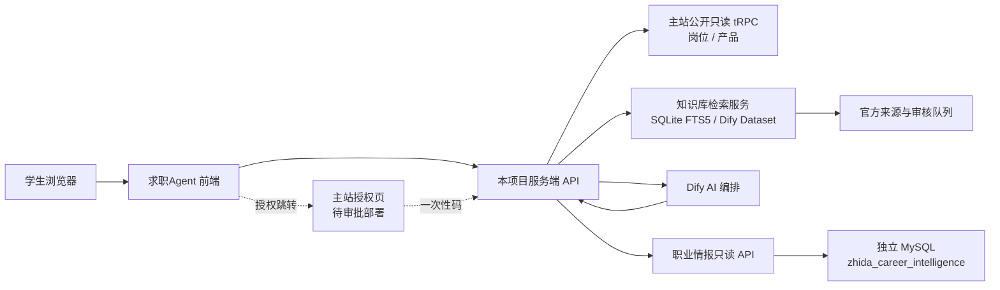

# 求职Agent 项目全景文档

> 文档名称：`PROJECT_DOCUMENTATION-AGENT.md`  
> 产品名称：求职Agent  
> 产品定位：面向学生的央国企职业规划、岗位决策与求职行动平台  
> 文档版本：v3.3  
> 最后盘点：2026-07-17（Asia/Shanghai）  
> 维护原则：先确认事实边界，再修改代码、数据库或部署

这是一份交接文档。新成员应先读本文件，再读对应目录下的代码和阶段报告。文档把“已经存在的代码”“仓库曾经记录的部署验证”“尚未接入的规划”分开写，不能只看一个状态词就判断系统已经生产可用。

当前最重要的结论：**主 Beta 页面和领域逻辑已形成，主站岗位/产品目录已有服务端只读适配，策略页也已接入独立职业情报的官方证据决策；Mac mini 上的独立情报 API 与知识库服务均在线。知识库当前保存 55 条文档，但不能统称为“55 篇正文”：确定性质量门禁将其分为 35 条可回答证据、20 条只用于发现详情页的栏目索引和 0 条残缺页。16 条当前由 Apple Vision 长图 OCR 补全，35 条原始 OCR 审计记录可追溯，当前低质量 OCR 为 0；47 个既有 Dify 映射均为 `synced` 且与本地正文 hash 一致，回答链只接受能映射回本地当前可回答正文、状态完成并符合学生已选企业的片段，栏目索引、残缺页、孤立远端记录、过期映射和错误企业证据都会被拒绝。相同当前版本与相同图片 hash 会复用已审计 OCR，避免同一长图重复同步时因 Vision 非确定性制造假版本；图片或引擎配置变化时才重新识别。企业门禁已同时存在于 Python 知识库和主项目 TypeScript 顾问层，支持“中广核/中国广核”“中石油/中国石油”等受控简称，并防止“航空工业惠阳/通飞”及“航天科技/航天科工”这类高度近似企业串线；短企业核心只允许精确或受控简称匹配，较长名称才保留有限 OCR 容错。多维问法保留 Dify 已命中的最多 1200 字官方片段，只从本地当前不可变正文补充缺失维度；最终引用上限 2500 字、最多展示 6 段，且先为用户明确询问的招聘对象、学历、专业、地点、投递、福利等维度分别取证，再补充普通相关片段；报名又细分结束点、入口和限报等子事实，送入模型的首来源预算仍为 1000 字。知识入库层已有两级公告安全闸门：同 URL 的截止日期、最低学历、毕业届别、投递次数或生命周期变化会隔离候选版本；新 URL 的更正、撤回、延期、暂停、恢复或部分岗位取消会建立可审计的跨公告关系审核，高置信候选旧公告也同步退出 FTS/Dify。人工批准后，明确“整批终止”或同时包含岗位/人数、招聘条件、报名信息与考试流程的完整恢复公告会接管旧公告；一句“恢复报名”的状态通知仍须对账。完整恢复公告接管暂停公告时会同时关闭原公告的暂停待对账链，避免路径永久卡在暂停；延期、补充、暂停和部分取消则继续隔离旧公告，直到完整现行岗位范围完成对账。跨已登记来源的精确原文链接只在新旧两端都是 `official + A/B` 时进入候选，中国广电同域延期、国家统计局跨域补充、江汽集团整批终止、建宁县单岗位取消和最高法“原始—暂缓—完整恢复”链已成为固定真实回归样本；第三方转载不会建立关系。短摘要升级为完整 OCR 正文仍可自动补全。AI 顾问已有目标企业相关性门禁、同集团/近名企业防串线、无证据拒答、确定性官方原文附录、明确结束点的时效核验和多招聘计划分源引用；11 个事实级回归场景在 Mac mini 真实 RAG + Dify 链路通过 11/11，覆盖校园与社会招聘、航天科技/航天科工双向隔离，并验证中国长城页面从标题残缺状态恢复为 2948 字完整 OCR 正文后能够只引用指定官方页回答。官方证据已扩至 62 个已核验岗位页、43 个去重证据快照，但相对 68,353 个当前岗位快照仍属于低覆盖。求职Agent 侧的主站资料/权益接力现已实现、通过本地模拟闭环并同步到 Mac mini 运行副本，包含一次性码、state、PKCE、最小快照校验、加密 HttpOnly 会话、显式填表核对和已购权益优先使用；Mac mini 未配置接力端点，`zhidaBridgeConfigured=false`，主站授权页与兑换端点也尚未获批部署，所以这不等于真实主站用户已经接通。大规模事实评测和正式公网主版本也尚未形成完整闭环。**

阅读建议：产品或新成员先读第 1–4、14、17 节；前端/后端开发重点读第 3、5–11、16、18 节；部署和数据维护人员必须先读第 9、12、13、15 节。遇到状态冲突时，以“当前代码 + 本轮只读验证”优先，阶段报告只代表其生成当时。

---

## 0. 五分钟交接摘要

如果只够先读这一节，应记住以下事实：

1. **产品不是聊天机器人，而是求职决策与执行平台。** 核心结果是可追溯的求职路径和行动，不是泛泛的 AI 回答。
2. **起点来自学生真实资料，终点来自真实在招岗位。** 当前匿名 Beta 的资料保存在本机；Agent 侧一次性只读接力已经实现并可本地模拟，正式使用仍等待主站授权端点。
3. **原始岗位、官方证据、知识正文是三种不同数据。** 原始岗位说明“市场上有什么”；官方证据决定“当前能不能投”；知识正文解释“为什么、如何准备”。
4. **硬规则不能交给模型猜。** 学历、专业、届别、截止时间只能由确定性规则和 A/B 级已核验证据改变；缺证据一律 `unknown`。
5. **商业化发生在真实卡点之后。** 已购买的服务主动提供功能，未购买的服务才作为可选解决方案出现；高风险或当前不可投的目标不能被营销包装成可投。
6. **主站与职业情报库严格隔离。** 当前只使用主站公开只读 API；独立 MySQL、知识库 SQLite 与 Dify 不得写入或替代主站数据库。
7. **当前主开发工作区是 `求职Agent`，情报基础设施在并行 worktree `求职Agent-career-intelligence`。** 两边均有未提交改动，不能混用路径或默认已推送。
8. **当前首要任务不是继续堆 UI 功能。** 主站侧只需补齐已设计的授权/兑换端点；主开发精力继续扩充公告变更表达样本、提高热门岗位官方证据和顾问事实覆盖。

当前开发判断顺序：

```text
确认工作区/分支
  → 确认问题属于 UI、领域规则、知识库、情报库还是部署
  → 只读验证真实状态
  → 修改最小范围
  → 跑对应测试
  → 本地验证不等于公网已部署
```

## 1. 一句话说明项目

求职Agent把学生的真实起点、当前在招岗位和可核验的官方招聘资料放在同一条求职路径上，输出“目标岗位 → 硬门槛 → 能力差距 → 行动成本 → 可选服务 → Offer”的决策闭环。

它不是单纯的聊天机器人，也不是泛化的岗位推荐器。核心对象是“求职路径”：

```text
学生档案
  → 真实岗位池
  → 学生选择一个或多个终点
  → 官方硬门槛核验
  → 路径风险与能力差距
  → 7 天/阶段行动
  → 只在真实卡点出现产品帮助
  → 持续执行并向 Offer 靠近
```

多个目标岗位会形成“求职网络”：共享的能力准备组成共同主干，企业或岗位专属要求形成分支。

## 2. 产品边界和成功标准

### 2.1 面向学生的主要价值

- 让学生知道自己目前在哪里，而不是只得到一句“你可以试试”。
- 让学生看到通往目标岗位需要补哪些能力、材料、经历和时间投入。
- 让学生看到每个目标的现实风险，并保留长期目标与当前替代机会。
- 让平台服务在学生真正卡住时出现，帮助完成简历、网申、面试、课程或岗位动作。
- 所有招聘事实都应能追溯到实时岗位、官方公告或可核验知识库资料。

### 2.2 明确不做的事情

- 不承诺“稳进、保录、内部名额”或伪造录取概率。
- 不把学历、专业或届别不满足的目标包装成当前可投。
- 不把资料缺失猜成符合；缺资料必须显示 `unknown`/“待核验”。
- 不自动投递、自动预约、自动购买或自动修改主站资料。
- 不把学生姓名、手机、身份证、简历原文、订单号等个人敏感数据写入职业情报库。
- 不直接从浏览器连接主站数据库、情报库、Dify 或模型服务。

### 2.3 “路径失败”的定义

产品不使用“路径失败”作为学生状态。以下情况要保留目标并明确风险：

- 当前学历或专业不满足公告硬门槛：`high-risk-long-term`，同时找同企业/相邻企业的可执行岗位。
- 当前批次已截止：`alternative-opportunity`，保留企业长期目标并寻找当前替代机会。
- 官方资料不足：`prepare-and-verify`，先补资料或人工核验。

真正禁止的是“虚假路径”：把不具备条件的目标显示成可直接投递，或把未知说成已确认。

### 2.4 商业闭环与产品触发原则

平台的商业模式不是先卖产品再找理由，而是先识别学生从起点到终点之间的真实缺口，再提供解决缺口的功能或服务。

```text
学生选择目标岗位
  → 系统识别硬门槛与能力缺口
  → 生成带时间/材料/完成标准的行动
  → 行动遇到卡点
       ├─ 用户已购买：直接弹出可使用功能
       ├─ 用户未购买：展示可选产品与适用原因
       └─ 当前目标不可投：先提示风险和替代机会，不做误导营销
```

产品触发必须同时满足：

- 有一个可解释的路径卡点，例如简历版本、网申材料、面试表达或岗位筛选；
- 产品确实解决该卡点，不能只靠关键词硬匹配；
- 已购/未购状态来自主站只读权益快照，未知时不得假装判断；
- 产品区与招聘事实区视觉和语义分离，始终标明“可选服务”；
- 不以“能保证录取”作为购买理由，不输出无法验证的成功概率。

商业化效果以后至少观察四类指标：路径创建率、首个行动完成率、卡点识别准确率、服务使用/购买后的行动解除率。成交额是业务指标，但不能替代路径真实性和行动完成质量。

---

## 3. 工作区、分支和真实来源

两个目录是同一个 Git 项目的并行 worktree，不能混用运行命令，也不能默认一个目录的改动已经同步到另一个目录。

| 工作区 | 分支 | 作用 | 当前入口 | 说明 |
| --- | --- | --- | --- | --- |
| `/Users/mr.zze/Desktop/项目中心/求职Agent` | `codex/rapid-beta-mvp` | 主 Beta 工作台、知识库适配层、用户路径 UI | `/`、`/v2`、`/progress` | 当前面向产品观察和主链路开发 |
| `/Users/mr.zze/Desktop/项目中心/求职Agent-career-intelligence` | `codex/career-intelligence-foundation` | 独立职业情报库、岗位快照、官方证据、只读情报 API | 独立前端与 `127.0.0.1:18080` | 影子/基础设施分支，阶段文档集中在其 `docs/` |

Git 远端：`git@github.com:axjlkeke/job-search-agent.git`。两个工作区当前都有大量未提交修改；不要把“本地文件存在”写成“GitHub 已发布”，也不要在未确认目标分支前合并或推送。

### 3.1 状态标记规则

后续文档、进度页和提交信息统一使用以下含义：

- **已实现**：代码、接口或测试在当前工作区可定位。
- **本轮已验证**：本轮命令或检查实际通过。
- **阶段报告记录**：在 `求职Agent-career-intelligence/docs/STAGE_*.md` 中有机器或远端报告，但本轮没有重新连接远端复核。
- **规划中**：有设计或契约，尚未完成接入。
- **禁止默认执行**：可能连接主站、生产、用户数据或产生外部写入，必须再次确认范围。

### 3.2 2026-07-17 当前状态快照

| 模块 | 当前状态 | 可以依赖的事实 | 不可误解为 |
| --- | --- | --- | --- |
| 主 Beta UI | 已实现，本地与 Mac mini 运行副本已更新 | `/`、`/v2`、`/progress` 和六个工作台视图存在；Mac mini 3000 已构建重启 | 公网域名已切换或已通过最终 UI 验收 |
| 主站岗位 | 已接入只读适配 | 服务端可调用公开 `job.list` 并规范化字段 | 已连接主站数据库或拥有写权限 |
| 产品目录 | 已接入只读适配 | 可读取公开 `product.list` | 未连接资料接力时已知用户买过什么、剩余几次权益 |
| 策略网络 | 已实现并接入官方决策 | 能生成共同主干、企业分支、风险与行动，并对选中岗位请求只读情报核验 | 每条路径都已有官方证据覆盖 |
| AI 顾问 | 代码与安全边界已实现，扩展事实回归已通过 | RAG、Dify、会话保护和匿名公开知识开关均真实可用；目标企业不匹配或只有残缺证据时 422 拒答；残缺页补成完整证据后可恢复回答；同集团/近名企业不再只靠宽松名称重叠；多维问题从本地当前正文按维度取样；明确截止日会按参考日期标注时效；多招聘计划分别引用；11 个固定场景通过 11/11 | 已接入正式登录授权，或 11 个样本代表完整央国企覆盖与模型质量验收 |
| Python 知识库 | OCR 稳定复用、目标企业与多维正文门禁版已部署，本地与 Mac mini 均 90 项测试通过 | 55 条保存文档分为 35 条可回答、20 条发现索引、0 条残缺；同图同版本复用 OCR 审计，SQLite 与 Dify 共用本地角色/状态/hash/目标企业门禁；短近名企业精确隔离，多维问题保留已有命中并只从本地当前正文补缺；另有不可变版本、同/跨 URL 变化隔离、恢复链闭环和覆盖率报告 | 已经拥有完整央国企知识库、保存页面数等于正文数，或向量相似结果可以绕过学生已选企业 |
| 独立职业情报库 | 已运行、只读核验通过 | 独立 MySQL、16 张业务表、3 个视图、只读 API 在线 | 可以修改或替代主站数据库 |
| 官方证据 | 受限批次已扩充 | 2026-07-17 只读健康核验为 62 个已核验官方岗位页、43 个去重证据快照 | 68,353 个岗位都已核验；页面数与去重快照数必须一一相等 |
| 用户档案/权益接力 | Agent 侧已实现并同步 Mac mini，正式能力安全关闭 | 一次性码、state、PKCE、最小快照、加密会话、显式核对、断开和权益优先触发均有代码与测试；远端状态为 `zhidaBridgeConfigured=false` | 主站授权页已部署、真实登录用户已接通或生产数据库已被读取 |
| 公网域名 | 有历史影子验证 | 阶段 I 记录过 `tokensoff.com` 影子上线 | 当前公网一定指向本工作区最新代码 |

### 3.3 系统架构与数据归属



数据归属必须保持清楚：

| 数据 | 权威来源 | 本项目当前处理方式 | 是否允许写入 |
| --- | --- | --- | --- |
| 登录、用户、订单、会员权益 | 职达主站 | Agent 侧最小快照接力已实现；主站授权端点待部署；连接后只存本项目加密 HttpOnly 会话 | 未经批准不允许写主站；Agent 只写自身 Cookie |
| 在招岗位、公开产品 | 主站公开 tRPC | 服务端只读拉取并转成领域字段 | 不允许 |
| 匿名预览档案、目标、任务完成状态 | 当前浏览器 | `localStorage` 保存 30 天 | 仅当前浏览器可写 |
| 企业、学校、岗位快照、证据、历史线索 | 独立职业情报库 | 线上 API 只读；批处理账号最小权限 | 仅独立追加流程、需明确批准 |
| 知识正文、版本、同/跨 URL 审核关系 | Python 知识库 SQLite / Dify Dataset | 独立知识库服务维护；机器只提出候选，运营批准后才改变当前/被替代状态 | 只允许知识库同步与显式审核流程 |
| 模型回答 | 临时生成 | 必须引用检索资料，不作为事实库 | 不得反写硬规则 |

---

## 4. 用户端完整路径

### 4.1 建档：确认学生起点

当前 Beta 的建档字段包括：

- 姓名（当前仅本地预览保存）
- 学校、学校层级、学历
- 专业、毕业年份
- 当前城市、意向城市
- 求职方向/行业
- 每周可投入小时数
- 六类能力状态：简历、网申材料、面试表达、项目证据、实习经历、竞赛经历

领域类型中还定义了更细的能力键：`resume`、`application`、`interview`、`target_research`、`project_evidence`、`qualification`、`internship`、`competition`、`academic`。UI 首版只采集其中六类，不能把未采集项误写成已完成。

当主站资料接力配置并成功连接时，档案页先显示已接入的最小档案和可用功能数量，学生点击“填入表单并核对”后才把学校、学历、专业、届别、偏好和有限能力状态写入表单。主站快照不提供姓名，表单使用已有本地称呼或“同学”；学生仍须点击保存才进入岗位匹配。

学生档案当前保存在浏览器 `localStorage`：

- 键名：`job-agent-workspace-v1`
- 默认保留：30 天
- 建档页提供清除本机资料
- 当前不支持跨设备同步，也不代表已连接主站登录态

接力会话与本地工作区不是一回事：接力资料/权益存在本项目加密 HttpOnly Cookie，浏览器脚本不能读取；保存后的匿名档案、目标和任务仍按上述规则存在 `localStorage`。断开接力只清除 Cookie，不会自动删除已由学生确认保存的本机档案。

### 4.2 推荐岗位：确定终点候选

岗位来自主站的服务端只读接口，不由模型编造。系统可以按专业、学历、届别、城市、企业关键词筛选，并显示：

- 企业和岗位名称
- 岗位类型、学历原文、专业要求原文
- 工作地点
- 投递开始/截止时间
- 来源系统和更新时间
- 是否当前可申请

用户最多同时选择 3 个目标岗位。数量限制用于保持路径清晰，并不代表未来不能扩展。

### 4.3 生成策略网络：共同主干 + 企业分支

策略网络由 `buildStrategyNetwork` 生成：

- 先把多个目标的共同能力合并为主干任务。
- 再为每个企业/岗位保留资格核验、岗位情报和专属能力分支。
- 每个任务必须有完成标准，而不是只有“提升自己”这种口号。
- 生成固定的 7 天聚焦行动，同时保留后续阶段计划。

### 4.4 执行行动：把成本说清楚

每个行动应回答四件事：

1. 为什么现在做；
2. 需要学生投入多少时间或材料；
3. 什么结果算完成；
4. 完成后会解除哪一个卡点。

行动状态刷新后应保持。当前 Beta 在浏览器本地保存完成状态；未来应迁移到登录用户的服务端状态。

### 4.5 服务触发：只在卡点处出现

产品不是首页广告位，而是路径上的可选解决方案：

- 简历卡点 → 简历指导/简历优化
- 网申材料卡点 → 网申指导
- 课程缺口 → 相关课程
- 面试表达卡点 → 面试指导/模拟面试
- 岗位选择或投递卡点 → 岗位匹配与投递建议

未连接主站资料接力时，前端只有公开产品目录，因此不能声称学生“已购买”。接力会话中的 `access.features[].allowed=true` 会被严格缩减成简历、网申/投递、面试三类功能权益，并在同类卡点中优先显示“直接使用”；没有被快照确认的服务仍只能作为可选营销。当前不把会员等级等同于某个具体产品，也不推断剩余次数。

### 4.6 功能优先级

| 优先级 | 功能 | 目的 | 当前状态 |
| --- | --- | --- | --- |
| P0 | 建档、真实岗位、目标选择 | 确定起点和终点 | 本地 Beta 已实现；Agent 侧资料接力已实现，主站端点待部署 |
| P0 | 官方门槛、风险状态、替代机会 | 防止虚假路径 | 规则、情报接口和策略页证据展示已接通；覆盖率仍低 |
| P0 | 策略网络、七日行动、完成标准 | 把建议变成执行 | 已实现本地状态 |
| P0 | 资料引用与未知降级 | 防止 AI 编造 | 接口安全边界已实现；真实知识覆盖不足 |
| P1 | 已购权益识别、卡点触发服务 | 形成服务闭环且避免重复营销 | Agent 侧权益消费和优先触发已实现；真实权益等待主站接力端点 |
| P1 | 服务端保存路径和行动状态 | 跨设备持续执行 | 规划中 |
| P1 | 主站一次性只读档案接力 | 消除重复填写 | Agent 侧已实现并本地端到端通过；主站授权/兑换端点待审批与部署 |
| P2 | 模拟面试、简历优化工作流 | 深化付费服务 | 只保留入口/规划，不算闭环 |
| P2 | 投递、预约、购买 | 完成交易与动作闭环 | 未开放，必须逐步确认 |
| P2 | 小程序/桌面端 | 扩展终端 | 先完成网页版后再做 |

### 4.7 用户角色与权限预期

| 角色 | 主要任务 | 可见数据 | 不应拥有的权限 |
| --- | --- | --- | --- |
| 学生 | 建档、选目标、执行行动、使用已购功能、咨询 AI | 本人档案、本人路径、公开岗位和已授权权益 | 查看他人资料、直接访问下游数据库或密钥 |
| 内容/运营 | 审核来源、处理异常资料、维护产品与卡点映射 | 公开知识、审核队列、聚合覆盖率 | 查看不必要的学生敏感信息、修改主站数据库 |
| 求职顾问 | 在学生授权范围内辅助核验路径和行动 | 学生主动授权的最小资料和当前路径 | 批量导出完整用户资料、绕过硬门槛 |
| 开发/运维 | 维护代码、部署、健康检查和备份 | 最小化日志、聚合状态、受限服务配置 | 把密钥下发浏览器、用线上只读账号写数据 |
| 独立同步任务 | 追加公开岗位/证据/知识版本 | 已审核公开来源和独立库 | 读取学生 PII、连接或修改主站生产库 |

正式多用户版本必须在服务端按用户隔离档案、目标、任务、对话和权益；浏览器 `localStorage` 只是一种匿名预览降级，不能作为正式权限模型。

---

## 5. 前端路由和组件

### 5.1 主工作区（`求职Agent`）

| 路由 | 用途 | 代码入口 |
| --- | --- | --- |
| `/` | 默认产品工作台 | `app/page.tsx` → `AgentWorkspace` |
| `/v2` | Studio 版新版工作台，保留独立观察入口 | `app/v2/page.tsx` |
| `/progress` | 开发里程碑、边界与验收状态 | `app/progress/page.tsx` |

工作台视图：

1. `overview`：策略总览，显示今天最该做的事；
2. `profile`：学生档案；
3. `jobs`：在招岗位和目标选择；
4. `strategy`：策略网络与风险；
5. `tasks`：七日行动；
6. `advisor`：AI 顾问和知识库解释。

核心文件：

- `app/AgentWorkspace.tsx`：页面状态、交互、视图编排和数据请求。
- `app/AdvisorThread.tsx`：顾问对话展示。
- `app/VisualAsset.tsx`：界面视觉资产占位/渲染。
- `app/career-strategy.module.css`、`app/globals.css`：工作台和全局样式。
- `lib/career/types.ts`：领域类型。
- `lib/career/eligibility.ts`：学历、专业、届别、截止时间等确定性判断。
- `lib/career/strategy.ts`：多目标策略网络和行动生成。
- `lib/career/live-job.ts`：主站岗位字段规范化。
- `lib/career/intelligence.ts`：把职业情报决策转换为主领域的资格结论，并最小化发送的学生字段。
- `lib/career/catalog.ts`、`lib/career/major.ts`：产品目录与专业映射。

### 5.2 职业情报分支前端

`求职Agent-career-intelligence/app/AgentWorkspace.tsx` 的视图更偏情报验证：AI 规划师、行动计划、真实决策、简历中心、面试训练。它显示“匿名预览”，并通过同源 `/api/intelligence` 访问只读情报服务。

注意：该分支 README 仍保留“原型模式/API 待接入/演示数据”的前端说明；这只描述前端产品壳，不能覆盖其 `docs/STAGE_B` 到 `STAGE_I` 对后端情报库的阶段报告。开发时要分别判断“前端是否接入”和“后端阶段是否已验证”。

### 5.3 前端技术栈

| 项目 | 当前选择 | 说明 |
| --- | --- | --- |
| 应用框架 | Next.js 16.2.6 + React 19.2.6 | App Router 风格目录，服务端 API 与页面同仓 |
| 本地/构建运行 | Vinext 0.0.50 + Vite 8 | `npm run dev/build/start` 由 Vinext 执行 |
| 语言 | TypeScript 5.9 | `strict` 类型检查由 `npm run typecheck` 验证 |
| AI UI | `@assistant-ui/react` | 顾问会话组件基础 |
| 图标 | Phosphor Icons | 禁止用 emoji 充当产品图标 |
| 样式 | CSS Modules + 全局 CSS | 当前没有把页面重构为第三方整套组件库 |
| 公网入口 | Cloudflare Tunnel | 只转发前端端口，内部服务保持回环监听 |

### 5.4 已确定的 UI/UX 方向

产品骨架已确定为“策略总览、档案、岗位、策略网络、行动、AI 顾问”六个主要视图，当前设计迭代原则是**不随意改变信息架构，重点改善视觉层级、可读性和行动感**。

- 主色采用正常黑白/中性灰，避免大面积花哨配色和廉价渐变；状态色只用于风险、完成与提示。
- 字号和间距要让学生一眼看到“终点、当前差距、下一步”，不能把所有信息压成同一视觉重量。
- 关键首屏允许使用协调的长幅背景图或编辑感图形；岗位终点、策略准备度和路径网络可使用信息图、示意图或轻动效加强理解。
- 图片、图标、图形分别承担场景、导航和结构说明，不能把占位符简单替换成无意义小图形。
- 不使用 emoji；图标风格、线宽、圆角、明暗和动效节奏必须统一。
- 不为了“看起来智能”堆叠发光、玻璃拟态、过密卡片或大段 AI 文案。
- 移动端优先保证下一步行动和底部导航可用；桌面端再增加并列信息，不让移动端变成缩小的后台系统。
- 产品文案使用人话，优先回答“我现在该做什么、为什么、要付出什么、做完算什么”。

设计验收不只看页面能否渲染，还要检查：首屏是否有明确终点、主行动是否唯一、风险是否可读、长页面是否有阶段收束、图片是否有意义、以及 390px 宽度下是否仍能完成核心路径。

---

## 6. 主项目服务端 API

浏览器只调用本项目服务端路由，密钥和下游地址不进入浏览器。

| 接口 | 作用 | 当前边界 |
| --- | --- | --- |
| `GET /api/jobs` | 读取并规范化主站在招岗位 | 只读；默认调用主站 `job.list` |
| `GET /api/products` | 读取在线产品目录 | 只读；不能确认用户购买状态 |
| `GET /api/system/status` | 返回岗位、职业情报、RAG、Dify、会话保护状态 | 只返回布尔状态和白名单计数，不返回密钥/地址 |
| `POST /api/zhida-connect/start` | 生成 state、PKCE 和主站授权跳转 | 未配置可信同源端点与 32 位以上专用密钥时 503 关闭 |
| `POST /api/zhida-connect/complete` | 服务端用一次性码兑换脱敏快照并签发本项目会话 | 请求体 8 KB、上游响应 128 KB、10 秒超时；敏感字段/错误来源/版本/隐私合同一律拒绝 |
| `GET /api/zhida-connect/session` | 返回已缩减的档案、权益和会员摘要 | 只读取加密 HttpOnly Cookie，不返回主站 token 或原始快照 |
| `DELETE /api/zhida-connect/session` | 断开资料接力 | 清除本项目会话，不修改主站资料或登录态 |
| `GET /api/intelligence/v1/jobs/search` | 同源代理职业情报岗位搜索 | 仅精确白名单路径、15 秒超时 |
| `POST /api/intelligence/v1/decisions/evaluate` | 让只读情报服务核验目标岗位 | 请求体最多 16 KB，不转发 Cookie/Authorization |
| `POST /api/advisor` | RAG 检索后调用 Dify，校验引用并返回答案 | 没有有效资料或配置时拒答 |

岗位接口对外输出的是领域字段，不直接把主站原始 JSON 全量透传。岗位筛选目前覆盖央企/国企校招及实习场景，并使用有限专业代码映射；未知字段保持未知。

`/api/system/status` 的职业情报探测只有在下游明确返回 `status=ok`、`accessMode=read-only`、`containsStudentPii=false` 时才会显示在线。可公开的计数采用字段白名单；数据库地址、账号和内部响应不会下发到浏览器。

### 6.1 AI 顾问请求链路

```text
浏览器
  → /api/advisor
  → 会话与限流检查
  → RAG_API_URL 检索
  → 规范化、限制数量、按目标企业过滤
  → DIFY_API_URL 流式请求
  → 校验 [资料1] 等引用
  → 按实际 citedSourceIds 绑定引用
  → 多目标分别附官方原文，并核验明确截止日
  → 返回带依据的回答
```

硬规则先于模型解释。Dify 不能改变学历、专业、届别或截止时间的确定性结论。

答案必须满足：

- 至少包含一个有效的 `[资料N]` 引用；
- 引用编号不能越界；
- 返回给浏览器的 `citedSourceIds` 必须与答案内编号和引用列表一一对应；
- 多个招聘计划必须分开陈述，不能把甲公告的投递次数、学历或截止时间套给乙公告；
- 公告原文明确给出报名/投递截止日时，以请求 `validAt` 或服务端当天为参考日期，过期机会必须写“已截止”，但仍可作为历史路径依据；
- RAG 无结果、Dify 流程失败、流提前结束时拒绝展示确定性答案；
- 事实、推断、建议分开表达；
- 没有资料时说“未知/待核验”，不补写常识作为公告事实。

---

## 7. 真实知识库与 RAG

知识库服务位于 `services/knowledge-base`，是一个独立的 Python FastAPI 服务：

- SQLite WAL 保存来源、文档、不可变正文版本、同步记录、Dify 映射和审核队列；
- SQLite FTS5（中文优先 `trigram`）提供本地检索；
- 配置 Dify Dataset 后优先使用远端混合检索；远端不可用或无结果时回退本地 FTS5；
- Dify 创建/更新是异步过程，只有远端批次返回同一个文档且状态为 `completed` 才把本地映射标为 `synced`；
- 文档被确定性分为 `evidence`、`discovery_index`、`content_stub`；只有 `evidence` 进入回答，发现索引保留用于继续抓详情页，残缺页进入 `content_quality` 审核；
- Dify 检索片段会按远端文档 ID 回查本地不可变事实，只有本地当前正文可回答、映射 `synced` 且 hash 一致才保留，再补齐标题、URL 和发布日期并合并同一文档的重复片段；孤立远端记录不可信；
- 请求带 `target.companies` 时，Dify 与 SQLite 结果必须再次命中选定企业或受控简称；企业目标优先于岗位名，明确企业无资料时返回空结果，不能拿岗位相似但企业错误的公告替代；
- 同一 URL + 同一正文 hash 不重复建版本；正文变化才追加新版本；
- 抓取/解析失败进入 `review_queue`，不伪装成已成功资料；
- 本地增强版支持来源主机白名单、包含/排除路径、跳转后最终 URL 复核和最多 50 个来源的受限批量同步；
- 本地增强版支持覆盖率报告，分开统计“已登记、已启用、已保存页面、可回答证据、发现索引、残缺页、从未同步、过期、待审核”，避免把抓取数量误写成知识覆盖；
- Mac mini 优先使用 Apple Vision 高精度中文 OCR，按 3000 像素高度切分超长海报；Vision/非 Mac 环境失败时回退 Tesseract；
- 清洗后的 OCR 正文进入检索，原始输出、图片 hash、引擎配置和质量分数写入独立 `ocr_artifacts` 审计表；低质量正文不发送 Dify，并进入审核队列；
- Bearer 鉴权可选，但生产必须配置强随机 `KB_API_KEY`。

知识库与职业情报库不是同一个系统：知识库保存可检索的正文和版本，用于回答与解释；职业情报库存结构化岗位快照和官方证据，用于确定性决策。两边可以引用同一个官方页面，但不得用模糊文本检索结果直接覆盖结构化硬门槛。

### 7.1 启动

```bash
cd /Users/mr.zze/Desktop/项目中心/求职Agent/services/knowledge-base
python3 -m venv .venv
source .venv/bin/activate
pip install -r requirements.txt
cp .env.example .env
set -a && source .env && set +a
python -m app.cli init
uvicorn app.main:app --host 127.0.0.1 --port 8001
```

健康检查：

```bash
curl http://127.0.0.1:8001/health
```

### 7.2 知识库接口

- `GET /health`：健康检查，不要求鉴权。
- `GET /stats`：来源、保存文档、版本、同步、审核队列，以及 `retrievableDocuments`、`discoveryDocuments`、`contentStubs`。
- `GET /coverage?stale_after_days=14`：来源启用、保存页面、可回答证据/发现索引/残缺页、陈旧和待审核报告；需鉴权。
- `GET /sources`：来源注册表。
- `POST /search`：检索真实正文，返回 `results[]`。
- `POST /sources`：登记来源。
- `POST /sources/{id}/sync`：同步单个已启用来源。

默认 `examples/sources.json` 有 4 个官方企业招聘入口，且 `enabled=false`。它们只是待审核种子，不代表已经抓取完整央国企资料，也不代表岗位覆盖率。`examples/verified-sources.json` 是已核对域名与栏目范围的候选来源包；导入会写入独立知识库来源注册表，执行前仍要确认当前机器网络、来源等级和抓取范围。

本地增强版 CLI：

```bash
# 单个来源
python -m app.cli sync "来源名称"

# 全部已启用来源；limit 仍受代码 50 的硬上限约束
python -m app.cli sync --all --limit-sources 20

# 对账 Dify 创建/更新后的异步索引批次
python -m app.cli dify-reconcile --limit 200

# 查看覆盖率，不等同于岗位覆盖率
python -m app.cli coverage --stale-after-days 14
```

Mac mini 定时入口为 `infra/macmini/run-kb-sync.sh`，LaunchAgent 模板为 `com.tokensoff.kb-sync.plist.template`，计划每天 04:10 运行。文档存在和本地脚本通过检查不等于定时任务已经安装；必须在目标机器上同时验证 plist 已加载、日志有运行记录、覆盖率发生预期变化。

### 7.3 来源治理与抓取安全

每个来源都应明确：

- `allowed_hosts`：允许访问的官方主机；
- `include_paths`：只允许进入的栏目路径；
- `exclude_paths`：登录、搜索、用户中心等明确排除路径；
- `follow_links` 与 `max_documents`：是否跟随链接和单次最大正文数；
- `source_grade`、标签、来源类型与启用状态。

同步器会拒绝回环、内网、保留地址和越界跳转。在使用透明代理 fake-IP DNS 的 Mac 上，只能显式开启 `KB_ALLOW_FAKE_IP_DNS=true`，且只放行 `198.18.0.0/15` 中、同时命中来源 `allowed_hosts` 的域名；直接访问 IP 字面量仍拒绝。`KB_PROXY_URL` 只允许指向本机代理，当前 Mac mini 没有可依赖的 `127.0.0.1:7897` 监听，因此不能照抄一个不存在的代理地址。

2026-07-17 验证发现 Mac mini 对国资委 HTTPS 抓取存在连接问题，而 HTTP 页面可达。若使用 HTTP 候选源，必须降为 B 级并保留正文 hash、版本和审核记录，不能因为发布方是官方机构就忽略传输安全差异写成 A 级。

### 7.4 RAG 请求契约

```json
{
  "query": "计算机专业想进国家电网应该准备什么？",
  "topK": 6,
  "profile": {
    "degreeLevel": "本科",
    "major": "计算机科学与技术",
    "graduationYear": 2027
  },
  "target": {
    "companies": ["国家电网"],
    "jobTitles": ["信息技术"]
  },
  "filters": {
    "validAt": "2026-07-17",
    "status": "recruiting"
  }
}
```

返回的每条资料至少要有标题和正文片段：

```json
{
  "results": [
    {
      "id": "document-or-segment-id",
      "title": "官方招聘公告",
      "snippet": "与问题相关的原文片段",
      "url": "https://official.example/notice/1",
      "publishedAt": "2026-07-01",
      "score": 0.91
    }
  ]
}
```

### 7.5 环境变量

主项目 `.env.example` 是服务端配置模板，关键变量为：

- `ZHIDA_TRPC_URL`：主站 tRPC 地址；
- `RAG_API_URL`、`RAG_API_KEY`：知识库检索；
- `DIFY_API_URL`、`DIFY_API_KEY`：Dify 应用；
- `CAREER_INTELLIGENCE_API_URL`：职业情报只读 API，运行时代码和 `.env.example` 默认 `http://127.0.0.1:18080`；
- `ADVISOR_SESSION_SECRET`：至少 32 位随机值；
- `ADVISOR_ALLOW_ANONYMOUS_PUBLIC_KB`：默认 `false`，含个人或内部资料时不得开启。
- `ZHIDA_AGENT_AUTHORIZE_URL`、`ZHIDA_AGENT_EXCHANGE_URL`：主站一次性授权与兑换地址；正式环境必须同属一个 HTTPS origin，本地只允许回环 HTTP；
- `ZHIDA_AGENT_SESSION_SECRET`：至少 32 位的接力专用加密密钥，不得与顾问会话或主站密钥复用；
- `ZHIDA_AGENT_AUDIENCE`：一次性码受众，默认 `job-search-agent`。

所有密钥只能存在服务端环境或 Mac mini 受限 secrets 目录；不能使用 `NEXT_PUBLIC_` 暴露。

知识库自身还使用 `KB_DATABASE_PATH`、`KB_API_KEY`、`DIFY_DATASET_ID`、`DIFY_DATASET_API_KEY`、`KB_ALLOW_FAKE_IP_DNS` 和可选 `KB_PROXY_URL`。图片公告识别另使用 `KB_VISION_OCR_PATH`、`KB_TESSERACT_PATH`、`KB_TESSDATA_DIR`、`KB_OCR_TIMEOUT_SECONDS`、`KB_OCR_MAX_IMAGES`、`KB_OCR_TRIGGER_CHARS`；两种引擎都没有配置时 OCR 保持关闭。`DIFY_API_KEY` 是聊天应用密钥，`DIFY_DATASET_API_KEY` 是知识库 Dataset 密钥，两者不能混用。

### 7.6 当前知识库状态边界

2026-07-17 对 Mac mini 的只读健康核验结果：知识库 `status=ok`、已开启鉴权、已配置 Dify Dataset；这只证明服务和配置存在，不证明每条资料已成功同步或每个问题都能得到正确引用。

同日部署实例最新只读统计为：11 个已登记来源、6 个已启用来源、55 条当前保存文档、104 个不可变版本、37 次同步、4 个待审核项。动态质量分类为 35 条可回答证据、20 条发现索引、0 条残缺页；47 个既有 Dify 映射均为 `synced`，`queued=0`、`error=0`，且映射状态/hash 不一致数为 0。16 条文档具有 `ocrStatus=completed` 且当前全部使用 Vision，当前 `ocrNeedsReview=0`；35 条 OCR 审计记录保留了历史 Tesseract/Vision 原始输出。回答链只接受其中与本地可回答当前正文和 hash 一致的记录。保存文档数量不能直接写成“正文覆盖”。

范围白名单、受限批量同步、待审核项去重和 `/coverage` 已增量发布到 Mac mini：

- 未鉴权访问 `/coverage` 返回 401，使用服务端运行密钥返回 200；
- 首次受限同步处理 6 个启用来源，5 个成功、1 个部分成功，检查 35 篇并新增/更新 32 篇；
- 国资委招聘栏目成功保存 30 个页面；其中历史栏目索引只用于发现详情页，不作为回答证据；
- Dify 异步对账会把处理中状态保留为 `queued`；错误、暂停、未知状态、文档 ID 不匹配或正文 hash 已变化时进入审核，不会误升级为成功；
- OCR 受限同步处理国资委招聘来源 30 个页面，成功 30、失败 0、正文变化 29；知识库由 35 篇增至 47 篇，天翼云公告由 47 字增至 1520 字；
- Vision 升级再次受限处理同一 30 个页面，两轮均成功 30、失败 0、正文变化 15；超长海报切片后，15 篇当前 OCR 正文全部转为 Vision，原先 6 篇 Tesseract 兜底不再作为当前正文；
- 2026-07-17 17:21 后新增“当前版本 + 图片 hash + OCR 引擎配置”复用门禁；原 30 页范围再次同步为 `seen=30 / changed=0 / errors=0`，证明同一长图不再因 Vision 输出抖动产生假版本；
- 国资委招聘来源仍限定 `www.sasac.gov.cn` 和 `/n2588035/n2588325/n2588350/`，单次上限从 30 提到 50；正式扩容为 `seen=50 / changed=9 / errors=0`，其中 8 条是只用于发现的历史索引，1 条是中国长城博士招聘从 51 字残缺页恢复为 2948 字完整证据；Dify 对账 `selected=1 / synced=1 / failed=0`，扩容后整批复跑为 `seen=50 / changed=0 / errors=0`；
- 扩容没有新增待审核项，原有 4 条超时、动态页面或 TLS 问题保持不变；独立 SQLite `quick_check=ok`，备份位于 `~/Backups/tokensoff/releases/20260717-172118-kb-coverage-expansion`，10 个归档文件的清单自校验全部通过；
- 12 条已经恢复的旧“正文过短”审核项自动关闭，审核队列只保留 4 条真实未解决的超时、动态页面或 TLS 问题；
- 远端真实查询“中国电信天翼云2027届超级优才招聘”使用 `engine=dify`、`fallbackUsed=false`；同一文档最多合并 3 个高相关片段，首条片段 1146 字并同时覆盖城市、投递要求和技术方向；
- `/api/advisor` 端到端请求返回 200、`available=true`、`evidenceRetrieved=true`。本地 1.5B 模型能归纳事实但没有稳定输出引用标记，因此服务端拒绝未经校验的模型文字，改为同一官方资料最多六段、按用户询问维度优先覆盖的原文摘录并保留 `[资料1]`；
- 顾问检索结果会在进入模型和浏览器之前按已选企业再次过滤。即使来源真实且属于官方，如果标题与片段不包含目标企业或受控简称，也不得用来回答当前目标；全部不匹配时返回 `422 / NO_GROUNDED_EVIDENCE`；
- 长度不足 8 个字符的企业核心只允许精确匹配或受控简称；较长名称的有限 OCR 容错必须达到至少 80% 的连续二元片段覆盖，且至少命中 3 个片段。“航空工业惠阳/通飞”和“中国航天科技/中国航天科工”均不得互相命中，常见“中广核/中国广核”“中石油/中国石油”仍走受控变体；
- 单目标回答附最相关的一份官方资料；明确比较多个企业或岗位计划时最多附两份分源原文。列表页优先级低于具体公告页，不能用栏目索引替代公告；
- 通过引用校验的模型答案仍会附与问题最相关的“已核验资料原文”。招聘事实覆盖不再依赖模型是否主动重复每个字段，模型负责解释，确定性片段负责核验；
- 原文中明确连接“报名/投递”和“截止”的日期，以及“报名时间即日起至某日”这类明确结束点，会被确定性解析；按 `reference_date` 判断后追加“已截止/尚未到截止日”，不把过期机会伪装成在招；
- 每日 04:10 LaunchAgent 已加载，安装后 `runs=0`，证明没有因安装误触发；首次同步由本轮明确手动执行。

OCR 当前在 Mac mini 使用 Apple Vision `accurate` 模式、`zh-Hans + en-US` 和语言纠错；大于 3000 像素的长海报按 80 像素重叠分片。Tesseract 5.5.0 与固定 `tessdata_fast 4.1.0` 仍作为兜底，中文模型 SHA-256 为 `a5fcb6f0db1e1d6d8522f39db4e848f05984669172e584e8d76b6b3141e1f730`。准备脚本会先校验 checksum 并编译 Vision 工具；OCR 只负责可追溯文本提取，不能作为学历、专业、届别等硬门槛的唯一依据。

### 7.7 顾问事实级回归契约

事实评测不是检查“回答有没有 `[资料N]`”这么简单，而是检查指定问题、指定目标、指定官方页面和指定关键事实是否同时成立。固定入口：

```bash
# 默认验证本机 3000；远端或其他端口使用 ADVISOR_BASE_URL 覆盖
npm run eval:advisor-facts
```

当前样本定义在 `evals/advisor-factual-cases.json`，执行器为 `scripts/evaluate-advisor-facts.mjs`。执行器只认可 `citedSourceIds` 实际引用到的资料，不再把“接口返回了该 URL、但答案没有引用”算作通过。2026-07-17 Mac mini 结果为 11/11：

| 场景 | 必须成立 | 本轮结果 |
| --- | --- | --- |
| 天翼云 2027 超级优才 | 命中指定国资委公告；回答含技术方向、工作城市、一次投递/一个意向 | 200，通过 |
| 中广核聚核体验营 | 命中指定国资委公告；回答含 2027–2028 届、本硕博和报名信息 | 200，通过 |
| 国资委委属事业单位 2026 招聘 | 命中指定公告；覆盖对象、本科及以上、一个岗位、2026-05-29 17:00，并以 2026-07-17 判断已截止 | 200，通过 |
| 航空工业惠阳设计岗位 | 不能串到航空工业通飞；覆盖保定、学历、专业和简历邮件命名格式 | 200，通过 |
| 天翼云超级优才 vs TeleAI Top Talent | 必须同时实际引用两份指定公告；分开写方向、人群和投递方式；TeleAI 不得无条件继承天翼云“一次投递” | 200，通过 |
| 航天科技集团 2027 提前批 | 不能串到航天科工；必须命中指定航天科技公告，并从本地当前正文覆盖两类毕业生、需求专业、北京/西安等地点和 `www.spacetalent.com.cn` | 200，通过 |
| 航天科工集团 2027 校招 | 反向不能串到航天科技；必须命中指定航天科工公告，并覆盖招聘单位分布、北京户口、六险两金、人才公寓和 `casicjob.iguopin.com` | 200，通过 |
| 南网共享公司 2026 社会招聘 | 必须覆盖本科及以上、博士/硕士/本科对应工作年限、每人一岗、系统外报名入口和 2026-07-06 17:00，并以参考日判断已截止 | 200，通过 |
| 中国建科 2026 校园招聘 | 必须覆盖境内应届生与国（境）外初次就业人群、计算机专业单位、落户/企业年金和投递—笔试—面试—体检流程 | 200，通过 |
| 中国长城全球博士人才招聘 | 残缺页已由同一官方长图恢复为完整正文；必须只引用 `/c35432080/content.html`，覆盖 2026 届/优秀往届博士、北京/深圳、六险二金、人才公寓、2026-07-31 17:00 和邮件主题 | 200，通过 |
| 虚构企业“火星轨道粮油集团” | 不能拿其他真实央企公告拼接答案 | 422 `NO_GROUNDED_EVIDENCE`，通过 |

这组评测曾真实暴露过“检索到官方资料，但属于错误企业”“航天科技/航天科工近名串线”“多维问题只截到公告前半段”“同一报名分面只取一段而漏掉截止时间/入口/限报”“福利段被单位分布与投递段挤掉”“标题残缺页被当作正文”“资料有关键字段，模型回答却漏写”“过期公告没有明确写已截止”和“比较两套计划时只实际引用一份资料”的问题。v2 基线在旧运行代码上为 4/6；修复后同一 Mac mini 真实链路为 6/6；将中国长城残缺证据缺陷固化后，v3 为 7/7；加入航天科技近名隔离和多维正文覆盖后，v4 为 8/8；加入航天科工反向隔离、南网社会招聘和中国建科校园招聘后，v5 当前运行版基线为 9/11，通用分面与时效修复后为 11/11。v6 保持总数 11，将已经失效的“中国长城残缺拒答”契约升级为“完整正文恢复后只引用指定公告回答”，真实链路仍为 11/11。11/11 只证明这十一个代表性场景，不代表完整央国企问题已验收。后续每修复一个事实错误或恢复一条证据，都应把对应最小案例加入或升级这组回归，而不是只做一次人工问答。

中广核长图还暴露了 Vision 把紧凑海报标签“报名方式/报名截止时间”识别成“报多方式/报多截止时间”的稳定错字。当前只在顾问原文摘录清洗层对这两个无歧义短语做上下文纠正；知识库 `ocr_artifacts.raw_text`、正文版本和原始引用片段保持不变，便于审计。不得把这种局部规则扩大成通用字符替换。

---

## 8. 决策规则和路径状态

### 8.1 硬门槛

当前确定性规则至少覆盖：

- 学历层次；
- 专业/专业类别；
- 毕业年份/届别；
- 投递截止时间；
- 官方页面明确写出的其他硬条件（后续扩展）。

每个门槛只能是：

- `met`：有有效证据且学生满足；
- `not_met`：有有效证据且学生当前不满足；
- `unknown`：证据缺失、资料缺失或规则无法安全解析。

### 8.2 路径状态

| 状态 | 含义 | 必须给学生的下一步 |
| --- | --- | --- |
| `direct-apply` | 官方硬门槛均满足且当前可投 | 进入投递准备，保留公告证据 |
| `prepare-and-verify` | 有未知项，暂不能下最终判断 | 补资料、做专业映射或人工核验 |
| `high-risk-long-term` | 结构性门槛不满足 | 保留长期目标，披露风险，寻找替代机会 |
| `alternative-opportunity` | 当前批次已关闭 | 保留长期目标，寻找同企业/相邻企业开放岗位 |

原始岗位字段不等于官方硬门槛。只有 A/B 级官方证据且状态 `verified`，才允许用于硬门槛结论。

### 8.3 成功率和上岸案例

历史上岸案例只能在来源、年份、企业、学校、专业和核验状态清楚时作为统计输入。未核验历史数据只能展示为线索，不得计算成功率、录取概率或“竞争激烈程度”的确定性结论。

### 8.4 核心领域对象

| 对象 | 代码位置 | 作用 |
| --- | --- | --- |
| `StudentProfile` | `lib/career/types.ts` | 学生起点、偏好和能力状态 |
| `JobOpening` | `lib/career/types.ts`、`live-job.ts` | 规范化后的真实岗位终点 |
| `EvidenceRef` | `lib/career/types.ts` | 来源、等级、核验状态、有效期和原文引用 |
| `EligibilityResult` | `lib/career/eligibility.ts` | 学历、专业、届别、截止时间的确定性结论 |
| `IntelligenceDecisionResponse` | `lib/career/intelligence.ts` | 独立情报 API 的决策响应契约 |
| `StrategyNetwork` | `lib/career/strategy.ts` | 多目标共同主干、企业分支和行动 |
| `StrategyTask` | `lib/career/types.ts` | 任务、完成标准、时间成本、依赖和状态 |
| `ProductOffer` | `lib/career/catalog.ts` | 卡点对应的已购功能或可选服务 |

基本规则：原始岗位负责“告诉系统有哪些岗位”，官方证据负责“判断能不能投”，AI 负责“解释原因和组织行动”。三者不能相互替代。

---

## 9. 独立职业情报库

职业情报库与主站数据库物理隔离，规划数据库名为 `zhida_career_intelligence`，所有业务表使用 `ci_` 前缀。其职责是保存企业、学校、历史线索、岗位快照和官方证据，不保存学生私密档案。

### 9.1 结构对象

基础迁移：`求职Agent-career-intelligence/infra/mysql/001_create_career_intelligence.sql`

- `ci_evidence_sources`：来源 URL、发布者、等级、时间、hash、核验状态；
- `ci_enterprises`：企业标准信息；
- `ci_enterprise_aliases`：简称/曾用名/招聘页名称；
- `ci_enterprise_relations`：集团、子公司和成员关系；
- `ci_schools`：学校标准信息；
- `ci_school_aliases`：学校别名；
- `ci_school_programs`：学校专业和培养层次；
- `ci_admission_cases`：上岸历史线索；
- `ci_admission_case_evidence`：案例证据关联；
- `ci_job_enterprise_map`：主站岗位 ID 到标准企业的软映射；
- `ci_ingestion_runs`：导入运行记录；
- `ci_data_quality_issues`：质量问题和人工复核队列；
- `ci_intervention_rules`：能力卡点到主站产品 ID 的可选映射；
- `ci_admission_statistics`：只统计已核验案例的视图。

追加迁移：

- `002_add_job_snapshots.sql`：`ci_job_snapshots`、`ci_current_job_snapshots`；
- `003_add_job_evidence_snapshots.sql`：`ci_evidence_snapshots`、`ci_job_evidence_links`、`ci_current_job_evidence`。

### 9.2 证据等级和状态

来源等级：

- A：招聘单位官网、政府/国资系统、学校官方报告；
- B：招聘单位官方招聘平台；
- C：可信机构报告；
- D：媒体或二手资料；
- E：历史 CSV、用户提供或来源未确认。

核验状态：`raw → normalized → verified`，也可能进入 `rejected` 或 `stale`。

硬门槛最少要求 A/B 级、已核验、时间有效的官方证据。

### 9.3 账号和权限

| 账号 | 用途 | 独立库权限 | 禁止 |
| --- | --- | --- | --- |
| `ci_reader@127.0.0.1` | 在线只读 API | `SELECT` | 写入、删改、建表、改表、授权 |
| `ci_append@127.0.0.1` | 追加岗位/证据快照 | `SELECT, INSERT` | `UPDATE/DELETE/DDL/REPLACE/GRANT OPTION` |
| `ci_sync@127.0.0.1` | 历史兼容账号 | `SELECT, INSERT, UPDATE` | 不作为新同步默认账号 |

运行时优先使用 `ci_reader`。新增同步使用 `ci_append`。不得在浏览器中保存任何数据库凭据。

### 9.4 Mac mini 当前状态与历史空库证据

阶段 C 报告记录了独立 MySQL **最初的空库建立过程**：

- MySQL 9.5 arm64 原生发行包；
- `127.0.0.1:13306`；
- 数据目录：`~/Services/zhida-career-intelligence/data/mysql`；
- Socket：`runtime/mysql.sock`；
- LaunchAgent：`com.zhidasihai.career-intelligence-mysql`；
- 二进制日志关闭、`LOCAL INFILE` 关闭、无公网监听、未加入 Dify Docker 网络；
- 阶段 C 空库检查：13 张基础表 + 1 个统计视图、业务行 0、跨库外键 0、个人敏感字段 0。

这只是历史起点，**不能再把当前实例写成空库**。2026-07-17 的只读核验结果为：

| 对象 | 当前数量 |
| --- | ---: |
| 学校 `schools` | 962 |
| 企业 `enterprises` | 11,644 |
| 岗位企业映射 `jobMappings` | 68,353 |
| 当前岗位快照 `currentJobSnapshots` | 68,353 |
| 历史上岸线索 `admissionCases` | 103,592 |
| 官方证据快照 `officialEvidenceSnapshots` | 43 |
| 已核验官方岗位页 `verifiedOfficialJobPages` | 62 |
| 已核验上岸案例 `verifiedAdmissionCases` | 0 |

数据库现有 16 张 `ci_` 基础表、3 个视图；非 `ci_` 业务表为 0，跨数据库外键为 0，抽查个人敏感字段为 0。MySQL 与 API 均只监听回环地址。早期报告中的“252,943 行基础表数据”是批量证据扩充前的历史快照，后续不得继续当成实时总量。

三个业务账号当前权限符合最小权限设计：`ci_reader` 只有 `SELECT`；`ci_append` 只有 `SELECT, INSERT`；`ci_sync` 有 `SELECT, INSERT, UPDATE`，但不作为新同步默认账号。三者均没有 `DELETE/CREATE/ALTER/DROP/GRANT OPTION`。

阶段 F 的历史报告 `求职Agent-career-intelligence/work/mysql-stage-f/stage-f-verification.json` 仍记录 `68,333` 与预期 `68,353` 不一致的失败状态，而当前数据库和健康接口均为 `68,353`。因此该报告属于**过期证据，待无损只读复验**，不能据此认定当前服务失败，也不能直接覆盖历史报告。

阶段 D 及之后记录了主站只读参考数据和岗位/证据快照的追加导入。这些报告是历史执行记录，不代表新的操作授权。任何重新导入、同步或读取主站生产数据的动作，都要单独确认范围，并继续保持主站只读。

### 9.5 2026-07-17 官方证据扩充记录

本轮只触发了已经存在的受限官方证据 LaunchAgent，来源是公开 Hotjob 官方招聘页，目标是独立 Dify Dataset 和独立职业情报库。结果：

- 选择 50 个页面；
- 成功 50、失败 0；
- 已核验官方岗位页由 12 增至 62；
- 去重官方证据快照由 12 增至 43；
- 未连接、修改或同步主站生产数据库；
- 未写入学生个人信息。

页面数大于证据快照数是正常的：多个岗位页面可能共享同一份公告正文或内容 hash，快照会去重。以后衡量覆盖率时要同时报告“岗位页覆盖”和“唯一证据覆盖”，不能强行要求二者相等。

---

## 10. 职业情报只读 API

代码：`求职Agent-career-intelligence/services/intelligence-api/server.mjs`

默认只监听 `127.0.0.1:18080`，使用 `ci_reader`，每个查询包装只读事务，并具备：

- 最多 8 个并发查询；
- 单次查询约 8 秒超时；
- 请求体 16 KB 上限；
- 响应 4 MB 上限；
- 参数白名单和数值范围检查；
- 只允许配置的来源跨域；
- 不记录学生个人字段。

主要接口：

- `GET /health`
- `GET /v1/enterprises/search?q=`
- `GET /v1/schools/search?q=`
- `GET /v1/jobs/search?q=`
- `GET /v1/jobs/:jobId`
- `GET /v1/jobs/:jobId/enterprise`
- `POST /v1/decisions/evaluate`
- `GET /v1/admissions/verified-summary`
- `GET /v1/admissions/raw-clues`

`raw-clues` 必须固定返回 `dataClass=raw-historical-clue`、`sourceGrade=E`、`usableForHardRules=false`、`usableForSuccessProbability=false`。

主 Beta 的同源代理 `app/api/intelligence/[...path]/route.ts` 当前只放行：

- `GET v1/jobs/search`
- `POST v1/decisions/evaluate`

其他路径返回 404。代理只自建 `Accept` 和必要的 `Content-Type`，不转发 Cookie、Authorization 或任意浏览器请求头；POST 使用流式 16 KB 硬上限，调用超时为 15 秒。

主 Beta 使用 `lib/server/career-intelligence.ts` 进行只读健康探测，`lib/career/intelligence.ts` 负责最小化决策档案并把 A/B 级已核验证据转换为本地资格状态。主工作台 `AgentWorkspace.tsx` 已在学生选定目标岗位后调用同源决策接口，并把结果注入策略网络：

- 只发送学历、专业、毕业年份和固定为 `null` 的学校字段，不发送姓名、账号、联系方式、简历或浏览器身份；
- 只有 A/B 级、`verified=true` 且来源为 `http(s)` 官方页面的证据可以改变硬门槛；
- 情报库未覆盖返回 404、服务不可用或响应不满足隐私契约时，页面显示明确原因并把全部门槛保持为 `unknown`；
- 决策结果只存在当前页面内存，不写入 `localStorage`，也不写入主站或独立情报库；
- 不满足当前批次时不会触发可选产品营销，仍保留长期目标和替代机会。

---

## 11. 主站只读集成和产品数据

### 11.1 当前已接入

主项目服务端默认调用主站公开 tRPC：

- `job.list`：实时岗位；
- `product.list`：公开产品目录。

主 Beta 还已接入职业情报服务的安全通道和状态探测：只允许岗位搜索、岗位决策两个路径，并在系统状态中显示 `intelligenceLive` 和经过白名单过滤的聚合计数。策略页已消费岗位决策结果，并在每条目标分支中展示官方证据、证据等级、发布方、抓取日期或安全降级原因。

职业情报分支的 `/api/main-site/products` 只返回活跃产品的最小字段：名称、slug、描述、价格、功能摘要、推荐状态和产品页 URL。失败时返回 502 和空目录，不影响岗位判断。

### 11.2 当前仍未正式接入

以下内容目前不能假设可用：

- 主站正式授权页和一次性码兑换端点；
- 真实登录用户的学生档案与权益快照；
- 简历原文、附件、姓名、手机号、邮箱、微信；
- 自动投递、支付、预约。

原因是 `tokensoff.com` 与主站属于不同站点，主站 host-only Cookie 不能直接跨站复用。Agent 页面未配置接力端点时显示“资料接力尚未开启”，继续允许手工建档；不能用模拟本科、专业、届别或权益冒充真实用户资料。

### 11.3 安全接力（J-B）当前实现

正式接入时采用一次性只读接力：

1. 用户从求职Agent跳转主站同域接力页；
2. 主站用自身 HttpOnly Cookie 确认登录；
3. 主站生成绑定 `state + PKCE + audience`、60 秒有效的一次性随机码；
4. 求职Agent服务端兑换后立即失效；
5. 只返回决策所需最小快照（学历、学校标签、专业、届别、偏好、能力状态、已购功能标识）；
6. 求职Agent签发自己的 host-only HttpOnly 会话；
7. 不把主站长期 token 放进 URL、localStorage、日志或情报库。

求职Agent 侧已实现第 1、4、5、6、7 步所需的发起、兑换、严格缩减、加密会话、档案核对、断开和权益触发代码：

- 只在授权端点与兑换端点同属一个 HTTPS origin 时启用；本机验证只允许 `127.0.0.1/localhost` HTTP；
- 授权流程 5 分钟失效，正式主站一次性码仍应限制为 60 秒且兑换一次即删除；
- 快照必须是 `schemaVersion=2026-07-17.2`、`source=zhida-main-site-readonly`、`privacy.mode=explicit-user-handoff`、`privacy.persistence=none-at-source`；
- 任意层级出现手机号、邮箱、证件、微信、头像、简历 URL/解析原文、订单号、金额、支付方式、内部用户 ID 或 openId 等禁止字段时，整份快照拒绝导入；
- 最多保留 8 项与简历、网申/投递、面试有关的允许功能；密文超过 3,800 字符时拒绝签发 Cookie；
- 接回来的档案只填入本地表单，学生仍要点击保存；不会自动覆盖主站或写入独立数据库；
- 已确认权益优先于同类营销产品，未知权益不推断为已购。

本地模拟器位于 `scripts/zhida-bridge-simulator.mjs`，只监听 `127.0.0.1`，用于开发验证，不得在公网或正式环境当作主站。J-B 仍未作为正式生产登录链路完成；J-B1 只读快照候选包有生产 hash 门禁和只读验证脚本，任何主站代码、构建包、数据库或生产配置变更前都必须重新审批并做前后数据不变验证。

---

## 12. Mac mini 和公网部署

### 12.1 主 Beta 运行拓扑

`求职Agent/infra/macmini` 的默认拓扑：

```text
tokensoff.com
  → Cloudflare Tunnel
  → 127.0.0.1:3000（前端）
       ├─ 127.0.0.1:8001（SQLite/Dify RAG 服务）
       ├─ 127.0.0.1:8000（Dify + Qdrant）
       ├─ 127.0.0.1:11434（Ollama 向量/模型）
       └─ 127.0.0.1:18080（职业情报只读 API）
            └─ 127.0.0.1:13306（独立 MySQL）
```

Dify、RAG、Ollama 不直接暴露公网。部署脚本尽量复用现有 Docker；Docker 不可用时使用 Colima 的保守配置。

### 12.2 职业情报影子拓扑

职业情报分支阶段报告记录的影子模式：

```text
tokensoff.com
  → Cloudflare Tunnel
  → 127.0.0.1:3001（职业情报前端）
       → 127.0.0.1:18080（只读职业情报 API）
            → 127.0.0.1:13306（独立 MySQL）
```

主 Beta 的 3000 和影子分支的 3001 是两个运行目标。`switch-tokensoff-frontend.sh` 只接受 3000 或 3001，并在切换失败时恢复备份配置；切换公网入口属于部署操作，不要在普通 UI 开发时执行。

仓库中的服务脚本有些指向已部署副本（例如 `/Users/work/Services/...`），本地开发目录是 `/Users/mr.zze/Desktop/项目中心/...`。执行脚本前必须确认脚本根目录、目标机器和部署副本是否一致。

### 12.3 常用命令

主前端：

```bash
cd /Users/mr.zze/Desktop/项目中心/求职Agent
npm install
npm run dev
npm run typecheck
npm run lint
npm test
```

默认本地访问：

- `http://localhost:3000/`
- `http://localhost:3000/v2`
- `http://localhost:3000/progress`

知识库：见第 7 节。Mac mini 服务部署入口：

```bash
./infra/macmini/deploy.sh local
./infra/macmini/healthcheck.sh
./infra/macmini/backup.sh
```

独立情报库的服务脚本位于 `求职Agent-career-intelligence/infra/career-intelligence-server`。运行前必须确认目标根目录为 Mac mini 的 `~/Services/zhida-career-intelligence`，并且只针对新库执行。

### 12.4 2026-07-17 运行状态快照

本轮通过 Mac mini 的独立 SSH 通道做了只读健康核验：

| 服务 | 地址/端口 | 当前只读结果 | 结论边界 |
| --- | --- | --- | --- |
| 职业情报 API | `127.0.0.1:18080` | `status=ok`、`accessMode=read-only` | 证明 API 在线和只读，不证明所有岗位有官方证据 |
| 知识库 | `127.0.0.1:8001` | `status=ok`、鉴权开启、Dify/OCR 已配置、增强版已发布 | 证明服务与受限同步链在线，不证明所有引用质量合格 |
| 独立 MySQL | `127.0.0.1:13306` | 由情报健康接口正常读取聚合计数 | 不允许据此连接或探测主站数据库 |
| 主 Beta 前端 | `127.0.0.1:3000` | Mac mini 运行副本已增量同步、66 项单测通过、重新构建并重启；`/v2`、`/progress`、`/connect/zhida`、系统状态、同源情报代理和 11 项顾问事实回归已复验；接力配置为关闭 | 只证明内网运行副本正确，不等于 `tokensoff.com` 已切到该版本或真实主站已接通 |

远程部署副本路径为 `/Users/work/Services/job-search-agent`，本地开发路径为 `/Users/mr.zze/Desktop/项目中心/求职Agent`。任何部署前都应先对比目标副本、备份被覆盖的配置/代码文件，再做选定文件的增量同步；不得使用带 `--delete` 的无差别覆盖，也不得上传本地 `env.local`。

本轮发布都在 Mac mini 留下了可回滚副本：

- `~/Backups/tokensoff/releases/20260717-084600-kb-ocr`：OCR 服务代码和配置发布前备份；
- `~/Backups/tokensoff/knowledge-before-ocr-20260717-084853.db`：受限 OCR 同步前的独立知识库一致性备份；
- `~/Backups/tokensoff/releases/20260717-085342-kb-review-recovery`：审核项自动关单逻辑发布前备份；
- `~/Backups/tokensoff/releases/20260717-085707-kb-segment-merge`：同文档多片段合并逻辑发布前备份；
- `~/Backups/tokensoff/releases/20260717-090448-advisor-evidence-fallback`：顾问多段官方原文安全降级发布前备份；
- `~/Backups/tokensoff/releases/20260717-090746-main-beta-runtime-sync`：主 Beta 运行副本补齐情报模块前备份。
- `~/Backups/tokensoff/releases/20260717-091500-project-doc-v17`：项目总文档 v1.7 同步前备份；
- `~/Backups/tokensoff/releases/20260717-093000-kb-vision-ocr`：Vision OCR、审计表和质量门槛发布前代码/SQLite 备份，并包含切片升级前的中间一致性备份。
- `~/Backups/tokensoff/releases/20260717-094500-advisor-target-relevance`：目标企业相关性门禁和事实评测脚本发布前备份；
- `~/Backups/tokensoff/releases/20260717-100450-advisor-evidence-appendix`：确定性官方原文附录发布前备份；
- `~/Backups/tokensoff/releases/20260717-100819-advisor-facet-excerpts`：学历、年级、报名、交通食宿、技术方向、工作地点等分面摘录优化前备份。
- `~/Backups/tokensoff/releases/20260717-105628-agent-zhida-bridge`：主站资料/权益接力代码增量同步前的前端、领域、测试、部署脚本和运行配置备份。
- `~/Backups/tokensoff/releases/20260717-101356-project-doc-v19`：总文档 v1.9、README 和进度页同步前备份。
- `~/Backups/tokensoff/releases/20260717-101656-advisor-ocr-label-normalization`：顾问回答层无歧义 OCR 标签纠错发布前备份。
- `~/Backups/tokensoff/releases/20260717-123859-advisor-factual-v2`：顾问截止时间核验、多来源分离、实体防串线和事实评测 v2 发布前代码备份。
- `~/Backups/tokensoff/releases/20260717-132822-kb-fact-review`：公告关键事实变化闸门发布前代码与 SQLite 一致性备份，备份库 `quick_check=ok`。
- `~/Backups/tokensoff/releases/20260717-134809-kb-cross-url-review`：跨 URL 更正/撤回/延期关系审核发布前代码与 SQLite 一致性备份，备份库 `quick_check=ok`，并保留发布前计数。
- `~/Backups/tokensoff/releases/20260717-140545-kb-cross-source-official-links`：跨已登记官方来源精确外链门禁发布前代码与 SQLite 一致性备份；备份库 `quick_check=ok`，发布前计数为 47/95/4/0/47/34。
- `~/Backups/tokensoff/releases/20260717-143354-kb-change-scope-reconciliation`：公告作用范围与对账闭环发布前代码/测试/文档和 SQLite 一致性备份；备份库 `quick_check=ok`，47 篇文档、95 个版本、4 个待处理项、47 个 Dify 映射和 34 条 OCR 审计均已核对。
- `~/Backups/tokensoff/releases/20260717-145852-kb-pause-resume-lifecycle`：暂停后恢复公告链闭环发布前代码/测试/文档和 SQLite 一致性备份；备份库初始化演练与 `quick_check=ok`，发布前后均保持 47 篇文档、95 个版本、4 个既有待处理项、0 个跨公告审核、0 个待对账、47 个 Dify 映射和 34 条 OCR 审计。
- `~/Backups/tokensoff/releases/20260717-152729-kb-retrieval-eligibility`：证据可用性门禁发布前代码/测试/文档和 SQLite 一致性备份；备份库 `quick_check=ok`。本次只改变读取与未来同步规则，没有运行来源同步或改写现有文档，发布前后均保持 47 条 active 文档、95 个版本、4 个既有待处理项、0 个跨公告审核、0 个待对账、0 个候选目标、47 个 Dify 映射和 34 条 OCR 审计。
- `~/Backups/tokensoff/releases/20260717-154308-kb-target-entity-gate`：知识库目标企业门禁发布前代码/测试/文档和 SQLite 一致性备份；备份库 `quick_check=ok`。本次只改变检索出口与进度文案，没有运行来源同步、没有改变表结构，也没有连接主站或独立 MySQL。
- `~/Backups/tokensoff/releases/20260717-155550-advisor-factual-v3`：第 7 个事实拒答场景发布前评测、契约、测试、文档和 SQLite 一致性快照；快照 `quick_check=ok`。
- `~/Backups/tokensoff/releases/20260717-161832-kb-near-name-multifacet-v4`：航天科技/航天科工近名隔离与多维取证 v4 首次发布前的 13 个文件、SHA-256 清单和 SQLite 一致性快照；首次发布回归时曾用此备份完整恢复稳定的 v3 7/7。
- `~/Backups/tokensoff/releases/20260717-165855-advisor-factual-v5`：事实评测从 8 项扩到 11 项前的 7 个覆盖文件、SHA-256 清单和独立 SQLite 一致性快照；归档 7 项、哈希 7 行，快照 `quick_check=ok`。
- `~/Backups/tokensoff/releases/20260717-172118-kb-coverage-expansion`：OCR 稳定复用与国资委招聘栏目 30→50 页扩容前的独立 SQLite 快照、旧知识库代码、来源配置、v5 评测契约、README、总文档和进度页；备份库 `quick_check=ok`，10 个归档文件的 SHA-256 清单全部通过。

同日端口核验显示 `3000`、`8000`、`8001`、`11434`、`13306`、`18080` 均只监听 `127.0.0.1`；公网只能经已批准的前端隧道进入，不能直接访问 MySQL、Dify、知识库、Ollama 或职业情报 API。

### 12.5 发布真相分层

每次汇报“完成/上线”必须分别回答：

1. **本地代码**：文件是否存在，测试是否通过；
2. **运行副本**：目标机器是否收到同一版本；
3. **服务进程**：LaunchAgent/容器是否加载并运行；
4. **数据路径**：接口是否真的读取预期独立数据源；
5. **公网入口**：域名是否指向该运行副本，浏览器是否验证；
6. **回滚能力**：上一版本、配置和数据备份是否可恢复。

只有六层都通过，才能说“正式公网版本已上线”。单独的本地构建通过、服务心跳、Cloudflare 卡片或历史阶段报告都不够。

---

## 13. 测试、验收与证据

### 13.1 主 Beta 本轮验证结果

2026-07-17 在 `/Users/mr.zze/Desktop/项目中心/求职Agent` 的最新结果：

- `npm run typecheck`：通过；
- 职业情报代理/健康探测定向测试：6/6 通过；
- 相关文件 ESLint：通过；
- 全量 `npm run test:unit`：66/66 通过；旧的 `live-job` 预期已更新为“原始岗位字段不能代替官方证据”；
- 新增 6 项官方决策测试，覆盖最小档案、A/B 级证据、未核验证据、当前批次不满足、隐私契约拒绝和禁止错误营销；
- 顾问测试覆盖目标企业串线拒绝、同集团企业隔离、常见央企简称、Dify 引用校验、模型失败安全降级、明确截止日解析、多来源官方原文附录和事实评测文件结构；
- `npm test` 对应各子环节均已复验：66 项单元测试、生产构建和 5 项服务端页面渲染检查；
- 主站资料接力新增 8 项核心测试/路由场景，覆盖最小档案、允许权益、禁止敏感字段、错误来源/版本/隐私合同、AES-GCM 防篡改、用途隔离、state/PKCE/过期回跳、发起—兑换—读取—断开闭环和 state 不匹配时不访问上游；
- `npm run verify:zhida-bridge`：在本机回环模拟器与 3010 生产构建之间真实跑通；接回武汉大学脱敏档案、`ai_resume_optimize`/`job_push` 两项权益并成功断开；临时模拟器和 3010 服务验证后已停止；
- 浏览器资料接力验证：桌面端完成跳转、回调、档案/2 项权益展示和“填入表单并核对”；表单得到武汉大学、计算机科学与技术、2027 届、北京/武汉；390×844 下无横向溢出，控制台无错误；
- 浏览器验证：真实岗位选择和策略生成可用；未被情报库覆盖的岗位展示“本次未连接”，所有硬门槛保持未知，控制台无错误；
- 同源接口验证：独立情报健康契约在线，岗位 `63381` 的最小档案决策返回 `direct-apply`、A 级已核验证据；该岗位不属于当前学生岗位筛选范围，因此本轮没有在浏览器中展示其证据卡片。
- Mac mini 同源代理实机验证：`GET /api/intelligence/v1/jobs/search?q=中国电信` 返回独立情报库岗位；`POST /api/intelligence/v1/decisions/evaluate` 对岗位 `63381` 返回学历、专业、届别和投递期硬门槛；未批准的 `/v1/admin/export` 被 404 拒绝。
- Mac mini 系统状态实机验证：`zhidaLive=true`、`intelligenceLive=true`、RAG/Dify 已配置、顾问会话保护和访问开关已开启；只下发聚合计数，不泄露内部地址、账号或密钥。
- Mac mini 页面实机验证：`/v2` 命中当前“策略总览/AI 顾问”版本，`/progress` 显示 47 篇正文、15 篇 OCR 和 Dify 47/47 对账完成。
- Mac mini 接力代码发布验证：增量同步后远端 `npm run typecheck`、66/66 单测和生产构建通过；3000 已重启，`/v2`、`/progress`、`/connect/zhida` 均为 200；`/api/zhida-connect/session` 返回 `configured=false, connected=false`，系统状态返回 `zhidaBridgeConfigured=false`，因此功能未误启用。
- Mac mini 事实级顾问回归：v2 评测先在旧运行代码得到 4/6，真实暴露“过期未标注”和“多计划只引用一份”两个缺口；发布后同一套 `npm run eval:advisor-facts` 为 6/6，五个官方正例返回 200，虚构企业负例返回 422 且不暴露无关引用。
- Mac mini 公告版本闸门发布验证：独立知识库远端 51/51 测试通过，`com.tokensoff.kb` 只重启知识库进程；健康检查正常，47 篇当前文档、95 个版本、47 个已同步 Dify 映射、34 条 OCR 审计和原有 4 个审核项均保持不变，`fact-review list` 为空；直接 Dify 检索有结果，主 Beta 顾问事实回归继续 6/6。
- Mac mini 跨公告关系闸门发布验证：远端 59/59 测试和备份副本迁移演练通过；只新增空的 `cross_document_reviews` / `cross_document_review_targets` 表，服务重启后 47 篇文档仍全部 active，95 个版本、原有 4 个审核项、47 个 Dify 映射和 34 条 OCR 审计均未改变；`fact-review list`、`cross-review list` 均为空，真实 Dify 检索和顾问 6/6 回归继续通过。
- Mac mini 跨来源官方外链门禁发布验证：本地与远端 63/63 测试、真实样本 JSON、备份副本初始化和代码 hash 对账通过；只重启 `com.tokensoff.kb`，没有数据库结构变化。重启后仍为 47 篇 active 文档、95 个版本、原有 4 个审核项、0 个跨公告审核/目标、47 个 Dify 映射和 34 条 OCR 审计，`quick_check=ok`；直接 Dify 检索为 3 条且未回退，顾问事实回归继续 6/6。
- Mac mini 公告作用范围/对账闭环发布验证：本地与远端 68/68 测试、编译、备份副本初始化和 SQLite `quick_check` 通过；只同步知识库代码/测试/四组官方样本并重启 `com.tokensoff.kb`，没有新增数据表或修改主站/独立 MySQL。重启后仍为 47 篇 active 文档、95 个版本、原有 4 个待处理项、0 个跨公告审核、0 个待对账、0 个候选目标、47 个 Dify 映射和 34 条 OCR 审计；`fact-review list`、`cross-review list`、`cross-review reconciliation-list` 均为空。直接检索为 `engine=dify`、3 条、`fallbackUsed=false`，顾问真实事实回归继续 6/6。
- Mac mini 暂停后恢复公告链发布验证：本地与远端 73/73 测试、编译、备份副本初始化和 SQLite `quick_check` 通过；只增量同步知识库语义识别、关系状态机、两组测试、六组官方样本和文档并重启 `com.tokensoff.kb`，没有运行来源同步、没有数据库结构变化，也没有连接主站或独立 MySQL。重启后仍为 47 篇 active 文档、95 个版本、原有 4 个待处理项、0 个跨公告审核、0 个待对账、0 个候选目标、47 个 Dify 映射和 34 条 OCR 审计；三类审核列表均为空。直接检索为 `engine=dify`、3 条、`fallbackUsed=false`，顾问真实事实回归继续 6/6。
- Mac mini 证据可用性门禁发布验证：本地与远端 81/81 知识库测试、Python 编译、主项目类型检查、ESLint、66 项单测、生产构建和 5 项页面渲染均通过；12 个发布文件本地/远端 SHA-256 一致。只增量同步知识库读取/未来同步代码、测试、README、总文档和进度页，重启 `com.tokensoff.kb` 与 `com.tokensoff.frontend`，没有运行来源同步、没有改变数据库结构，也没有连接主站或独立 MySQL。`/stats` 与 `/coverage` 动态分类为 34 条可回答证据、12 条发现索引、1 条残缺页；发布前后运行库保持 47/95/4/0/0/0/47/34 不变，`quick_check=ok`。中国长城标题残缺页和人事招聘历史栏目页不再出现在回答结果，央企名录与天翼云正文仍可检索；顾问真实事实回归继续 6/6。
- Mac mini 目标企业门禁发布验证：本地与远端 88/88 知识库测试、Python 编译、主项目类型检查、ESLint、66 项单测、生产构建和 5 项页面渲染均通过；9 个发布文件本地/远端 SHA-256 一致。只增量同步实体匹配、检索出口、测试、文档和进度页，重启 `com.tokensoff.kb` 与 `com.tokensoff.frontend`。真实 Dataset 请求中，明确目标“中国长城”返回空结果而不是其他企业公告；目标“中国电信天翼云”只保留天翼云；目标“航空工业惠阳”只保留惠阳、不出现通飞；无企业目标的通用央企政策查询仍返回结果。发布前后运行库继续保持 47/95/4/0/0/0/47/34，动态角色为 34/12/1，`quick_check=ok`；顾问真实事实回归继续 6/6。
- Mac mini 顾问事实评测 v3 发布验证：发布前备份位于 `~/Backups/tokensoff/releases/20260717-155550-advisor-factual-v3`，包含原评测/契约/测试/文档/进度页归档、SHA-256 清单和独立知识库只读快照，快照 `quick_check=ok`。本轮只增量同步 7 个评测、测试与文档文件，远端文件哈希与本地一致；远端类型检查、ESLint、66 项单测、生产构建、5 项页面渲染和 88 项知识库测试通过。只重启 `com.tokensoff.frontend`，没有重启知识库、运行来源同步、修改 SQLite、连接主站数据库或独立 MySQL。`npm run eval:advisor-facts` 在真实 3000 → RAG/Dify 链路通过 7/7：五个官方正例返回 200；中国长城标题残缺证据与虚构企业两个负例均返回 422，且没有暴露无关引用。评测后运行库仍为 47/95/4/0/0/0/47/34，`quick_check=ok`。
- Mac mini 近名隔离与多维取证 v4 发布验证：发布前备份位于 `~/Backups/tokensoff/releases/20260717-161832-kb-near-name-multifacet-v4`，包含本轮 13 个文件、SHA-256 清单和独立知识库只读快照。第一次用新摘录替换原检索片段后，真实评测从稳定版 7/7 回归为 2/8，随即按备份完整恢复，恢复后 v3 重新通过 7/7；没有把失败版本留在运行环境。第二次改为“保留 Dify 已命中片段、只从本地当前正文补缺”后，旧 7 项全部恢复，但新增航天科技场景仍漏人工智能与投递网址，结果为 7/8。随后把长企业 OCR 容错改为连续窗口覆盖，并补齐海报结构标签，首轮实机为 6/8，暴露同一 OCR 长段中“专业/投递”会挤掉“招聘对象/学历”的稳定性缺口；最终改为先按用户明确询问的每个维度分别取证，再补普通相关片段。最终 13 个发布文件本地/远端 SHA-256 一致，本地与远端知识库 89/89、类型检查、ESLint、66/66 单测、生产构建和 5/5 页面渲染均通过，重启后的 `npm run eval:advisor-facts` 在真实 3000 → RAG/Dify 链路通过 8/8。航天科技专项答案同时包含 2027 届高校毕业生、2026 届未就业高校毕业生、人工智能、北京、西安和 `www.spacetalent.com.cn`，不含“航天科工”或其投递域名，实际引用也只绑定航天科技官方公告。最终只读核对显示知识库与前端 LaunchAgent 均为 running，`/v2`、`/progress` 均为 200，`/progress` 可见 8/8；独立 SQLite `quick_check=ok`，运行库保持 47/95/4/0/0/0/47/34，Dify 队列和错误均为 0。全程没有运行来源同步、数据库迁移或写操作，没有连接主站数据库或独立 MySQL，`zhidaBridgeConfigured=false`。
- Mac mini 顾问事实评测 v5 发布验证：先从现有 34 条可回答证据只读筛选航天科工 2027 校招、南网共享公司 2026 社会招聘和中国建科 2026 校园招聘三条互补公告，不运行来源同步。新增契约直接请求旧运行版得到 9/11：航天科工漏福利，南网漏报名结束点、系统外入口、限报和“已截止”，原 8 项全部通过。通用修复新增福利分面，并把报名拆成结束点、入口、限报等可独立覆盖的子事实；时效解析同时接受“报名时间即日起至某日”这类明确结束点。发布前备份为 `~/Backups/tokensoff/releases/20260717-165855-advisor-factual-v5`；先同步 4 个代码/评测文件，双端知识库 89/89、类型检查、ESLint、66/66 单测、生产构建和 5/5 页面渲染通过后，只重启 `com.tokensoff.frontend`。真实 3000 → RAG/Dify 评测最终为 11/11；三个新增场景均只实际引用各自指定公告，航天科工答案不含“航天科技”或 `www.spacetalent.com.cn`。最终 7 个覆盖文件本地/远端 SHA-256 一致；知识库文件修改时间仍为 `2026-07-17 13:48:55 +0800`，运行库保持 47/95/4/0/0/0/47/34，Dify 队列和错误均为 0，`quick_check=ok`。知识库与前端 LaunchAgent 均为 running，`/v2`、`/progress` 均为 200，`zhidaBridgeConfigured=false`；本轮没有数据库写入、结构迁移、来源同步、主站数据库连接或独立 MySQL 操作。
- Mac mini OCR 稳定复用与知识覆盖扩容 v6 验证：先只读发现同一批 30 页重复同步仍有 15 条变化，版本正文差异均来自同一招聘长图的 Vision OCR 输出抖动。新增“当前版本 + 图片 hash + 同引擎配置”复用门禁和端到端回归，本地/远端知识库 90/90 通过；部署后原 30 页单源同步为 `30/0/0`。在 `~/Backups/tokensoff/releases/20260717-172118-kb-coverage-expansion` 完成 SQLite 和旧代码快照后，仅把同一国资委官方栏目上限从 30 提到 50，域名和路径白名单未改变。正式批次为 `50/9/0`：新增 8 条发现索引，中国长城博士招聘从 51 字残缺页恢复为 2948 字完整 OCR 证据；Dify 对账 `1/1/0`，再跑完整 50 页为 `50/0/0`。最终运行库为 55 条文档、104 个版本、35 条可回答证据、20 条发现索引、0 条残缺页、35 条 OCR 审计、47 个已同步且 hash 一致的 Dify 映射和原有 4 个待审核项；本轮新增待审核为 0，`quick_check=ok`。事实契约升级为 v6，把旧中国长城拒答场景改为完整证据正例，真实 3000 → RAG/Dify 仍为 11/11；没有连接、修改或同步主站数据库和独立 MySQL。

因此当前准确状态是：**本地类型、66 项单测、生产构建、5 项页面渲染、安全降级路径、Agent 侧主站资料/权益接力模拟闭环，以及 Mac mini 3000 最新运行副本到独立知识库/职业情报 API 的数据链均已验证；11 个顾问事实场景也已通过**。这仍不证明主站授权/兑换端点已部署、真实用户/权益已经接通、公网域名已经切换或大规模顾问事实覆盖已经验收。

### 13.2 知识库本地增强版验证

2026-07-17 在 `services/knowledge-base` 的本地最新结果：

- `pytest -q`：90 项通过，只有 1 条 Starlette TestClient 弃用提示；
- 覆盖 hash 去重、正文变更、同图同版本 OCR 审计复用、关键事实提取、同 URL 候选版本隔离、跨 URL 生命周期识别、`whole/partial/unknown` 作用范围、整批终止直接替代、局部/未知变更待对账、未更新原公告拒绝复活、更新后恢复、可信官方完整公告替代、暂缓/恢复表达识别、完整恢复公告接管、状态型恢复强制对账、原公告—暂停公告—恢复公告旧链闭环、显式链接/标题核心/招聘年份候选、中国广电同域延期、国家统计局跨域补充、江汽集团整批终止、建宁县单岗位取消和最高法暂停/恢复真实样本、跨来源 A/B 官方双端门禁、第三方外链拒绝、无法唯一定位时人工指定、`superseded` 防复活、重复候选去重、本地与 Dify 双重屏蔽、CLI 审核/对账、中文检索、发现索引/标题残缺/可回答正文分层、非证据页移出 FTS、残缺正文补全后恢复、孤立 Dify 记录拒绝、映射状态与 hash 门禁、Python/TypeScript 双层目标企业过滤、央企受控简称、同集团兄弟企业防串线、企业目标优先、无目标通用查询、Dify 回退、异步索引对账、同文档片段合并、引用字段补全、Bearer 鉴权、来源范围、fake-IP 限定、受限批量同步、覆盖率报告、Vision 优先/Tesseract 回退、原始 OCR 审计记录和低质量禁止入 Dify；
- `run-kb-sync.sh` 通过 Shell 语法检查；
- `com.tokensoff.kb-sync.plist.template` 通过 plist 结构检查；
- 国资委 HTTPS 在当前 Mac 网络失败、HTTP 可达；候选源保持 HTTP/B 级、域名/路径白名单不变，单次最多 50 页，并完成扩容与重复同步稳定性验证。

远端健康、来源导入、受限同步、`/stats`、`/coverage`、47 个 Dify 映射完成状态、16 条当前 OCR 文档、真实 Dify 检索和顾问安全降级均已复验；同 URL 关键事实变化、跨 URL 关系闸门、跨来源 A/B 官方双端门禁、整批终止/部分取消安全分流、人工对账、暂停后恢复闭环、证据可用性门禁、OCR 稳定复用、短近名企业隔离和多维当前正文取样都已发布到 Mac mini。远端 90/90 测试、备份副本 `quick_check`、健康检查、三类空公告审核列表和 11/11 顾问事实回归均通过；本轮没有数据库结构变化，没有连接或修改主站数据库和独立 MySQL。

保存文档已按 35 条可回答证据、20 条发现索引、0 条残缺页分层；栏目索引即使仍存在于旧 Dify Dataset，也会被本地角色/映射/hash 门禁拦截；明确目标企业的请求还必须通过受控简称、短企业精确匹配与同集团防串线规则。真实天翼云问题现在能以可读原文覆盖技术方向、工作城市和“一人一次、一个意向”的投递限制；中广核 600×9901 长海报正确识别出 2027–2028 届、本科/硕士/博士、交通食宿和报名信息；航天科技与航天科工已经双向隔离；南网社会招聘可同时覆盖学历、三档工作年限、报名结束点、系统外入口和每人一岗；中国建科校园招聘可覆盖招聘对象、计算机相关单位、福利和招聘流程；中国长城博士招聘已恢复对象、岗位城市、待遇、截止时间和投递方式。Vision 仍可能产生个别错字，原始结果与质量分数均可追溯。当前本地 1.5B 模型没有稳定遵守引用格式，因此系统拒绝未经校验的归纳，只展示带官方来源的多段原文；即使模型引用合格，也会追加确定性原文核验区。下一批重点是补充更多公告变更表述、学历专业组合、无资料问题、图片公告和目标企业。

### 13.3 情报分支验证文件

职业情报分支的阶段安全测试包括：

- `tests/intelligence-schema.test.ts`
- `tests/intelligence-stage-b-safety.test.ts`
- `tests/intelligence-stage-c-safety.test.ts`
- `tests/intelligence-stage-d-safety.test.ts`
- `tests/intelligence-stage-e-api.test.ts`
- `tests/intelligence-stage-f-job-snapshots.test.ts`
- `tests/intelligence-stage-g-evidence.test.ts`
- `tests/intelligence-stage-h-evidence-batch.test.ts`
- `tests/intelligence-public-proxy.test.ts`
- `tests/intelligence-public-deploy.test.ts`
- `tests/main-site-products.test.ts`
- `tests/main-site-readonly-snapshot.test.mjs`

阶段报告位于 `求职Agent-career-intelligence/docs/`。阅读这些报告时注意它们是按阶段生成的历史证据，实时数据规模会随着主站岗位爬虫变化，不应硬编码成永久数量。

### 13.4 上线验收最低条件

- 岗位事实显示来源和更新时间；
- 所有硬门槛结论可追溯到 A/B 级已核验证据；
- 资料不足时输出未知，不输出虚假匹配；
- 刷新后档案、目标、任务状态不丢失；
- RAG 不可用时不编造结论；
- 产品推荐与招聘事实分区展示；
- 未登录时不显示伪造学生资料；
- 主站数据库无写入、无结构变化；
- 公网只进入前端，数据库/Dify/RAG/Ollama 仍为回环监听；
- 关闭情报服务后主 Beta 仍能独立运行。

### 13.5 分模块完成定义

| 模块 | 只有满足以下条件才算完成 |
| --- | --- |
| UI 页面 | 类型/构建/渲染通过，390px 和桌面视觉检查通过，主行动与风险信息可读 |
| 领域规则 | 有单元测试；未知不会被升级成满足；证据可追溯；模型不能覆盖 |
| 知识来源 | 域名/路径/等级已审核；同步有版本、hash、失败队列和覆盖率；真实引用冒烟通过 |
| 下游 API | 服务端调用；输入白名单；超时和大小上限；不转发身份凭据；安全降级有测试 |
| 数据库变更 | 只针对独立库；追加迁移；最小权限；备份/回滚/结构验证；主站前后不变 |
| Mac mini 发布 | 运行副本、进程、健康、数据路径、日志、备份和回滚均验证 |
| 公网上线 | 域名指向正确版本；浏览器核心路径通过；内部端口不暴露；旧版本可回退 |
| 产品闭环 | 卡点有依据；已购权益可用；未购服务可选；完成后能确认卡点解除 |

---

## 14. 当前缺口和风险清单

1. **主站正式授权/兑换端点尚未部署**：Agent 侧和本地模拟器已完成，但真实用户仍需手工填写；不得把模拟闭环写成生产接通。
2. **真实已购权益尚未进入 Agent**：权益缩减、优先触发和直接使用入口已实现，但没有主站签发的真实快照时只能展示公开产品目录。
3. **真实知识库覆盖仍需持续扩充**：Mac mini 运行实例已有 11 个登记来源、6 个启用来源和 55 条当前保存文档，但只有 35 条可回答证据；另有 20 条发现索引、0 条残缺页。16 条由 OCR 补全，规模仍远不足以支持完整央国企规划。
4. **官方证据覆盖仍很低**：62 个已核验岗位页、43 个去重证据快照对应 68,353 个当前岗位快照，大多数岗位必须保持“待核验”。
5. **情报库历史线索质量不够作为硬规则**：103,592 条历史线索仍为 raw/E，已核验案例为 0，必须保持不可用于成功率。
6. **阶段 F 历史报告已过期**：报告中的 68,333/68,353 差异与当前数据库、健康接口不一致。
7. **跨实例限流和审计日志尚未完成**：当前部分限流为单实例内存状态。
8. **部署副本路径存在差异**：Desktop worktree、`/Users/work/Services` 和 Mac mini 路径不能直接互换。
9. **两个 worktree 均有未提交修改**：提交/推送前必须先确认目标分支和改动归属。
10. **Dify/模型实际可用性必须以 `/api/system/status`、知识库 `/health`、索引对账和事实回归为准**，不能只看配置文件存在；当前 47 个映射全部 `synced` 且 hash 一致，扩展事实回归为 11/11，但本地 1.5B 模型的引用格式稳定性不足，仍需依靠服务端校验/原文附录并扩大评测覆盖。
11. **写操作尚未形成安全闭环**：投递、预约、购买、档案更新都要有用户确认和权限校验。
12. **图片 OCR 仍可能有个别错字**：16 篇当前正文已全部使用 Vision，同图复用、低质量门槛、原始审计和 Tesseract 兜底已建立，但 OCR 文本仍不能单独升级硬门槛结论。

---

## 15. 严格禁止事项

以下事项没有新的明确批准不得执行：

- 连接、探测、导出或修改职达主站生产数据库；
- 在主站现有数据库建表、改表、删表、加字段、建外键或写入数据；
- 把主站长期数据库密码、Cookie、Bearer token 写入代码、URL、localStorage 或日志；
- 在职业情报库之外复制学生个人敏感数据；
- 将 `raw`/E 级历史线索升级为硬门槛、录取率或成功概率；
- 直接将 3001 影子前端切到公网而没有浏览器、API、回滚验证；
- 删除数据库目录、LaunchAgent、密钥目录或已有业务数据；
- 使用 `DROP`、`TRUNCATE`、`DELETE`、`REPLACE`、无范围 `UPDATE` 等破坏性 SQL；
- 未经确认把本地“已通过”写成“线上已部署”。

数据库结构新增只能走独立库、`ci_` 命名空间和追加迁移；主站集成优先使用服务端只读 API 或一次性只读快照。

---

## 16. 开发和修复流程

### 16.1 开始工作前

1. 确认当前目录和分支：`pwd`、`git status --short --branch`。
2. 判断问题属于主 Beta、知识库、主站只读集成，还是职业情报影子分支。
3. 先读相应代码和 `docs/STAGE_*.md`，不要只凭浏览器截图判断后端状态。
4. 如果涉及数据库或生产，先写出“只读/新增/写入”的边界并获得批准。

### 16.2 修改时

- 领域规则放 `lib/career` 或 `lib/intelligence`，不要把硬规则散落到 JSX。
- 下游密钥只在服务端读取；浏览器只访问本项目 API。
- 新增接口必须有参数白名单、请求/响应上限和错误边界。
- 新增数据对象必须记录来源、时间、核验状态和可追溯 ID。
- 产品推荐必须由能力卡点触发，并标明“可选”。
- UI 改动不能改变“事实/推断/建议”的信息层级。

### 16.3 修改后

```bash
npm run typecheck
npm run lint
npm test
```

如果涉及知识库：执行 `services/knowledge-base` 的 `pytest -q`。如果涉及职业情报分支：先执行对应安全测试，再做本地 API 检查。
如果涉及顾问检索、引用、OCR 摘录或目标企业判断：在对应运行实例启动后执行 `npm run eval:advisor-facts`；新增事实缺陷必须补充回归样本。

提交信息应说明：

- 改了哪个 worktree/分支；
- 是否影响数据边界；
- 是否新增环境变量；
- 是否需要部署或数据库迁移；
- 通过了哪些检查。

### 16.4 常见故障定位

| 现象 | 先看哪里 | 常见原因 | 安全处理 |
| --- | --- | --- | --- |
| `localhost:3000` 打不开 | 运行进程、终端日志、`/api/system/status` | 前端未启动、端口被旧进程占用、构建失败 | 在当前 worktree 用空闲端口启动，不先杀未知进程 |
| 岗位为空 | `/api/jobs`、`ZHIDA_TRPC_URL`、主站公开接口 | 主站接口变更、网络超时、筛选过严 | 只读检查响应，不连接数据库 |
| 职业情报显示离线 | `127.0.0.1:18080/health`、SSH Tunnel、健康契约 | Tunnel 未连、API 停止、响应不再满足只读/无 PII | 先只读探测；不要绕过健康校验 |
| 所有目标都“待核验” | 官方证据数量、决策响应、证据等级 | 岗位只有原始字段，没有 A/B 级 verified 证据 | 保持 unknown，补官方证据，不放宽规则 |
| AI 顾问不可用 | `/api/system/status`、RAG `/health`、Dify 配置 | 缺会话密钥、知识库无结果、Dify 不可用 | 明确拒答；不要回退成无依据聊天 |
| 已购用户仍看到营销 | 产品目录与权益接口 | 当前只读目录不包含用户权益 | 接入最小权限快照前，不声称已购/未购 |
| 主站资料接力显示未开启 | `/api/zhida-connect/session`、四个 `ZHIDA_AGENT_*` 环境变量 | 端点未配置、不同 origin、非 HTTPS、密钥过短 | 保持手工建档；不得复制主站 Cookie 或降低同源门禁 |
| 接力回调提示安全合同不匹配 | 主站快照 source/schema/privacy 与禁止字段 | 主站字段漂移、夹带 PII、版本未协商 | 整份拒绝导入，先更新合同和测试，不临时放宽校验 |
| 页面看起来是旧版 | 当前端口、worktree、Cloudflare 指向、浏览器缓存 | 3000/3001 混用、部署副本与 Desktop 不同 | 先证明实际进程目录与入口，再重启或切换 |
| 数量与阶段报告不同 | 当前健康接口/数据库只读计数、报告生成时间 | 报告是历史快照或爬虫数据变化 | 标记报告过期，做无损复验，不覆盖原证据 |

---

## 17. 推荐下一步路线

按风险和价值排序：

1. **继续扩大顾问事实级评测集**：现有 11 个固定顾问场景已覆盖长图、纯文本硬门槛、校园与社会招聘、过期公告、学历和工作年限、福利与招聘流程、同集团/近名企业双向隔离、多维长图事实、双来源比较、残缺证据恢复和虚构企业拒答；入库层已固定中国广电同域延期、国家统计局跨域补充、江汽集团整批终止和建宁县单岗位取消四组真实关系样本，并验证跨来源 A/B 官方双端门禁及作用范围/对账闭环。下一批增加更多撤回、核减和暂停表述、学历专业组合与无资料问题。
2. **把每次线上事实错误转成固定回归**：不仅检查 `[资料N]` 格式，还检查目标企业、指定官方 URL、关键事实和拒答状态；OCR 低质量页面继续进入人工审核。
3. **按业务优先级扩充官方证据**：从 62 个已核验岗位页继续覆盖高频央企、热门岗位和学生当前选中的目标，并同时报告岗位页覆盖与唯一证据覆盖。
4. **补齐真实知识库内容**：覆盖企业介绍、招聘政策、岗位要求、求职方法和有效期，持续处理剩余 4 个审核项并提高带发布日期正文比例。
5. **主站侧实现并审核授权/兑换端点**：复用现有 J-B1 SELECT_ONLY 快照合同，绑定 state、PKCE、audience、redirect URI，一次性码 60 秒失效且只可兑换一次；先在隔离测试环境验证，不连接或修改主站生产数据库。
6. **联调真实最小档案与权益快照**：确认字段白名单、跨用户隔离、主站前后无写入、退出/过期行为和已购功能跳转；Agent 侧不得接收原始简历或联系方式。
7. **把策略网络和行动状态迁移到登录用户服务端**：保留本地匿名预览作为降级模式。
8. **补齐跨实例限流、脱敏日志、告警和审计**。
9. **完成移动端/小程序适配和隐私、用户协议、数据删除流程**。
10. **最后再开放投递、预约、购买等写操作**，并为每一步增加确认页和回滚方案。

---

## 18. 重要文件索引

### 主 Beta

- `app/api/zhida-connect/start/route.ts`：发起 state + PKCE 一次性授权。
- `app/api/zhida-connect/complete/route.ts`：服务端兑换、严格快照校验和本项目加密会话。
- `app/api/zhida-connect/session/route.ts`：读取脱敏会话和断开连接。
- `app/connect/zhida/`：跨站授权回调页。
- `lib/server/zhida-bridge.ts`：快照缩减、禁止字段、AES-GCM Cookie、PKCE 和会话守卫。
- `scripts/zhida-bridge-simulator.mjs`：仅限回环的脱敏主站模拟器。
- `scripts/verify-zhida-bridge-e2e.mjs`：本地接力端到端验证脚本。

- `README.md`：快速介绍和产品原则。
- `app/AgentWorkspace.tsx`：主工作台。
- `app/api/jobs/route.ts`：主站岗位只读适配。
- `app/api/products/route.ts`：主站产品目录只读适配。
- `app/api/advisor/route.ts`：RAG + Dify 顾问适配。
- `lib/server/advisor.ts`：RAG 结果归一化、目标实体门禁、Dify 流式回答、引用校验、安全降级和确定性官方原文附录。
- `app/api/intelligence/[...path]/route.ts`：职业情报安全同源代理。
- `app/api/system/status/route.ts`：系统能力状态。
- `lib/server/career-intelligence.ts`：只读/无 PII 健康契约与白名单计数。
- `lib/career/eligibility.ts`：确定性硬门槛。
- `lib/career/intelligence.ts`：职业情报响应校验、最小档案和资格状态转换。
- `lib/career/strategy.ts`：策略网络和七日行动。
- `tests/career-intelligence.test.ts`、`tests/intelligence-proxy.test.ts`：职业情报健康与代理边界测试。
- `tests/intelligence-decision.test.ts`：最小档案、官方证据、隐私契约和错误营销防护测试。
- `evals/advisor-factual-cases.json`：顾问事实级回归场景与指定官方事实契约。
- `scripts/evaluate-advisor-facts.mjs`：对运行中的 `/api/advisor` 执行端到端事实回归。
- `tests/advisor.test.ts`、`tests/factual-eval-contract.test.ts`：目标实体、引用、安全降级、原文附录和评测文件结构测试。
- `services/knowledge-base/README.md`：知识库运维和 RAG 契约。
- `services/knowledge-base/examples/sources.json`：默认关闭的候选官方招聘入口。
- `services/knowledge-base/examples/verified-sources.json`：已核对范围的候选来源包；仍需在目标机器复验等级和网络。
- `services/knowledge-base/app/ingestion.py`：抓取范围、网络安全、单源/受限批量同步、图片公告 OCR 和恢复后审核项自动关单。
- `services/knowledge-base/app/fact_review.py`：截止日、学历、届别、投递次数、暂停/恢复等生命周期事实提取，`whole/partial/unknown` 作用范围、恢复公告完整度与 `supersede/reconcile` 决策，以及显式链接/标题核心/年份的跨公告候选判定。
- `services/knowledge-base/app/database.py`：来源、不可变正文版本、同 URL 候选隔离、跨 URL 关系审核、整批终止替代、完整恢复公告接管与暂停旧链闭环、状态型恢复/局部变更待对账、`superseded` 防复活、批准/驳回和覆盖率事实记录。
- `services/knowledge-base/app/cli.py`：来源维护、同步、覆盖率、Dify 对账、`fact-review`、`cross-review` 与跨公告对账运维入口。
- `services/knowledge-base/app/dify.py`、`services/knowledge-base/app/reconciliation.py`：Dify 文档创建/更新与异步索引对账。
- `services/knowledge-base/app/retrieval.py`：Dify/FTS5 检索归一化、引用字段补全和同文档片段去重。
- `infra/macmini/README.md`：Mac mini、Dify、Ollama、Tunnel 运维。
- `infra/macmini/vision-ocr.swift`：Apple Vision 中文识别、超长海报分片和阅读顺序恢复。
- `infra/macmini/prepare-kb-ocr.sh`：编译 Vision 工具、固定 Tesseract 模型版本、checksum 校验和私有 tessdata 准备。
- `infra/macmini/run-kb-sync.sh`：受限知识来源批量同步入口。
- `infra/macmini/launchd/com.tokensoff.kb-sync.plist.template`：每日知识同步任务模板。

### 职业情报分支

- `docs/CAREER_INTELLIGENCE_ARCHITECTURE.md`：情报层总架构。
- `docs/STAGE_C_SERVER_VALIDATION.md`：Mac mini 空库和权限验证记录。
- `docs/STAGE_D_READ_ONLY_SOURCE_IMPORT.md`：主站只读参考数据导入记录。
- `docs/STAGE_E_READ_ONLY_API.md`：只读 API 记录。
- `docs/STAGE_F_IMMUTABLE_JOB_SNAPSHOTS.md`：岗位不可变快照。
- `docs/STAGE_G_OFFICIAL_EVIDENCE_AND_DECISION.md`：官方证据和路径判断。
- `docs/STAGE_H_AUTOMATED_EVIDENCE_WORKER.md`：每日证据追加任务。
- `docs/STAGE_I_PUBLIC_SHADOW_DEPLOYMENT.md`：tokensoff.com 影子上线和回滚。
- `docs/STAGE_J_MAIN_SITE_READ_ONLY_INTEGRATION.md`：主站只读集成和产品触发。
- `infra/mysql/*.sql`：独立库新增结构，只能针对独立实例执行。
- `infra/career-intelligence-server/*.sh`：独立 MySQL、API、账号和验证脚本。
- `services/intelligence-api/server.mjs`：职业情报只读 API。

---

## 19. 术语表

| 术语 | 含义 |
| --- | --- |
| 求职路径 | 从学生当前起点到一个目标岗位的条件、差距和行动序列 |
| 求职网络/策略网络 | 多个目标岗位共享主干、保留企业分支的集合 |
| 硬门槛 | 学历、专业、届别、截止时间等有明确来源的确定性条件 |
| 官方证据 | 来自招聘单位官网、官方招聘平台或政府/学校官方资料的可引用内容 |
| 情报库 | 独立保存企业、学校、案例、岗位快照和证据的数据库 |
| raw 线索 | 未完成核验的历史或来源数据，只能作为线索 |
| RAG | 先检索知识库，再让模型基于检索结果回答 |
| Dify | 项目使用的 AI 编排、知识库检索和对话服务 |
| 主站 | `www.zhidasihai.cn` 及其现有业务数据库、用户、岗位、产品系统 |
| 影子上线 | 新版前端在独立端口运行，能通过公网观察，但保留旧服务回退 |

---

## 20. 文档维护规则

每次发生以下变化，都要在本文件和相关阶段文档中更新：

- 新增或删除用户路径；
- 新增 API、环境变量、权限账号或数据库表；
- 主站只读字段、登录接力或产品权益契约变化；
- Mac mini 端口、LaunchAgent、Tunnel 或部署副本变化；
- 硬门槛、路径状态或产品触发规则变化；
- 线上验证、回滚或安全事故。

更新时必须写清：变更日期、工作区/分支、影响范围、验证命令、是否需要批准。任何人只读本文件和它引用的代码/报告后，都应能判断下一步该在哪里开发、如何验证、哪些地方绝对不能动。

### 20.1 变更记录

| 版本 | 日期 | 主要变化 |
| --- | --- | --- |
| v1.0 | 2026-07-17 | 建立产品、前端、RAG、情报库、主站集成、部署与安全边界的统一交接文档 |
| v1.1 | 2026-07-17 | 加入真实系统架构、数据归属、Mac mini 当前计数、情报代理、官方证据覆盖、最新测试状态、故障定位与执行优先级 |
| v1.2 | 2026-07-17 | 记录主 Beta 官方决策接线、最小档案与安全降级规则，恢复 50/50 测试基线并校正下一步路线 |
| v1.3 | 2026-07-17 | 增加五分钟交接、商业闭环、角色权限、前端设计规范、知识来源治理、发布真相分层、模块完成定义和架构决策；校准官方证据为 62 个岗位页/43 个去重快照，并区分知识库本地增强版与 Mac mini 运行版 |
| v1.4 | 2026-07-17 | 记录知识库增强版的 Mac mini 增量发布、HTTP/B 级国资委来源、35 篇真实正文、覆盖率鉴权、每日任务、审核项去重、远端检索回退与 27 项测试；下一步转向 Dify 索引对账和事实级评测 |
| v1.5 | 2026-07-17 | 校准 Dify 35/35 异步索引完成、引用字段补全、16 个待审核项和 36 项知识库测试；记录图片公告 OCR 仅本地实现、远端尚未启用，并清理重复说明 |
| v1.6 | 2026-07-17 | 记录 OCR 正式发布、47 篇正文/15 篇 OCR/47 个 Dify 映射、4 个待审核项、同文档片段合并、多段原文安全降级和 37 项知识库测试 |
| v1.7 | 2026-07-17 | 记录 Mac mini 主 Beta 运行副本补齐、同源情报代理/顾问实机验证、回环端口边界、六个回滚点，以及天翼云 OCR 质量缺口 |
| v1.8 | 2026-07-17 | 记录 Vision/Tesseract 双引擎、超长海报分片、34 条原始 OCR 审计、低质量禁止入 Dify、15 篇当前 Vision 正文、95 个版本/34 次同步和 42 项知识库测试 |
| v1.9 | 2026-07-17 | 记录目标企业相关性门禁、无证据 422、确定性官方原文附录、55 项主项目单测，以及天翼云/中广核/错误企业首批事实回归 3/3 |
| v2.0 | 2026-07-17 | 实现 Agent 侧主站资料/权益一次性接力、AES-GCM HttpOnly 会话、禁止敏感字段门禁、显式表单核对、已购权益优先触发、本地回环模拟器与真实端到端验证；校准为 63 项单测；增量同步到 Mac mini 并保持 `zhidaBridgeConfigured=false`，明确主站端点尚未部署 |
| v2.1 | 2026-07-17 | 收紧同集团企业实体匹配；新增明确报名截止日解析与时效标注、多招聘计划分源原文、实际引用 ID 验收；事实评测由 3 项扩至 6 项，旧运行基线 4/6、发布后真实 RAG + Dify 6/6；校准为 66 项单测并记录 12:38:59 回滚点 |
| v2.2 | 2026-07-17 | 新增同 URL 公告关键事实变化闸门、候选版本隔离、FTS/Dify 双重屏蔽和人工批准/驳回；区分 OCR 技术补全与官网语义变更，知识库测试扩至本地/远端 51 项；已发布 Mac mini 并保持 47 篇当前文档、95 个版本、47 个 Dify 映射和原有 4 个审核项不变；下一步转向跨 URL 更正公告冲突 |
| v2.3 | 2026-07-17 | 新增新 URL 更正/撤回/延期关系审核、候选旧公告临时屏蔽、人工指定目标、批准后 `superseded` 防复活和 `cross-review` CLI；本地/远端知识库测试扩至 59 项，已发布 Mac mini；只新增两张空审核表并保持 47/95/4/47/34 运行计数不变 |
| v2.4 | 2026-07-17 | 固定中国广电同域延期与国家统计局跨域补充两组真实公告样本；跨已登记来源的精确原文链接仅在新旧两端均为 `official + A/B` 时进入人工审核，第三方转载不建立关系；本地/远端 63 项测试通过并发布 Mac mini，保持 47/95/4/0/47/34 运行计数不变 |
| v2.5 | 2026-07-17 | 新增跨公告 `whole/partial/unknown` 作用范围与 `supersede/reconcile` 分流；只有明确整批终止直接替代旧公告，延期/补充/部分取消进入待对账隔离；补齐更新原公告或指定可信完整公告的对账 CLI，并固定江汽集团整批终止、建宁县单岗位取消样本。本地/远端 68 项测试、备份副本演练、Dify 直检和顾问 6/6 通过，运行库保持 47/95/4/0/0/47/34 不变 |
| v2.6 | 2026-07-17 | 新增“暂缓/恢复/重新启动”生命周期识别和恢复公告完整度门禁；完整恢复公告可接管暂停公告并自动闭合原公告的待对账链，状态型恢复通知即使请求替代也会被数据库强制降为对账。固定最高人民法院第五巡回法庭原始—暂缓—恢复真实样本；本地/远端 73 项测试、迁移演练、Dify 直检和顾问 6/6 通过，运行库保持 47/95/4/0/0/47/34 不变 |
| v2.7 | 2026-07-17 | 新增确定性的文档角色与证据可用性门禁：47 条保存文档分为 34 条可回答证据、12 条发现索引、1 条残缺页；新同步不再把非证据页写入 FTS/Dify，既有历史索引保留但在运行时拦截，旧远端片段必须映射到本地当前可回答正文且状态/hash 一致。残缺页补全后自动恢复并关闭 `content_quality` 审核。发布前后数据库 47/95/4/0/0/0/47/34 不变，备份 `quick_check=ok`，本地/远端 81 项测试、主项目完整构建和顾问 6/6 通过 |
| v2.8 | 2026-07-17 | 将目标企业确定性门禁前置到 Python 知识库，Dify 与 SQLite 共用企业优先规则；复用主项目同等级的规范化、公司后缀剥离、中国/中简称和 80% 二元片段覆盖，支持“中广核/中国广核”“中石油/中国石油”并阻止“航空工业惠阳/通飞”串线。明确企业无证据时知识库直接返回空结果，不再先输出其他真实企业公告。知识库测试增至本地/远端 88 项，运行库计数保持不变，顾问回归继续 6/6 |
| v2.9 | 2026-07-17 | 把“中国长城真实企业但只有标题残缺页时必须拒答”固化为第 7 个顾问事实级端到端场景；评测同时要求 422、`NO_GROUNDED_EVIDENCE`、无 citations、无 citedSourceIds，并与虚构企业拒答形成两个独立负例。评测契约升级为 `2026-07-17-v3`，Mac mini 真实 RAG + Dify 通过 7/7 |
| v3.0 | 2026-07-17 | 修复“中国航天科技/中国航天科工”短近名企业 80% 二元片段误命中：短企业核心改为精确或受控简称匹配，长名称才允许有限 OCR 容错；多维问题保留 Dify 已命中的最多 1200 字片段，只从本地当前不可变正文补充缺失维度，最终引用上限 2500 字、模型首来源预算维持 1000 字，SQLite 回退共用。知识库测试增至本地/远端 89 项；评测契约升级为 `2026-07-17-v4`，新增航天科技毕业生/专业/地点/投递入口和航天科工禁词验收，真实链路通过 8/8 |
| v3.1 | 2026-07-17 | 校准 v4 实际发布过程与最终算法：记录首次 2/8 后完整回滚、保守补缺版 7/8、连续窗口版首轮 6/8 和最终 8/8；多维原文由按片段竞争改为按招聘对象、学历、专业、地点、投递等用户询问维度优先覆盖，确定性附录最多 6 段。补齐 16:18:32 回滚点、13 文件哈希、双端完整测试、专项引用隔离、服务状态与数据库零写入证据 |
| v3.2 | 2026-07-17 | 事实评测契约升级为 `2026-07-17-v5`，从现有只读官方正文新增航天科工反向近名隔离、南网社会招聘硬门槛/时效和中国建科校园招聘对象/福利/流程三项；旧运行基线为 9/11。新增福利分面、报名结束点/入口/限报子事实覆盖，以及“报名时间即日起至”时效解析，Mac mini 真实 RAG + Dify 最终 11/11。补齐 16:58:55 回滚点、7 文件哈希、双端完整测试、服务状态和数据库修改时间未变化证据 |
| v3.3 | 2026-07-17 | 修复同一长图重复 Vision OCR 导致的假版本：当前版本按图片 hash 与引擎配置复用审计结果，原 30 页复跑由 15 条误变更降为 0。备份后保持国资委域名/路径边界，把单次上限 30→50；正式批次新增 8 条发现索引，并将中国长城博士招聘从 51 字残缺页恢复为 2948 字完整证据，Dify 对账后 50 页复跑为 0 变更。运行库更新为 55/104/4/47/35，动态角色 35/20/0，OCR 审计 35；知识库测试 90/90。事实契约升级为 v6，中国长城由拒答负例变为指定官方页正例，真实链路仍为 11/11 |

---

## 21. 新成员开始开发的推荐顺序

### 21.1 第一次进入项目

```bash
cd /Users/mr.zze/Desktop/项目中心/求职Agent
git branch --show-current
git status --short
npm install
npm run typecheck
npm run test:unit
npm run dev
```

然后依次打开：

1. `/progress`：看当前里程碑和边界；
2. `/v2`：走一遍建档、岗位、策略和行动；
3. `/api/system/status`：看下游能力，不要只看页面图标；
4. 本文件第 14、15 节：确认缺口和禁止事项；
5. 与任务直接相关的领域文件和测试。

不要一上来同时启动两个 worktree 的 3000 端口。要观察情报分支时使用独立端口，并在终端记录“目录、分支、端口”三件事。

### 21.2 按任务类型选择入口

| 任务 | 先读 | 首选验证 |
| --- | --- | --- |
| 页面视觉/交互 | `AgentWorkspace.tsx`、CSS、5.4 节 | `typecheck`、构建、桌面与 390px 视觉检查 |
| 岗位筛选 | `zhida-jobs.ts`、`live-job.ts`、`major.ts` | 岗位适配单测、公开接口只读样本 |
| 路径/硬门槛 | `eligibility.ts`、`strategy.ts`、`intelligence.ts` | 领域单测、未知降级、错误营销防护 |
| AI 顾问 | `advisor.ts`、`advisor/route.ts`、`evals/` | 无资料拒答、目标实体门禁、引用越界、下游失败、会话测试和 `npm run eval:advisor-facts` |
| 知识库 | `services/knowledge-base/README.md` 与 `app/` | `pytest -q`、临时库、单源同步、覆盖率和真实引用 |
| 情报库/API | 情报 worktree 的架构和对应阶段报告 | 安全测试、只读健康、最小权限和计数复验 |
| 主站档案/权益 | 第 11 节 J-B 契约 | 一次性码、最小字段、只读前后不变、跨用户隔离 |
| Mac mini/公网 | 第 12、13、15 节与 infra README | 运行副本、服务、数据路径、公网、回滚六层验证 |

### 21.3 修复问题时的最小证据包

任何缺陷修复至少保留：

- 复现入口、时间、工作区、分支和端口；
- 预期结果与实际结果；
- 所属边界（本地/远端、匿名/登录、岗位/证据/知识）；
- 根因对应的文件或接口，而不是只有截图；
- 修复前失败、修复后通过的测试或验证；
- 是否需要部署、数据迁移、配置变化和回滚。

涉及生产或数据库时，先把证据包写完再提出操作，不以“可能能修好”为理由直接重启、改表或全量同步。

---

## 22. 已确定的架构决策记录

| 决策 | 选择 | 原因 | 重新评估条件 |
| --- | --- | --- | --- |
| 产品核心 | 路径/策略网络优先，聊天为辅助 | 用户需要可执行决策，不是答案堆积 | 用户研究证明独立聊天更能完成行动 |
| 岗位来源 | 复用主站公开只读 API | 避免重复建设岗位主数据和直接连生产库 | 主站提供正式内部只读服务或契约变化 |
| 硬规则 | 确定性代码 + A/B 级官方证据 | 防止模型编造资格和虚假路径 | 出现可审计、可证明等价的新规则引擎 |
| 未知处理 | 缺资料即 `unknown` | 宁可少结论，也不制造错误确定性 | 不应放宽，只能补证据或人工核验 |
| 情报数据 | 独立 MySQL，主站物理隔离 | 降低对现有业务和生产数据的风险 | 经正式架构审批后仍需保留逻辑隔离 |
| 知识正文 | SQLite 事实记录 + Dify 可重建索引 | 轻量、可版本化、适合 Mac mini，避免被第三方锁定 | 数据规模/并发超出单机，迁移也需保留不可变版本 |
| 回答证据资格 | 由本地确定性角色、当前文档状态、Dify 映射状态、正文 hash 与学生已选企业共同决定；保存页面数、向量相似度和 Dify 命中都不能单独证明可回答 | 栏目索引与标题残缺页曾排到检索首位；明确问中国长城时也曾返回其他企业公告。让孤立、过期或错误企业片段通过会绕过 SQLite 事实和路径目标 | 有同等可审计、能阻断孤立/过期/错误企业记录且覆盖发现页与正文质量的新证据注册机制 |
| 公告版本变化 | 同 URL 关键事实变化和新 URL 关系都先隔离；跨 URL 只有明确整批终止或经结构完整度核验的恢复公告才直接下线旧链，其余变更必须完成现行范围对账 | 多数版本是 OCR 技术补全；“取消一个岗位”不等于整批招聘结束，“恢复报名”也不等于旧岗位数和旧时间仍有效；直接信任最新 hash、永久并存冲突公告或一律替代都会制造虚假路径 | 能提供可审计、误报率受控且包含岗位级变更范围的官方结构化订阅 |
| 学生预览状态 | 浏览器 30 天 localStorage | 快速原型且不碰主站用户库 | 正式登录接入后迁移服务端，仅保留匿名降级 |
| 用户接力 | 一次性码 + PKCE + 最小只读快照 | 跨域无法复用主站 Cookie，避免长期 token 暴露 | 主站与本项目合并为同一安全域 |
| 商业化 | 卡点触发、已购优先使用、未购可选营销 | 让销售服务于求职路径，避免误导 | 产品目录或权益模型变化时更新映射 |
| 部署 | Mac mini 回环服务 + Cloudflare 前端入口 | 利用现有 16G M4，快速低成本上线 | 可用性/并发/合规要求需要托管集群 |
| 客户端顺序 | 先网页版，后小程序/桌面端 | 先验证产品闭环，避免多端重复开发 | 网页 MVP 数据证明主要渠道必须是小程序 |

新决策如改变任一硬边界，应先新增记录，再修改代码；不要只在聊天或个人笔记里留下关键架构信息。
